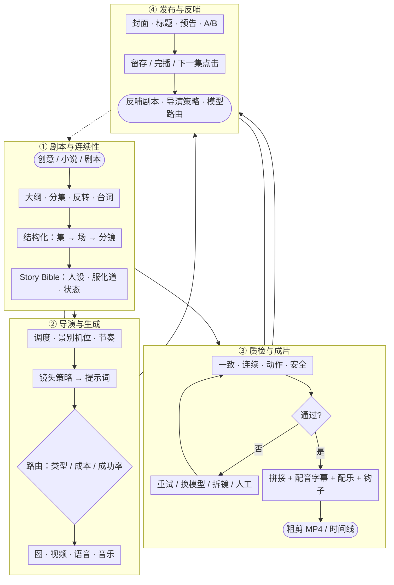

# 文档入口

项目日常只阅读和维护：[项目核心总文档.md](./项目核心总文档.md)。

下方内容及其他 Markdown 文件仅作为历史规划或官方资料副本；核心结论已合并到总文档。

---

# AI 短剧创作平台产品与技术规划（历史）

> 文档状态：讨论稿，持续更新  
> 项目目标：自主研发一套在关键生产指标上超过“火山剧创”的 AI 短剧工业化创作平台。  
> 更新时间：2026-08-18

## 1. 项目愿景

打造“AI 导演 + 多模型路由 + 连续性引擎 + 自动质检 + 自动成片 + 数据增长闭环”的短剧生产操作系统。

我们不以自研通用视频基础模型为首要目标，而是整合多个领先模型，通过工作流、数据和行业知识提高成片质量、生产效率与商业回报。

### 制作流程总览

一部优秀 AI 漫剧的生产链路：左上 → 右上 → 左下 → 右下，虚线为发布数据反哺。

## 2. “超过”的初步定义

以下指标需在讨论后确定目标值：

- 从结构化剧本到 90 秒粗剪的耗时
- 每分钟可用成片成本
- 单镜头平均生成次数
- 主要角色跨镜头一致率
- 服装、场景和道具连续性正确率
- 镜头一次生成可用率
- 自动完成剪辑、配音、字幕和音效的比例
- 每分钟成片所需人工操作时间
- 前 5 秒留存、整集完播率和下一集点击率

## 3. 产品定位（待确认）

### 初步建议

面向 AI 漫剧/短剧工作室的一站式工业化生产平台，先聚焦一个高频题材，通过以下能力建立差异化：

1. 从创意和小说开始，而不只接收完整剧本。
2. 支持多个图像、视频、语音和音乐模型。
3. 根据镜头类型、预算和历史成功率自动选择模型。
4. 通过 Story Bible 管理跨集人物与剧情状态。
5. 自动检查角色、服装、道具、动作和画面质量。
6. 对不合格镜头自动修改策略并重试。
7. 自动生成接近可发布状态的粗剪。
8. 将发布数据反馈到剧本和导演策略。

### 首个目标客户（待选择）

- [ ] AI 漫剧工作室
- [ ] 真人短剧制作公司
- [ ] MCN/内容机构
- [ ] 网文/IP 公司
- [ ] 广告与品牌内容团队
- [ ] 海外短剧团队
- [ ] 个人创作者

### 首个内容方向（待选择）

- [ ] 都市情感/霸总甜宠
- [ ] 悬疑反转
- [ ] 玄幻/仙侠漫剧
- [ ] 穿越/重生
- [ ] 儿童故事
- [ ] 品牌定制短剧
- [ ] 出海短剧

## 4. 核心产品模块

### 4.1 创意与剧本

- 一句话创意生成
- 小说/网文改编
- 故事大纲与人物关系
- 分集梗概与单集剧本
- 冲突、反转与集尾悬念设计
- 台词优化
- 剧情逻辑和连续性检查
- 合规与版权风险提示
- 剧本版本管理

### 4.2 结构化剧本

核心层级：项目 → 季 → 剧集 → 场次 → 剧情节拍 → 分镜。

每个分镜记录人物、服装、场景、道具、动作、表情、台词、景别、机位、运镜、光线、时长、参考素材、生成模型、生成参数、结果评分、成本与版本。

### 4.3 Story Bible 与资产

- 世界观和时间线
- 人物档案与关系变化
- 人物已知/未知信息
- 角色标准图、表情、服装与年龄状态
- 角色声音
- 场景空间结构
- 关键道具及归属
- 人物伤势、位置和情绪状态
- 跨集连续性追踪

### 4.4 AI 导演

- 场面调度和人物站位
- 景别、机位和运镜选择
- 情绪与剪辑节奏
- 正反打与视线连续性
- 镜头拆分和时长规划
- 镜头策略库
- 自动生成提示词
- 按镜头特点选择生成方式

### 4.5 多模型路由

统一接入文本、图片、视频、语音、音乐、口型和视觉评估模型。

路由依据：镜头类型、风格、人物数量、动作复杂度、时长、分辨率、历史成功率、成本、速度和用户预算。

### 4.6 自动质检与修复

- 角色身份和人脸一致性
- 服装、场景、道具连续性
- 动作完成度
- 人物数量
- 肢体畸变、闪烁和画面突变
- 首尾帧衔接
- 台词与画面匹配
- 异常文字和水印
- 内容安全
- 自动重试、换模型、换参考图、拆镜头或转人工审核

### 4.7 自动成片

- 镜头自动拼接
- 配音和角色音色锁定
- 字幕、花字、环境音和动作音效
- 自动配乐和情绪起伏
- J-cut/L-cut 与反应镜头
- 坏帧删除和响度标准化
- 开场钩子和集尾悬念卡
- MP4、剪映/Premiere 时间线导出

### 4.8 发布与数据增长

- 多渠道版本管理
- 封面、标题、简介和预告生成
- 开场/封面 A/B 测试
- 1/3/5/10 秒留存与完播率
- 镜头级退出分析
- 下一集点击和付费转化
- 数据反哺剧本、镜头策略和模型路由

### 4.9 自动导演约束与辅助系统

产品默认面向不具备深度影视和生成模型经验的创作者。导演组只需要表达故事意图、情绪、必须保留的内容和审美偏好，系统负责把专业规则编译成可执行生产方案。

#### 默认由系统承担

- 根据剧情节拍自动选择景别、机位、运镜和镜头时长
- 将抽象情绪转换为可生成的表情、肢体和动作细节
- 根据模型上限与内容复杂度自动拆分逻辑镜头和生成片段
- 自动识别参考生成、视频编辑、视频延长和轨道补全等任务类型
- 从资产库选择最少且有效的角色、场景、动作和音频素材
- 自动生成不同模型所需的专用提示词，不要求用户掌握模型语法
- 自动维护人物、服装、道具、空间、摄影机、光影、情绪和声音连续性
- 自动设置入口状态、出口状态、稳定切点和隐藏切点
- 自动判断文戏使用延长、武戏分段生成、复杂场景降级拆镜
- 生成前执行可生成性检查，生成后执行质量检测、修复和有限重试
- 根据质量、成本、速度和历史成功率自动选择模型

#### 用户默认只需确认

1. 这场戏要表达什么；
2. 观众应感受到什么；
3. 哪些剧情、人物或台词不能改变；
4. 更偏好的候选版本。

景别、轴线、动作边界、素材优先级、模型参数、衔接删帧等专业细节默认折叠在“高级/专业模式”中，不作为完成作品的前置知识。

#### 人工介入原则

系统只有在以下情况才请求人工处理：

- 剧情存在多种合理解释且会改变叙事含义
- 涉及肖像、声音、IP、敏感内容等授权或合规决策
- 多个候选结果质量接近，需要审美选择
- 自动修复达到预算或重试上限
- 修改会影响已锁定的剧情事实或关键资产

系统提示应使用创作语言说明问题并给出推荐选项，例如“该镜头人物过多，建议拆成两组拍摄”，而不是要求用户理解模型参数和底层错误。

#### 三层交互模式

- **自动模式（默认）**：输入剧本或创作意图，系统自动生成到粗剪，只在关键决策点请求确认。
- **引导模式**：以少量创作问题帮助用户选择节奏、情绪和视觉方向，同时隐藏实现细节。
- **专业模式**：允许导演或技术人员展开编辑分镜、状态、素材绑定、模型路由、提示词和修复策略。

## 5. 初步技术架构

### 前端

- Next.js + React + TypeScript
- TanStack Query + Zustand
- Konva.js/Fabric.js（分镜画布）
- Remotion（程序化视频预览与合成）
- HLS.js/WebCodecs（视频预览和局部处理）

### 后端与工作流

- FastAPI + Python
- PostgreSQL
- Redis
- Temporal（长时间生成任务、回调、重试、取消、人工审核）
- FFmpeg（转码、拼接、抽帧、音频处理）
- S3/TOS 兼容对象存储 + CDN
- pgvector/Qdrant（世界观和资产检索）

### 模型抽象

- TextModel
- ImageModel
- VideoModel
- SpeechModel
- MusicModel
- LipSyncModel
- VisionEvaluationModel
- ModerationModel

每次调用记录供应商、模型版本、输入、参数、参考资产、耗时、成本、失败原因、自动评分、人工评分和最终采用状态。

## 6. MVP 建议范围

目标：8～12 周内完成“输入一集剧本 → 输出可观看粗剪”的闭环。

### MVP 必做

1. 用户、团队和项目
2. 剧本生成/上传与结构化解析
3. 角色、场景、服装和道具资产
4. Story Bible 基础版
5. 自动分镜和提示词
6. 至少两个图片模型和两个视频模型
7. 异步生成任务与成本记录
8. 人工选择和替换镜头
9. 基础自动质检
10. 配音、字幕和音乐
11. FFmpeg 自动合成
12. MP4 下载

### MVP 暂不做

- 完整专业时间线编辑器
- 自研通用视频基础模型
- 多平台自动发布
- 大型素材交易市场
- 复杂企业审批
- 原生移动端

## 7. 路线图草案

### 阶段一：核心闭环（8～12 周）

完成 3 集样片，验证画面质量、耗时、成本和人工操作量。

### 阶段二：差异化（3～6 个月）

增加跨集连续性、多模型智能路由、自动评分与重生成、首尾帧衔接、简单时间线编辑、团队审核和专业时间线导出。

### 阶段三：规模化（6～12 个月）

增加发布数据回流、A/B 测试、批量生产、模板市场、API、私有化、多语言、企业权限与商业计费。

## 8. 风险与原则

- 不在早期训练通用视频基础模型。
- 不用“Agent 数量”代替可靠工作流。
- 不优先开发复杂专业剪辑器。
- 不以单次生成价格衡量成本，以可用成片分钟计量。
- 不将业务直接绑定某一家模型供应商。
- 所有核心资产、剧本和镜头都保留版本与生成来源。
- 真人肖像、声音、IP、音乐和字体必须保留授权记录。
- 专业知识应编码为默认约束、策略和自动检查，而不是转嫁给导演组。
- 默认走自动化安全路径，高级参数仅在专业模式中按需展开。
- 系统应解释结果、推荐方案并允许覆盖，但不要求用户从空白参数开始配置。
- 自动修复必须有质量、成本和重试上限，达到上限后才请求人工决策。

## 9. 待讨论决策

### P0：现在必须明确

1. 这是内部短剧生产工具，还是对外销售的 SaaS？
2. 第一批客户是谁？
3. 第一种短剧题材是什么？
4. 首版偏 AI 漫剧、仿真人，还是真人+AI？
5. 当前团队人数、技术背景和预算是多少？
6. 希望多久做出第一部可发布样片？
7. “超过火山剧创”最重要的前三项指标是什么？

### P1：产品方案确定后明确

1. 首批接入哪些模型？
2. 使用国内云还是支持私有化？
3. 是否需要多语言和出海？
4. 是否自带内容生产团队获取训练与评估数据？
5. SaaS 采用席位、积分、项目还是成片分钟计费？

## 10. 决策记录

| 日期 | 决策 | 原因 | 状态 |
|---|---|---|---|
| 2026-08-17 | 不把自研通用视频基础模型作为首要路线 | 初期应把资源投入工作流、连续性、路由和质检 | 初步建议 |
| 2026-08-17 | 首版围绕剧本到粗剪闭环 | 最快验证真实生产价值 | 初步建议 |
| 2026-08-18 | 专业导演和模型知识编码为系统前置约束与自动辅助 | 让非专业创作者也能稳定产出质量合格的作品，减少对人工经验的依赖 | 已确认 |
| 2026-08-18 | 产品默认采用自动模式，另提供引导模式和专业模式 | 保持低门槛，同时保留导演和技术人员的控制能力 | 已确认 |

## 11. 讨论记录

### 2026-08-17

- 用户目标：自主开发 AI 短剧创作平台，并在关键能力上超过火山剧创。
- 初步方向：多模型、AI 导演、连续性引擎、自动质检、自动成片、发布数据反馈。

### 2026-08-18

- 明确产品不依赖导演组手工掌握镜头语言、模型限制、连续性和提示词技巧。
- 将专业经验实现为前置约束、自动规划、质量门禁和修复策略。
- 默认自动模式只要求用户表达故事、情绪、不可改变项和审美选择；专业细节按需展开。

---

## 下一轮讨论入口

请先回答第 9 节 P0 的 7 个问题。回答后我们会更新：

1. 产品定位；
2. MVP 功能边界；
3. 技术架构；
4. 人员与预算；
5. 12 周执行计划。
