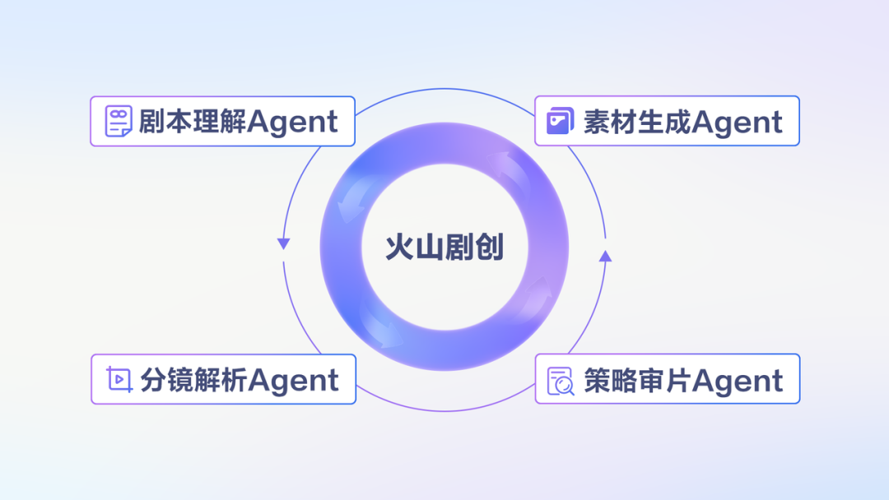
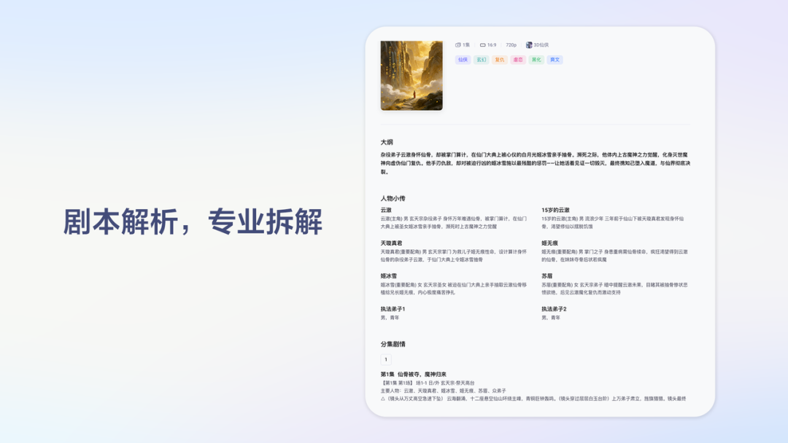
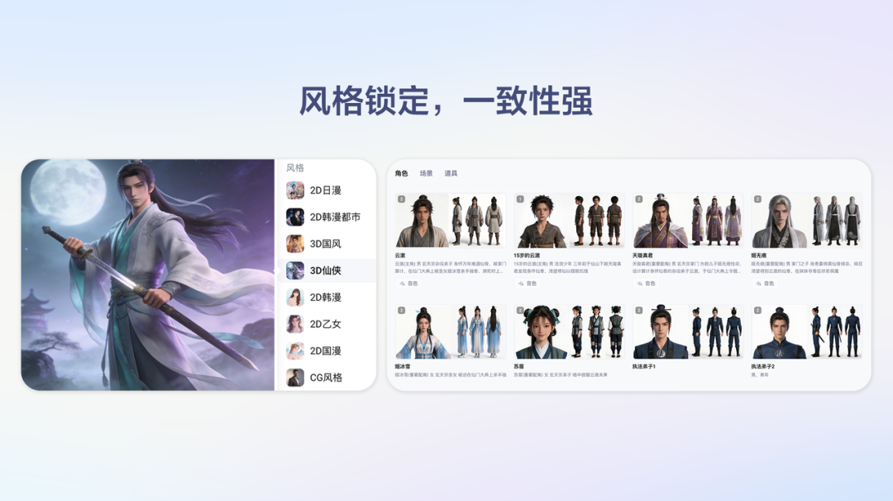
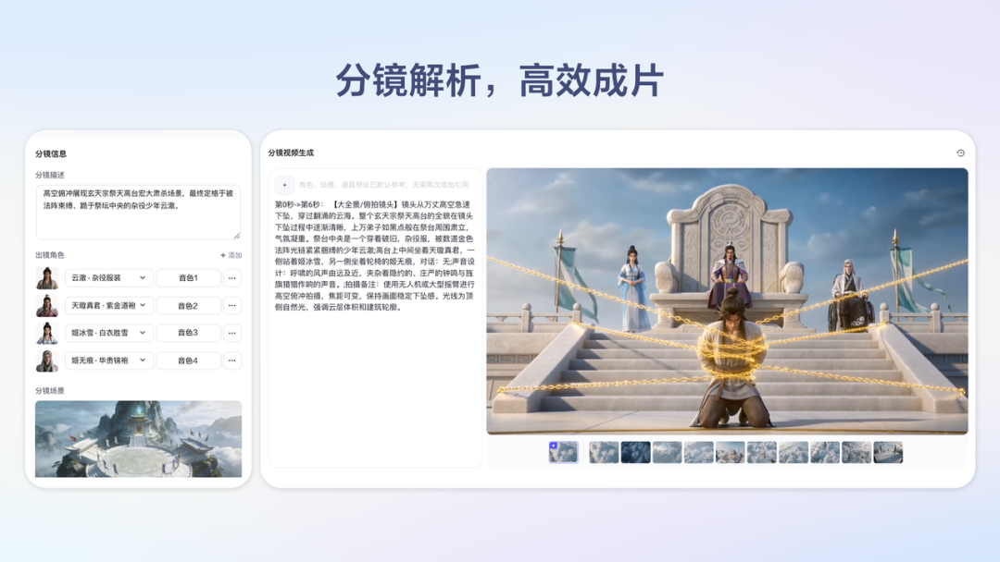
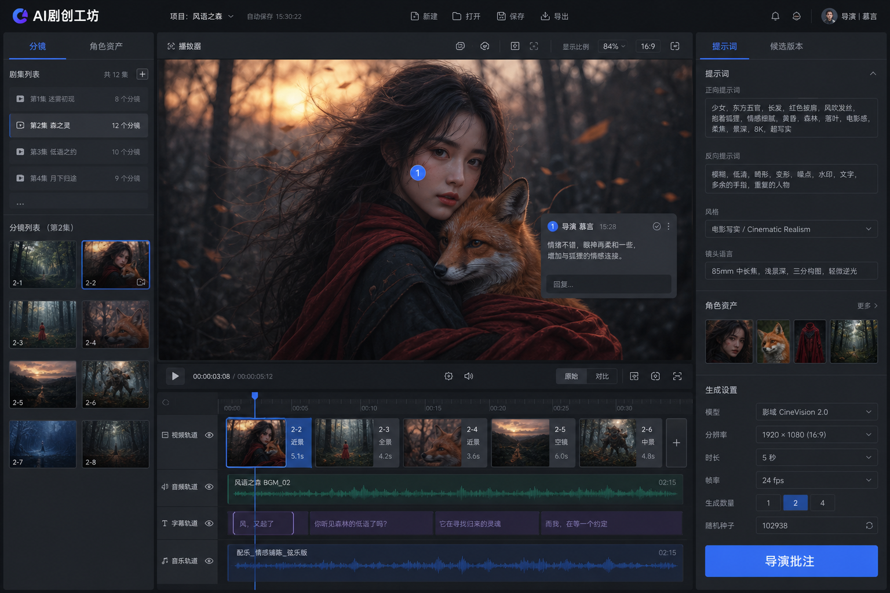
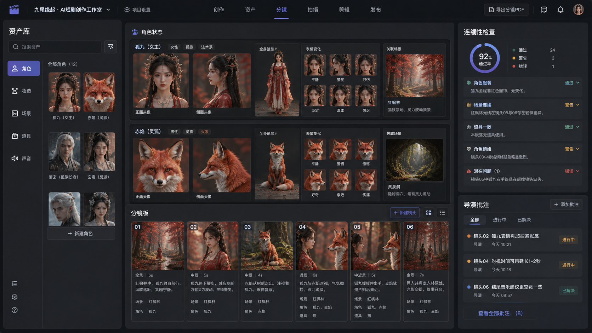
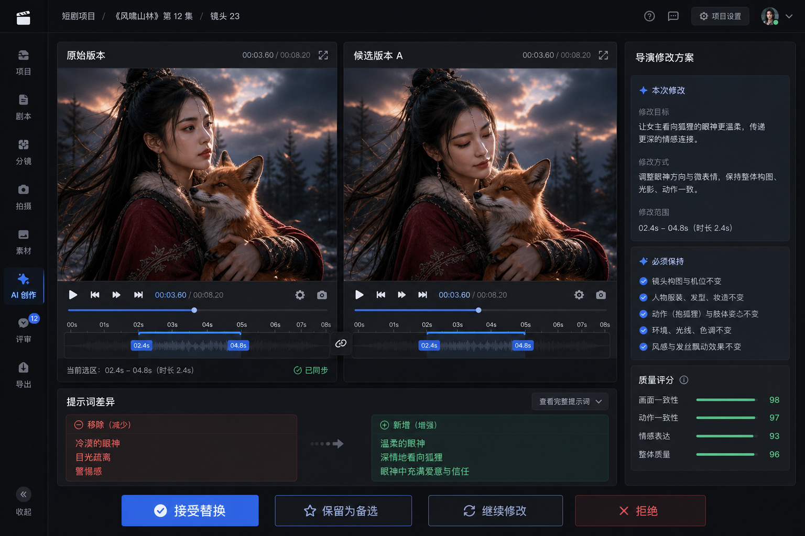
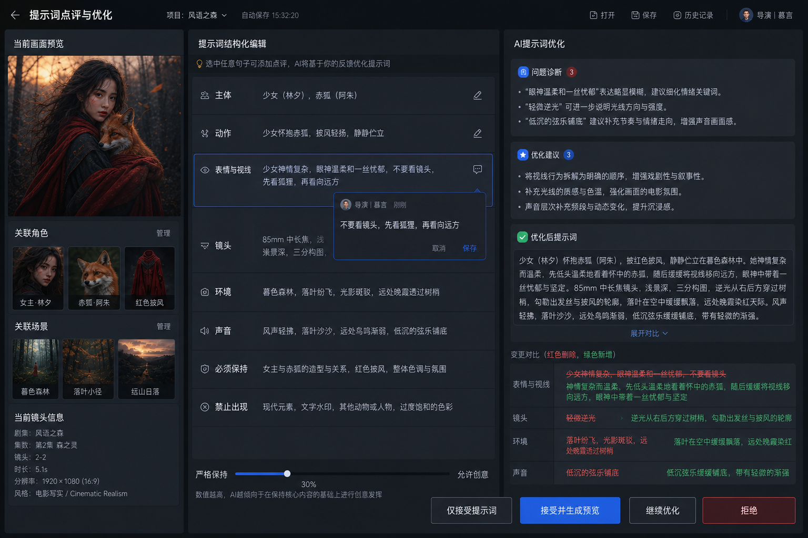
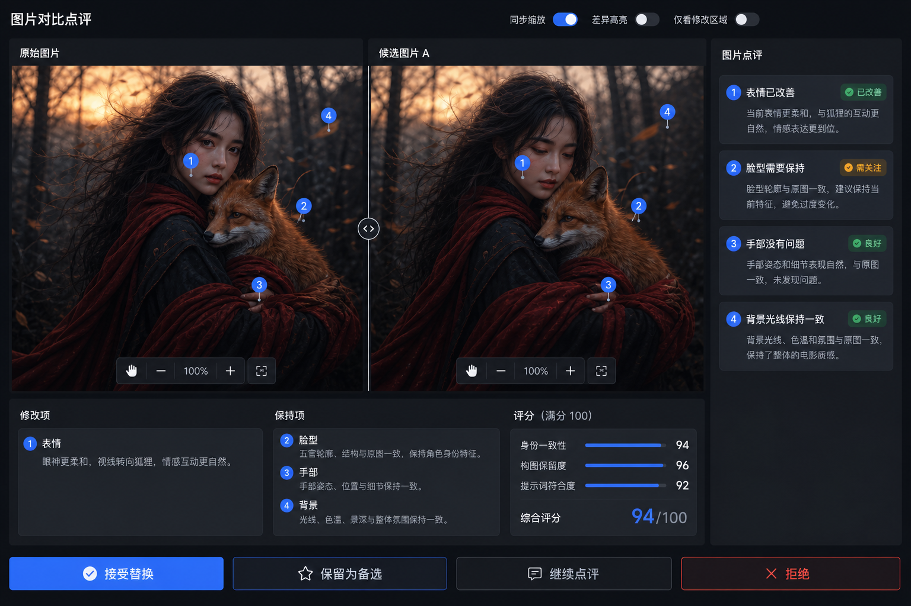

# AI剧创工坊产品设计文档

> 版本：v0.1（平台细化版）  
> 状态：详细产品概念稿  
> 日期：2026-08-22  
> 暂定产品名：AI剧创工坊  
> 下一阶段：确认产品范围后编写技术设计文档

---

## 1. 文档目的

本文档用于定义一款面向短剧、漫剧和 AI 视频创作者的一站式创作工坊。

产品以行业中成熟的“剧本解析—角色与场景资产—分镜—图片/视频生成—成片”工作流为功能底座，在此基础上重点建设一套更高效、更可控的创作返修机制：

> 创作者可以直接点评图片、视频、提示词、参考素材和生成参数；AI 导演理解修改意图，结合专业知识与全剧上下文生成候选版本，由创作者决定是否接受、替换或继续修改。

本产品不以复制其他产品的界面或品牌为目标，而是参考其已经被验证的创作流程，并通过“导演批注、局部返修、版本管理、全剧连续性”建立差异化。

---

## 2. 产品定位

### 2.1 一句话定位

一款可以像导演批片一样，通过自然语言持续修改剧本、分镜、提示词、图片和视频的 AI 短剧创作工坊。

### 2.2 核心价值

传统 AI 视频生成的低效流程是：

```text
发现问题
→ 猜测问题来自提示词还是模型
→ 手工重写提示词
→ 重新选择参数
→ 整段重新生成
→ 人工对比
→ 继续抽卡
```

本产品希望将其压缩为：

```text
指出问题
→ AI理解并给出修改方案
→ 生成候选版本
→ 创作者审核
```

### 2.3 产品原则

1. **创作者拥有最终决定权**：AI 可以建议和执行，但不能未经确认覆盖正式内容。
2. **默认局部修改**：能改字幕就不重新生成视频，能局部重绘就不重做整张图。
3. **修改必须可追溯**：每次批注、提示词变化、模型参数和生成结果都形成版本记录。
4. **全剧上下文优先**：修改单镜头时必须考虑角色、场景、服装、道具和前后镜头。
5. **先预览再生产**：高不确定性镜头优先生成低成本预览，再生成正式版本。
6. **专业能力对用户透明**：用户表达创作意图，系统负责转换为模型可执行的专业指令。

### 2.4 竞品底色：火山剧创公开能力

本产品参考火山剧创已经公开展示的全流程生产框架。以下截图来自火山引擎官方产品介绍和官方开发者社区文章，仅用于竞品研究与产品讨论，相关图片与产品名称版权归火山引擎所有。

火山剧创将剧本理解、素材生成、分镜解析和策略审片组织成多 Agent 协作流程：



> 外部参考来源：[火山引擎官方介绍文章](https://developer.volcengine.com/articles/7622325633040793641)

剧本理解阶段会提取故事大纲、人物小传和分集剧情，为后续角色资产和镜头生成提供结构化上下文：



角色、场景和道具被沉淀为可复用资产，并通过风格锁定和状态追踪降低人物崩坏、妆造变化与场景穿帮：



分镜阶段将角色、场景、提示词和候选画面组织在同一工作区，用于逐镜生成和筛选：



火山剧创当前公开产品能力还包括 Agent/人工两种创作模式、多画幅与多分辨率视频、全局风格锁定、多人协作、资产沉淀、历史版本和用量管理。[火山剧创官方产品页](https://www.volcengine.com/product/dramart)

在这一功能底色上，我们重点增加以下创作闭环：

```text
任何中间产物均可点评
→ Agent理解修改项、保持项和影响范围
→ 自动修改提示词、参考约束或生成参数
→ 选择最低成本的返修方式
→ 生成候选版本
→ 对比、接受、拒绝或继续修改
→ 修改经验进入项目级创作记忆
```

这里的“任何中间产物”包括剧本段落、分镜描述、结构化提示词、参考图片、参考视频、生成图片、生成视频、字幕、配音、音效和剪辑片段。

### 2.5 我们的产品概念总览

下图为原创产品概念图，用于表达首版工作台的信息密度与功能关系，不代表最终视觉稿。界面以分镜树、图片/视频预览区、提示词和参考资产、生成设置、导演批注以及多轨时间线为核心。



图中“导演批注”是创作环节的统一返修入口。用户可以从内容预览区、提示词、参考素材或时间线发起批注，无需先理解底层模型能力。

---

## 3. 目标用户

### 3.1 核心用户

- AI 漫剧和动态漫画创作者；
- 网络小说改编团队；
- 短剧编剧、导演和制片团队；
- MCN 和批量视频内容团队；
- 小型动画、广告和短视频工作室。

### 3.2 用户主要痛点

- 不会编写专业图片或视频提示词；
- 图片和视频生成结果不可控，需要反复抽卡；
- 只想改一个表情或动作，却需要整段重新生成；
- 人物外观、服装、场景在不同镜头中不一致；
- 不知道问题来自剧本、分镜、提示词、参考素材还是模型；
- 多人协作时修改意见散落在聊天软件中；
- 无法清楚追踪每个镜头生成了多少次、花费多少成本；
- 接受一个修改后，无法判断是否影响后续镜头。

---

## 4. 产品范围

### 4.1 完整业务流程

```text
故事构思/小说/剧本
        ↓
剧本解析与剧本医生
        ↓
世界观、角色关系、分集大纲
        ↓
角色、服装、场景、道具资产
        ↓
场次拆解与结构化分镜
        ↓
分镜提示词与参考素材
        ↓
图片/视频/配音生成
        ↓
导演批注与AI返修
        ↓
候选版本对比与审核
        ↓
镜头编排、字幕、音效和成片
        ↓
导出、发布和数据反馈
```

### 4.2 第一阶段聚焦

第一阶段不追求完整替代专业剪辑软件，重点完成：

- 项目、剧集、场次和镜头管理；
- 角色与场景资产管理；
- 图片和短视频生成；
- 提示词可视化编辑；
- 导演批注；
- AI 生成修改方案；
- 候选版本对比；
- 接受、拒绝、回退和版本历史；
- 基础镜头拼接与素材导出。

---

## 5. 产品信息架构

```text
工作台
├─ 项目列表
├─ 模板与示例项目
└─ 最近任务

项目
├─ 故事与剧本
├─ 世界观
├─ 角色关系
├─ 资产库
│  ├─ 角色
│  ├─ 妆造
│  ├─ 场景
│  ├─ 道具
│  ├─ 声音
│  └─ 参考素材
├─ 剧集
│  └─ 场次
│     └─ 镜头
├─ 创作工坊
├─ 成片时间线
├─ 导演批注中心
├─ 版本历史
├─ 任务与成本
└─ 团队与权限
```

### 5.1 资产、分镜与连续性视图

资产管理不只是文件列表，还需要表达角色身份、妆造、表情、场景关联和跨镜头状态。连续性检查与导演批注应直接出现在资产和分镜工作区，帮助团队在正式生成前发现问题。



---

## 6. 创作工坊界面

### 6.1 推荐布局

```text
┌────────────────────────────────────────────────────────────┐
│ 项目 / 第03集 / 第12场       保存状态     成本     导出      │
├─────────────┬─────────────────────────────┬────────────────┤
│             │                             │                │
│ 剧集与镜头树 │        图片/视频预览区        │ 属性与导演批注  │
│             │                             │                │
│ Shot 01     │   圈选、播放、对比、标记      │ 提示词          │
│ Shot 02     │                             │ 参考素材        │
│ Shot 03     │                             │ 生成参数        │
│             │                             │ 评论与版本      │
├─────────────┴─────────────────────────────┴────────────────┤
│ 镜头候选版本 / 时间线 / 生成进度 / 音轨 / 字幕              │
└────────────────────────────────────────────────────────────┘
```

### 6.2 内容预览区支持的对象

- 图片；
- 视频；
- 视频指定时间段；
- 视频中的主体或画面区域；
- 提示词；
- 输入参考图片；
- 输入参考视频；
- 配音、字幕和音轨。

### 6.3 AI生成内容样片

下图是为本产品文档生成的原创镜头样片，模拟“女孩抱着狐狸，森林黄昏，头发随风运动”的视频关键帧。它既可以作为图片生成结果，也可以作为图生视频的首帧、角色动作参考或导演批注对象。


该样片在产品中的关联数据应包括：结构化提示词、角色资产、场景资产、参考素材、Seed、模型、画幅、时长、音频设置以及版本来源。

---

## 7. 核心功能：导演批注

### 7.1 功能定义

导演批注是一套统一的创作修改入口。用户不需要判断该调用哪个模型或修改哪个参数，只需要指出不满意的内容并描述目标。

默认交互必须保持轻量：点击内容、输入点评、查看候选、左右对比。区域圈选、时间段定位和高级生成参数只在需要时展开，不能让用户先进入复杂编辑模式才能完成一次修改。

### 7.2 可批注对象

| 对象 | 可定位范围 | 示例 |
|---|---|---|
| 图片 | 整张、人物、物体、框选区域 | “女孩表情太凶，温柔一点” |
| 视频 | 整段、时间范围、主体、画面区域 | “2秒后拉镜太快” |
| 提示词 | 整段、句子、词语、结构化字段 | “不要看镜头，改成看狐狸” |
| 参考图片 | 整张或指定人物/区域 | “只参考脸型和服装” |
| 参考视频 | 整段或时间范围 | “只参考3～5秒运镜” |
| 配音 | 角色、句子、时间范围 | “语气更克制，语速降低” |
| 字幕 | 单句或时间范围 | “这句字幕提前0.3秒” |
| 生成参数 | 模型、画幅、时长、Seed等 | “保持构图，改为9:16” |

### 7.3 完整交互流程

```text
选择点评对象
├─ 图片：整图或圈选区域
├─ 视频：主体、区域或时间段
├─ 提示词：选中句子、词语或字段
└─ 参考素材：选中输入图片或视频
          ↓
点击“导演批注”
          ↓
输入自然语言修改意见
          ↓
Agent读取创作上下文
├─ 原始提示词和参数
├─ 输入参考素材
├─ 当前生成结果
├─ 角色、场景、服装和道具设定
├─ 前后镜头
└─ 用户历史偏好
          ↓
生成导演修改方案
├─ 要修改的内容
├─ 必须保持的内容
├─ 新提示词
├─ 参数调整
├─ 影响范围
└─ 推荐返修方式
          ↓
自动执行或由用户确认后执行
          ↓
生成1～3个候选版本
          ↓
原版、新版和提示词差异对比
          ↓
接受替换 / 仅接受提示词 / 保存备选
继续修改 / 拒绝 / 恢复旧版本
```

### 7.3.1 批注结果对比概念图

用户提交批注后，系统将原始版本与候选版本同步展示，同时解释提示词变化、修改范围和必须保持的内容。用户可以接受替换、保留备选、继续修改或拒绝。



对视频进行比较时，两侧播放器应同步时间轴，并自动循环播放被批注的时间范围，避免用户反复拖动定位。

### 7.4 批注面板

```text
┌─ 导演批注 ─────────────────────────┐
│ 对象：Shot 023 / 女孩面部           │
│ 时间：02.4s ～ 04.8s                │
│                                    │
│ [描述你希望如何修改……]             │
│                                    │
│ ☑ 其他内容保持不变                  │
│ ☑ 保持角色身份和妆造                │
│ ☑ 保持原有构图与光线                │
│                                    │
│ 候选数量：○1  ●2  ○3               │
│ 输出模式：●预览  ○正式              │
│ 预计成本：XX积分                    │
│                                    │
│ [生成修改方案]  [直接生成候选版本]  │
└────────────────────────────────────┘
```

### 7.5 快捷批注类型

- 表情；
- 视线；
- 动作；
- 人物一致性；
- 构图；
- 景别；
- 运镜；
- 节奏；
- 光线；
- 风格；
- 对白；
- 配音；
- 音效；
- 字幕；
- 删除多余元素。

---

## 8. 提示词点评与改写

### 8.1 提示词是一等创作资产

每张图片和每段视频都必须关联明确的提示词版本。提示词可以：

- 选中批注；
- 由 AI 优化；
- 查看修改前后差异；
- 单独接受而不立即生成；
- 回退到历史版本；
- 与对应媒体结果绑定。

### 8.2 结构化提示词

```text
主体：女孩、狐狸
场景：森林边缘、黄昏、微风
人物动作：抱住狐狸、睁眼、抬头
表情：温柔、略带担忧
视线：狐狸 → 远方
镜头：中景，缓慢拉远
环境动作：头发被风吹动
音频：自然风声
保持项：脸型、发型、服装、狐狸动作
禁止项：直视镜头、夸张笑容、快速转头
```

用户既可以编辑完整自然语言 Prompt，也可以单独批注某个结构化字段。

### 8.3 提示词修改结果

Agent 必须展示：

- 原提示词；
- 修改后的提示词；
- 新增内容；
- 删除内容；
- 保持项；
- 修改理由；
- 可能影响；
- 是否需要重新生成。

### 8.4 接受方式

- 仅接受提示词；
- 接受提示词并生成预览；
- 接受提示词并生成正式内容；
- 保存为提示词备选；
- 继续批注；
- 拒绝并说明原因。

### 8.5 提示词点评与优化界面

提示词点评不只是一个“AI润色”按钮，而是一套可定位、可解释、可选择接受的修改流程。用户可以选中一个词、一句话、一个结构化字段，也可以对整段提示词提出意见；系统必须记住批注的作用范围，避免将局部意见错误地扩散到整段 Prompt。



建议交互流程：

1. 用户点击某个结构化字段或选中原 Prompt 中的文字，直接输入点评；
2. Agent 先诊断问题类型，包括描述歧义、条件冲突、信息缺失、镜头语言不足、角色连续性风险和模型难以执行的表达；
3. Agent 输出优化建议、优化后提示词以及红删绿增的文本差异；
4. 系统明确列出锁定不改的字段、受影响字段、预计生成成本和是否需要重生成；
5. 用户选择“仅接受提示词”“接受并生成预览”“继续优化”或“拒绝”，原提示词不得被自动覆盖。

界面需要提供“严格遵循—允许创意”的优化尺度。严格模式只修复歧义、冲突和缺失信息；创意模式可以补充镜头、氛围和动作细节，但所有新增创意都必须在差异视图中标记，不得暗中改写作者意图。

提示词点评结果至少包含以下信息：

- 批注对象与选中文字范围；
- 问题诊断和修改理由；
- 原提示词、优化后提示词及差异；
- 必须保持项与禁止项；
- 可能影响的图片、视频、配音或后续镜头；
- 当前改写是否只保存文本，还是立即触发预览生成。

---

## 9. 参考素材点评

### 9.1 参考图片

用户可以指定参考图的使用范围：

```text
使用：人物身份、脸型、发型、服装
忽略：表情、姿势、背景、光线
```

### 9.2 参考视频

用户可以指定：

```text
参考时间：03.0s ～ 05.0s
参考内容：镜头运动、速度、节奏
忽略内容：人物、服装、场景和画面风格
```

### 9.3 素材冲突提醒

当多张参考图之间人物脸型、服装或风格冲突时，系统应在生成前提示用户，而不是直接把冲突交给模型处理。

---

## 10. AI导演修改方案

### 10.1 标准输出

```json
{
  "target": {
    "shot_id": "shot_023",
    "time_range": [2.4, 4.8],
    "subject": "female_character",
    "region": "face"
  },
  "changes": [
    {
      "property": "expression",
      "from": "angry",
      "to": "gentle_but_alert"
    },
    {
      "property": "gaze",
      "to": "look_at_fox_then_distance"
    }
  ],
  "locked": [
    "identity",
    "face_shape",
    "hair",
    "clothing",
    "lighting",
    "background"
  ],
  "recommended_operation": "video_regeneration_with_reference",
  "candidate_count": 2
}
```

### 10.2 必须区分三类内容

1. **必须修改**：本次生成必须解决的问题。
2. **必须保持**：不得发生变化的内容。
3. **允许自由发挥**：模型可以合理变化的细节。

### 10.3 返修路由

| 问题类型 | 优先处理方式 |
|---|---|
| 字幕错误 | 直接修改字幕 |
| 配音语气 | 重新配音 |
| BGM或音效 | 替换局部音轨 |
| 图片局部表情/物体 | 局部重绘 |
| 图片整体风格 | 图生图或重新生成 |
| 视频动作/运镜 | 视频重新生成或局部重生成 |
| 首尾衔接 | 首尾帧约束生成 |
| 角色设定错误 | 返回资产层修改并检查关联镜头 |
| 情节逻辑错误 | 返回剧本或分镜层修改 |

---

## 11. 候选版本与对比

### 11.1 对比方式

- 图片左右对比；
- 图片滑块对比；
- 视频同步播放；
- 修改时间段循环播放；
- 原提示词与新提示词文本差异；
- 生成参数差异；
- 自动质量评分。

### 11.2 候选版本说明

```text
候选版本 B

已修改：
• 女孩表情变得柔和
• 视线改为先看狐狸再看远方
• 镜头拉远速度降低

保持不变：
• 人物身份与服装
• 狐狸动作
• 场景与光线
• 视频时长

自动检查：
• 意图符合度：91%
• 角色一致性：88%
• 构图保持度：94%
• 前后镜头连续性：85%
```

### 11.3 用户操作

- 接受并替换当前版本；
- 仅接受修改后的提示词；
- 保存为备选版本；
- 基于候选版本继续批注；
- 拒绝；
- 拒绝并填写原因；
- 恢复历史版本。

### 11.4 图片对比点评界面

静态图片默认采用左右对比，原始图片固定在左侧，当前候选固定在右侧。用户无需切换页面即可继续点评，且每一条点评都要绑定到具体区域和对应版本。



对比区应支持：

- 同步缩放与同步拖动，保证两侧始终查看同一位置；
- 左右并排、滑块叠加和差异高亮三种查看方式；
- “仅看修改区域”，快速跳转到发生变化的位置；
- 在两侧显示相同编号的点评标记，点击任意一侧标记即可定位对应意见；
- 对脸部、手部、服装、道具、构图和背景分别给出一致性检查结果；
- 把“需要修改”和“必须保持”分开呈现，防止修好一个问题时破坏已正确内容。

每条图片点评具有“已改善、仍需修改、保持良好”三种状态，并记录点评人、目标区域、原始意见、Agent 理解和候选响应。系统可以允许用户针对某个区域继续发起修改，但在模型无法稳定进行局部合成时，不承诺把多个候选区域直接拼成一张正式结果。

用户接受候选后，系统应保留原图、候选图、提示词差异、区域点评和生成参数，形成可回退的新版本；“保留为备选”和“拒绝”都不能删除已有结果。

---

## 12. 非破坏式版本管理

### 12.1 基本规则

- 新生成内容永远先成为候选分支；
- 接受后只改变“当前使用版本”指针；
- 原版本不删除；
- 用户可以随时恢复；
- 提示词版本与媒体版本必须成对关联；
- 每个正式成片必须能够追溯素材来源。

### 12.2 修改影响检查

当修改可能影响后续镜头时，系统应提示：

```text
该角色在后续12个镜头中仍穿着白色服装。

○ 只替换当前镜头
● 将红色服装设为当前场景造型
○ 检查并批量修改后续关联镜头
```

默认不自动修改全剧。

---

## 13. 生成预览与正式生产

### 13.1 两级生成

- 预览模式：验证动作、镜头、节奏、构图和提示词意图；
- 正式模式：生成最终画质和可交付素材。

### 13.2 推荐流程

```text
导演批注
→ 生成修改方案
→ 生成1～3个低成本预览
→ 用户选择
→ 锁定模型、提示词、参考素材、Seed、时长和画幅
→ 生成正式版本
```

### 13.3 成本透明

生成前展示：

- 预计积分；
- 预计等待时间；
- 候选数量；
- 预览或正式模式；
- 是否可能影响关联镜头。

---

## 14. 协作与审核

### 14.1 角色

- 所有者；
- 制片人；
- 导演；
- 编剧；
- 美术；
- 剪辑；
- 审核人；
- 只读成员。

### 14.2 批注状态

```text
草稿 → 待处理 → AI处理中 → 候选待审核 → 已接受/已拒绝 → 已解决
```

### 14.3 团队功能

- @成员；
- 指派批注；
- 批注优先级；
- 审核截止时间；
- 镜头锁定；
- 批量审批；
- 操作日志。

---

## 15. 数据记录与产品学习

每次导演批注至少记录：

```text
comment_id
project_id
episode_id
scene_id
shot_id
target_type
target_region_or_time_range
user_comment
interpreted_revision_spec
original_prompt_version
revised_prompt_version
locked_constraints
parent_media_version
candidate_media_versions
model_and_parameters
generation_cost
generation_time
automatic_quality_scores
accepted_or_rejected
rejection_reason
operator
created_at
```

这些数据未来可用于：

- 分析返修最多的问题；
- 比较不同模型的稳定性；
- 优化 Agent 的修改策略；
- 建立团队和个人创作偏好；
- 预测镜头成本；
- 提升候选版本接受率。

不应未经用户授权直接使用项目素材训练公共模型。

---

## 16. MVP范围

### 16.1 MVP必须完成

1. 创建项目、剧集、场次和镜头；
2. 上传角色和场景参考图；
3. 编辑结构化图片/视频提示词；
4. 生成图片和短视频；
5. 对整张图片或完整视频镜头发起导演批注；
6. Agent 提取“修改项、保持项和新提示词”；
7. 生成两个候选版本；
8. 原版与候选版本对比；
9. 接受、拒绝、继续修改和撤销；
10. 提示词与媒体版本历史；
11. 生成成本和任务状态。

### 16.2 P1

- 图片区域框选；
- 视频时间段批注；
- 参考图片和视频点评；
- 局部重绘；
- 预览转正式版本；
- 自动质量检查；
- 团队批注和审核。

### 16.3 P2

- 视频主体跟踪与区域批注；
- 全剧连续性检查；
- 修改影响分析；
- 批量修改关联镜头；
- 用户创作偏好；
- 多模型质量/成本路由；
- 自动推荐最佳候选；
- 成片数据反馈反哺创作策略。

---

## 17. 核心指标

### 17.1 北极星指标

**每个被接受镜头所需的平均人工操作次数和生成成本。**

### 17.2 关键指标

- 导演批注使用率；
- 批注到首个候选版本的时间；
- 候选版本首次接受率；
- 平均返修轮数；
- 局部修改占全部修改的比例；
- 提示词建议接受率；
- 单镜头平均生成成本；
- 单镜头平均完成时间；
- 角色一致性通过率；
- 历史版本恢复率；
- 用户完成一集作品所需时间。

---

## 18. MVP验收标准

以一个10镜头的AI漫剧片段为例：

1. 用户可以为每个镜头配置提示词和参考图；
2. 用户可以生成并查看至少两个候选结果；
3. 用户可以对图片、视频和提示词分别发起批注；
4. Agent 可以输出明确的修改项、保持项和新提示词；
5. 用户可以只接受提示词，也可以接受生成结果；
6. 接受候选结果不会删除原版本；
7. 用户可以恢复任意历史版本；
8. 系统可以展示每次生成的耗时和成本；
9. 所有正式镜头可以追溯到提示词、参考素材和生成任务；
10. 项目可以导出镜头视频、字幕和基础成片。

---

## 19. 风险与限制

### 19.1 模型能力限制

- 局部视频修改不一定真正只改变局部；
- 高分辨率正式版可能与预览存在细节差异；
- 人物脸型、手部和复杂互动仍可能不稳定；
- 多个参考素材可能产生冲突。

产品需要明确展示“强约束、弱约束和模型可能变化的部分”，不能向用户承诺像素级一致。

### 19.2 成本和延迟

- 多 Agent 链路可能增加响应时间；
- 不应每次批注都调用全部专业 Agent；
- 应先由返修路由判断最小处理方式；
- 高成本生成前必须展示预计费用。

### 19.3 合规

- 真人肖像和声音需要明确授权；
- 记录参考素材来源和使用范围；
- 建立内容安全审核；
- 支持 AI 生成内容标识；
- 企业项目和个人项目数据隔离；
- 敏感素材不得出现在公开样例或公共训练数据中。

---

## 20. 待共同确认的问题

以下问题决定下一版产品范围和后续技术架构：

1. 首发聚焦 AI 漫剧、真人短剧，还是两者都支持？
2. 主要用户是个人创作者、小团队，还是影视制作公司？
3. 第一版是否需要剧本生成，还是从用户已有剧本开始？
4. 第一版是否需要完整时间线编辑器？
5. 第一版优先接入哪些图片、视频和语音模型？
6. 是否允许用户使用自己的模型 API Key？
7. 产品采用积分制、订阅制，还是按生成成本计费？
8. 候选版本默认生成1个、2个还是3个？
9. 导演批注是否需要先展示修改方案再生成，还是默认直接生成？
10. 是否在第一版支持多人审批和团队权限？
11. 产品最终名称和品牌方向是什么？

---

## 21. 平台级产品细节

本节补充平台从进入、创作、生成、点评、审核到交付的完整使用细节。平台不是单一生成器，而是围绕“项目—剧集—场次—镜头—版本”组织生产过程，并用导演批注贯穿所有内容对象。

### 21.1 全局导航

桌面端采用左侧主导航，保证用户在任何页面都能快速返回当前生产任务。

| 一级入口 | 主要内容 | 默认展示 |
|---|---|---|
| 首页 | 最近项目、待办、生成动态、用量 | 最近打开的项目 |
| 项目 | 我创建、我参与、已归档、模板 | 卡片或列表视图 |
| 任务中心 | 生成中、排队中、失败、已完成 | 当前团队全部活跃任务 |
| 资产库 | 角色、场景、道具、声音、参考素材 | 按项目筛选 |
| 审核中心 | 待我审核、我发起、已完成 | 按优先级排序 |
| 灵感与模板 | 剧集模板、镜头模板、提示词模板 | 官方与团队模板 |
| 用量与账单 | 积分、模型用量、成员消耗、账单 | 当月用量概览 |

导航底部放置团队切换、邀请成员、帮助中心、通知和个人设置。项目名称、当前剧集和当前镜头需要始终出现在顶部面包屑中，避免用户在多项目并行时误操作。

### 21.2 首页工作台

首页优先回答四个问题：我正在做什么、现在卡在哪里、哪些内容需要我处理、今天消耗了多少。

首页模块包括：

- “继续创作”：展示最近访问的3～6个项目和上次停留位置；
- “待我处理”：被指派的批注、待审核候选、失败任务和即将到期事项；
- “生产动态”：最近生成完成、版本被接受、成员回复和导出完成；
- “项目健康度”：已完成镜头、待返修镜头、连续性风险和预计剩余成本；
- “快速开始”：新建空白项目、从剧本创建、从模板创建、导入已有分镜；
- “用量提醒”：今日和本月消耗、剩余额度以及异常高消耗提示。

首页不直接承载复杂编辑。点击任务应定位到对应项目、镜头、版本和批注，而不是只打开项目首页。

### 21.3 新建项目

新建项目采用分步引导，但允许跳过非必要配置：

1. 基本信息：项目名称、作品类型、画幅、目标时长和语言；
2. 创作方式：从剧本开始、从分镜开始、从素材开始或使用模板；
3. 风格基线：真人、动漫、3D、绘本或自定义参考图；
4. 生产设置：默认预览模型、正式模型、候选数量和成本上限；
5. 团队设置：邀请成员、分配角色和设置默认审核人。

创建完成后，系统生成项目空结构和一条“开始配置角色/导入剧本”的明确下一步，不应把用户丢进空白工作区。

### 21.4 项目总览

项目总览用于制片管理，不承担具体镜头编辑。页面应展示：

- 剧集和场次完成进度；
- 镜头状态分布：未开始、生成中、待审核、需返修、已锁定、已交付；
- 角色与场景资产完整度；
- 最近批注和阻塞问题；
- 本项目累计成本、近7日消耗和预算剩余；
- 预计完成时间和当前生产速度；
- 成员工作量及待办数量；
- 一键进入上次编辑镜头。

用户可以从总览批量选择镜头，执行指派、提交审核、锁定、导出和修改生产优先级，但批量操作前必须展示影响范围。

### 21.5 创作工坊的固定区域

创作工坊由五个稳定区域组成，不采用自由摆放式界面：

| 区域 | 作用 | 关键内容 |
|---|---|---|
| 顶部工具栏 | 项目定位和全局动作 | 面包屑、保存状态、撤销、任务状态、预览、导出 |
| 左侧镜头树 | 选择生产对象 | 剧集、场次、镜头、状态、缩略图、筛选 |
| 中央预览区 | 查看和点评当前内容 | 图片/视频、区域标记、时间范围、版本切换 |
| 右侧属性区 | 编辑创作条件 | 提示词、参考素材、生成参数、导演批注 |
| 底部镜头条 | 查看前后关系 | 镜头顺序、时长、对白、音乐、连续性提示 |

用户切换镜头时，系统需要保存未提交的提示词草稿。若存在未发送的点评、正在上传的素材或尚未保存的参数变化，离开前给出明确提示。

### 21.6 镜头卡片

每个镜头卡片至少包含：

- 镜头编号、场次和一句话内容；
- 当前主版本缩略图；
- 图片、视频、配音和字幕完成状态；
- 负责人和审核人；
- 未解决批注数量；
- 生成任务状态和进度；
- 连续性风险标记；
- 当前成本；
- 是否已经锁定。

镜头卡片支持按“待生成、待我审核、需返修、任务失败、超过预算、连续性风险”筛选。用户应能直接看到问题，不需要逐个打开镜头寻找异常。

### 21.7 右侧属性区

右侧属性区使用固定标签页，保持所有镜头的一致操作位置：

1. 内容：当前镜头描述、对白、动作和镜头目标；
2. 提示词：结构化字段、自然语言 Prompt、负面提示词和版本；
3. 参考：角色、场景、道具、首尾帧及参考视频；
4. 生成：模型、比例、分辨率、时长、Seed、音频和候选数量；
5. 批注：当前对象的点评、处理状态和历史回复；
6. 检查：角色一致性、构图、手部、口型、字幕和镜头衔接；
7. 版本：当前版本来源、父版本、候选和历史版本。

高频项默认展开，专业参数折叠到“高级设置”。用户切换模型时，系统应说明哪些参数会失效或被重置，并在确认前保留原配置。

### 21.8 导演批注的快速入口

点评入口需要在用户视线附近出现，而不是藏在多级菜单中：

- 点击图片或视频后，预览区下方直接出现“输入你的修改意见”；
- 选中文字后，浮出“点评这段提示词”；
- 选中图片区域后，输入框自动标记区域范围；
- 在视频时间轴选择范围后，输入框自动带入起止时间；
- 点击已有编号标记，右侧展开对应讨论和候选结果。

默认输入框支持自然语言。快捷标签只用于减少输入，例如“表情、视线、动作、构图、保持人物一致”，不能强迫用户先分类再点评。

提交前显示本次作用对象和范围，例如“Shot 023 / 候选B / 女孩面部 / 2.4s～4.8s”。如果用户的文字与选择范围冲突，Agent 先询问或给出范围修正建议，不直接生成。

### 21.9 批注详情与讨论

一条批注的详情页或侧栏应完整展示：

- 原始点评和创建人；
- 目标版本、区域或时间段；
- Agent 对意图的结构化理解；
- 修改项、保持项和禁止项；
- 采用的处理方式及原因；
- 关联的候选版本和成本；
- 团队回复、@成员和状态变化；
- 最终接受版本及处理结论。

批注可以被指派、设为高优先级、补充说明、重新打开或标记已解决。只有接受了结果或人工确认无需修改后，批注才能进入“已解决”，生成完成本身不等于问题解决。

### 21.10 生成前确认

点击生成后先出现轻量确认条，展示：

```text
任务：Shot 023 表情与视线返修
模式：预览
候选：2个
预计：36～52秒
预计消耗：120～160积分
保持：人物身份、服装、构图、狐狸动作
可能变化：头发细节、背景树叶
```

低成本且低风险的任务可以允许用户设置“以后直接生成”。正式视频、高候选数、超过项目单次成本阈值或可能影响多个镜头的任务必须再次确认。

### 21.11 任务中心

所有媒体生成采用异步任务。任务中心按以下状态组织：

```text
等待上传 → 分析素材 → 排队中 → 生成中 → 质量检查 → 已完成
                                      ├─ 部分成功
                                      ├─ 已取消
                                      └─ 失败
```

每个任务展示模型、创建人、所属镜头、候选数量、排队时间、生成时间、当前进度、消耗和失败原因。用户可以安全地取消排队任务；对已经开始计费的任务，应明确说明可否退款或退回积分。

失败任务提供“原参数重试”“调整后重试”和“切换推荐模型”三个入口。重试必须创建新任务记录并关联原失败任务，不能覆盖失败证据。

### 21.12 候选结果到达

候选生成完成后：

- 当前页面仍停留在该镜头时，预览区出现非打断式提醒；
- 用户在其他镜头时，通过通知中心提示，不自动跳转；
- 多个候选同时完成时，合并为一条通知；
- 候选区先展示首帧和关键指标，视频加载完成后再允许同步播放；
- 系统可推荐一个候选，但必须解释推荐依据，不能代替用户接受。

候选的“接受”表示设为当前主版本；“锁定”表示进入后续环节时默认不可被批量修改。这两个动作必须分开。

### 21.13 资产库

资产库以“可复用创作身份”组织，而不只是文件夹。主要资产类型包括角色、场景、道具、服装造型、声音、音乐、图片参考和视频参考。

角色资产详情包含：

- 名称、角色ID、人物小传和身份标签；
- 正面、侧面、全身、表情和服装参考；
- 可使用和禁止使用的视觉特征；
- 默认声音及说话风格；
- 出现的场次和镜头；
- 当前生效造型及变更记录；
- 肖像、声音和素材授权信息。

素材上传后先进行清晰度、重复文件、人物数量、版权信息和安全检查。用户可以指定“只参考脸型”“只参考服装”“只参考构图”等使用范围，避免模型把整张参考图全部照搬。

### 21.14 审核中心

审核中心将分散在各项目中的待审核内容集中处理。审核单元默认是单个镜头，也支持按场次批量提交。

审核人可以：

- 通过并设为当前主版本；
- 通过并锁定；
- 退回并填写点评；
- 指定必须保留的版本；
- 将问题指派给具体成员；
- 查看原版、候选、提示词和参数差异；
- 查看本轮生成成本及历史返修次数。

批量通过只适用于没有未解决高优先级批注、没有连续性红色风险且质量检查通过的镜头。其余镜头自动从批量操作中排除并说明原因。

### 21.15 搜索、筛选与定位

全局搜索支持项目名、角色名、镜头编号、对白、提示词内容、批注文字和任务ID。搜索结果必须显示所属项目与版本，点击后准确定位到目标对象。

常用筛选条件包括负责人、审核人、状态、资产类型、生成模型、创建时间、成本区间、是否有未解决批注和是否存在连续性风险。用户可以保存个人筛选视图，团队管理员可以发布共享视图。

### 21.16 通知机制

平台内通知分为四级：

| 级别 | 示例 | 表现 |
|---|---|---|
| 必须处理 | 预算超限、正式生成失败、授权过期 | 明确红色提醒，不自动消失 |
| 待办 | 被指派批注、收到审核任务 | 进入待办列表 |
| 进度 | 生成完成、导出完成 | 普通通知，可合并 |
| 信息 | 成员回复、版本被恢复 | 通知中心记录 |

用户可以按项目设置通知偏好。生成进度不应频繁弹窗，只在完成、失败或需要决策时提醒。

### 21.17 用量、额度与预算

成本需要在平台的三个层级可见：

- 生成前：预计区间、计费单位和可能追加费用；
- 生成中：当前任务是否已经开始计费；
- 生成后：实际消耗、失败扣费情况和候选分别消耗。

团队管理员可以设置团队月预算、项目预算、成员日限额、单任务上限和正式生成审批阈值。达到80%时预警，达到100%时按规则停止高成本任务，但允许保存、点评和查看已有内容。

用量报表应支持按项目、成员、模型、内容类型和时间范围统计，并区分预览浪费、正式产出、失败任务和被接受版本成本。

### 21.18 权限细节

权限同时受团队角色和项目角色控制：

| 操作 | 所有者/制片人 | 导演 | 创作者 | 审核人 | 只读 |
|---|---:|---:|---:|---:|---:|
| 修改项目设置 | 是 | 部分 | 否 | 否 | 否 |
| 编辑提示词与素材 | 是 | 是 | 是 | 否 | 否 |
| 发起生成 | 是 | 是 | 按额度 | 否 | 否 |
| 发表评论 | 是 | 是 | 是 | 是 | 否 |
| 接受候选 | 是 | 是 | 可配置 | 审核范围内 | 否 |
| 锁定镜头 | 是 | 是 | 否 | 可配置 | 否 |
| 导出正式资产 | 是 | 可配置 | 否 | 否 | 否 |
| 查看成本 | 是 | 是 | 仅本人 | 可配置 | 否 |

涉及删除、永久导出、预算修改、成员移除和正式版本覆盖的操作必须进入审计日志。

### 21.19 保存、撤销与冲突处理

提示词、批注草稿和镜头基础信息自动保存，并在顶部显示“保存中、已保存、保存失败”。生成参数在用户点击生成时形成不可变快照。

多人同时编辑同一提示词时，后进入者看到“某成员正在编辑”。如果仍然发生并发提交，平台保留两个草稿并展示差异，不使用最后一次提交静默覆盖。

撤销用于恢复最近的界面编辑；历史版本恢复用于创建一个以旧版本为来源的新版本。恢复历史版本不得删除恢复点之后的记录。

### 21.20 空状态、加载状态和错误状态

平台的状态文案需要告诉用户发生了什么以及下一步能做什么：

- 无项目：展示创建项目、导入剧本和查看示例；
- 无镜头：引导新建镜头或从剧本拆分；
- 无参考素材：说明可以生成，但角色一致性可能降低；
- 正在生成：显示所处阶段和预计时间，不使用虚假精确百分比；
- 排队过久：给出继续等待、降低规格或切换模型；
- 素材不合规：指出具体素材和可处理方式；
- 参数不兼容：标出冲突字段并提供推荐配置；
- 生成失败：保留原输入、失败码、扣费状态和重试入口；
- 网络中断：本地保留未提交文本，恢复后允许继续发送。

错误提示不能只显示“生成失败，请重试”，需要区分平台、模型、素材、额度、参数和网络问题。

### 21.21 导出与交付

导出前提供交付检查：镜头是否锁定、字幕是否缺失、音频是否完成、分辨率是否一致、是否存在未解决高优先级批注、素材授权是否完整。

支持导出：

- 单镜头原始文件；
- 按场次或剧集打包的图片/视频；
- 合成预览片；
- 字幕文件；
- 配音与音乐分轨；
- 提示词、Seed和生成参数清单；
- 批注与版本审计报告。

每次导出形成任务记录，包含导出人、时间、版本范围、规格和下载有效期。正式交付包只读取已锁定版本，避免把临时候选误发给客户。

### 21.22 平台设置

团队设置包括品牌信息、成员与角色、默认模型、额度与预算、审核流程、内容安全、数据保留周期、通知和水印。项目设置可以覆盖团队默认值，但必须记录覆盖项。

个人设置包括语言、快捷键、默认候选数量、通知偏好、视频自动播放、对比模式和常用导出格式。个人设置不得改变团队的安全、授权和预算规则。

### 21.23 新用户引导

首次进入不做长篇功能介绍，而是使用一个3镜头示例项目完成核心闭环：

1. 打开一个已有候选的镜头；
2. 点击人物并输入一句点评；
3. 查看 Agent 提取的修改项和保持项；
4. 生成低成本预览；
5. 左右对比并接受候选；
6. 在版本历史中恢复原版。

完成后用户已经理解平台最重要的能力。角色资产、批量生产和高级模型参数在实际需要时再进行情境式引导。

### 21.24 平台体验底线

1. 任何生成结果都能追溯到输入、提示词、模型、参数和父版本；
2. 任何 Agent 改写都先展示差异，不静默替换作者内容；
3. 任何正式生成都展示成本和影响范围；
4. 任何接受替换都可撤销、可回退；
5. 点评入口始终靠近被点评对象；
6. 生成完成不等于批注已解决；
7. 平台不能承诺模型无法保证的局部像素级不变；
8. 用户无需理解底层模型名称，也能完成一次有效返修。

---

## 22. Agent 系统设计

### 22.1 设计目标

平台的 Agent 系统不是“用户输入一句话，模型随机改一次”的黑盒，而是一套围绕创作事实、版本和可解释返修运行的生产系统。

它必须同时支持两条路径：

1. 完整生产链路：从剧本、分镜、资产、提示词、预览、审核直到交付；
2. 即时返修链路：用户点击图片、视频、提示词或输入素材并发表评论后，准确处理“要改什么、必须保留什么”。

无论用户从哪条路径进入，系统都必须读写同一份项目状态和版本历史，不能出现“评论改了结果，但项目设定没有更新”或“新版本无法追溯原始输入”的情况。

### 22.2 总体结构

```text
用户 / 团队成员
        ↓
导演 Agent（总控：理解意图、编排流程、决定下一步）
        ↓
创作状态库（项目、剧本、镜头、资产、提示词、版本、批注）
        ↓
专业 Agent 与执行工具
├─ 剧本与分镜 Agent
├─ 提示词 Agent
├─ 角色与连续性 Agent
├─ 图片/视频返修路由 Agent
├─ 质量检查 Agent
├─ 审核与版本 Agent
└─ 成本与任务调度 Agent
        ↓
图片、视频、语音、字幕等模型能力
```

导演 Agent 是唯一的统一入口：它不直接生成媒体，而是负责理解用户意图、读取上下文、选择最小且合适的处理方式、组织专业 Agent、向用户解释影响和等待用户决策。专业 Agent 只在导演 Agent 指定的范围内工作，避免多个 Agent 同时修改同一内容。

### 22.3 创作状态库：所有 Agent 的共同事实

每一个可生成或可点评的镜头都需要具备可读取、可版本化的创作状态。例如：

```text
Shot 023
当前主版本：V12
人物：林夏
当前造型：白色风衣 / 长发
场景：黄昏森林
提示词版本：P8
参考资产：角色图 R3、狐狸图 A8
保持项：脸型、服装、狐狸动作、构图
未解决批注：3条
```

创作状态至少由以下对象构成：

| 对象 | 作用 | 关键内容 |
|---|---|---|
| `CreativeContext` | 当前创作上下文 | 项目、剧集、场次、镜头、角色、场景、前后镜头约束 |
| `MediaVersion` | 图片或视频版本 | 父版本、模型、参数、文件、质量结果、是否为主版本 |
| `PromptVersion` | 提示词版本 | 结构化字段、自然语言文本、负面提示词、差异、锁定字段 |
| `ReferenceAsset` | 输入或参考素材 | 使用范围、授权、关联角色/场景、强弱约束 |
| `Comment` | 用户或团队点评 | 目标对象、区域/时间范围、自然语言意见、状态、指派人 |
| `RevisionSpec` | 可执行返修规格 | 修改项、保持项、禁止项、影响范围、推荐方案 |
| `GenerationTask` | 异步生成任务 | 输入快照、模型、队列状态、成本、候选结果、失败信息 |

任何 Agent 不得只依赖聊天上下文做决定；必须从状态库取得对应镜头、版本和素材的明确快照。任何生成任务都必须将当时使用的状态快照固化，保证后续可以解释结果为何出现。

### 22.4 核心产物：RevisionSpec（返修规格）

用户评论本身往往是模糊的，例如“表情温柔一点，不要看镜头”。系统不能直接把原话拼接到 Prompt，而应先转化为用户可见、可确认、可执行的返修规格。

```text
目标：Shot 023 / V12 / 女孩面部 / 2.4s～4.8s

修改项：
- 表情改为温柔、克制
- 视线从直视镜头改为先看狐狸，再看向远方

保持项：
- 角色脸型、发型、白色风衣
- 狐狸姿势
- 原有构图、黄昏光线、镜头时长

推荐方式：
- 图片：局部重绘或图生图候选
- 视频：针对目标时间段生成低成本预览

风险提示：
- 局部重绘可能连带改变发丝和背景边缘
```

`RevisionSpec` 必须包含：目标范围、修改项、保持项、禁止项、理解置信度、涉及的提示词字段、可能影响、推荐返修方式、预计成本、预计时间和是否需要用户确认。它是用户体验、Agent 编排和技术任务之间的共同契约。

### 22.5 即时点评返修链路

```text
点击图片 / 视频 / 提示词 / 输入素材
→ 定位对象、区域或时间范围
→ 输入自然语言点评
→ 导演 Agent 读取 CreativeContext
→ 生成 RevisionSpec
→ 用户确认，或按低风险规则直接生成
→ 返修路由 Agent 选择执行方式
→ 创建 GenerationTask
→ 生成候选 + 质量检查 + 差异说明
→ 原版与候选对比
→ 接受 / 继续修改 / 保留备选 / 拒绝
→ 写回版本、批注状态和项目经验
```

点评提交时，系统需要先校验评论对象与文本是否一致。例如用户圈选“女孩面部”却写“镜头拉远太快”，导演 Agent 应建议将目标改为视频时间段，而不是在脸部区域上执行无效返修。

低风险的提示词改写可以允许直接生成预览；涉及正式生成、多个镜头、资产设定变更、预算超限或 Agent 理解置信度不足时，必须先展示 `RevisionSpec` 请用户确认。

### 22.6 完整生产链路

```text
剧本
→ 分场与分镜
→ 角色、场景、道具资产建立
→ 每镜头结构化提示词
→ 图片或视频低成本预览
→ 自动质量检查
→ 导演批注与候选返修
→ 对比、审核、接受
→ 锁定镜头
→ 合成、字幕、配音、导出
```

完整生产并不意味着全部自动执行。导演 Agent 在每个需要创作决策的位置输出建议和依据，用户或团队决定是否采纳。已锁定镜头进入后续制作时，任何可能破坏其内容的变更都必须提示影响范围并创建新版本。

即时点评链路是完整生产链路中的可插入返修支线：它可以发生在预览前、预览后、审核中或正式版出现问题后，但始终回到同一套版本与审核机制。

### 22.7 专业 Agent 职责

| Agent | 输入 | 输出 | 不负责的事 |
|---|---|---|---|
| 导演 Agent | 用户意图、全量上下文、当前状态 | `RevisionSpec`、编排决策、用户解释 | 直接调用媒体模型并静默替换结果 |
| 剧本与分镜 Agent | 剧本、人物设定、时长目标 | 场次、镜头目标、分镜草案 | 未经确认改写剧情主线 |
| 提示词 Agent | 结构化 Prompt、评论、保持项 | Prompt 差异、优化建议、冲突提示 | 决定是否接受媒体候选 |
| 连续性 Agent | 当前镜头、资产、前后镜头 | 角色/服装/场景/道具风险 | 自动批量修改后续镜头 |
| 返修路由 Agent | `RevisionSpec`、模型能力、成本 | 局部重绘/重生成/配音修改等方案 | 改变用户创作意图 |
| 质量检查 Agent | 原版、候选、约束 | 意图符合度、一致性、缺陷和风险 | 用单一评分直接替用户做决定 |
| 审核与版本 Agent | 候选、批注、审核意见 | 主版本切换、锁定、审计记录 | 删除可追溯的历史版本 |
| 成本与任务调度 Agent | 任务规格、预算、队列 | 预计费用、队列优先级、任务状态 | 以节省成本为由忽略用户锁定项 |

### 22.8 路由决策原则

返修路由 Agent 的首要目标是“以最小成本和最小破坏范围实现用户意图”，而不是一律重新生成。建议路由规则如下：

| 用户意图 | 优先处理方式 | 必须保持 |
|---|---|---|
| 调整单个描述、视线、情绪 | 改写提示词 + 低成本预览 | 人物与构图约束 |
| 图片单一区域问题 | 局部重绘；能力不足时图生图候选 | 选区外内容尽量保持 |
| 视频节奏、运镜、动作问题 | 选定时间段重生成预览 | 首尾衔接、人物身份 |
| 配音语气或语速问题 | 重生成配音，不重做画面 | 台词与时长约束 |
| 角色服装或设定变化 | 修改资产状态并进行影响检查 | 用户指定的影响范围 |
| 情节或镜头目标变化 | 返回剧本/分镜层确认 | 已锁定镜头不自动变动 |

模型能力无法保证局部稳定时，系统必须明确提示“可能改变范围”，并提供整镜头重生成、保留原版或减少候选数等替代方案。

### 22.9 Agent 决策边界与人工确认

Agent 可以自动完成：提取修改项与保持项、诊断 Prompt 冲突、选择低成本预览方案、创建任务、生成质量摘要和推荐候选。

Agent 不可自动完成：覆盖主版本、修改已锁定镜头、扩大到后续镜头、改变角色资产设定、提交正式交付、超过预算阈值、删除历史记录或把用户素材用于公共训练。

当评论存在多种合理理解时，导演 Agent 应提出最少量的澄清问题；若用户没有回应，可以生成带假设说明的低成本候选，但不能把假设写回长期角色或项目设定。

### 22.10 质量检查与推荐候选

质量检查 Agent 不应输出一个神秘总分，而应围绕返修规格说明候选表现：

- 用户要求的修改是否实现；
- 必须保持项是否仍成立；
- 是否存在手部、脸部、口型、穿帮、抖动或字幕问题；
- 与前后镜头的连续性风险；
- 与原版相比的可见差异；
- 生成成本与耗时。

系统可以标记“推荐候选”，但必须展示推荐依据，例如“候选B实现了视线修改，且人物一致性最高；候选A表情更好但背景变化较大”。用户始终拥有最终接受权。

### 22.11 状态与审计

批注、返修规格、任务和版本应有明确状态：

```text
批注：草稿 → 待理解 → 待确认 / 处理中 → 候选待审核 → 已解决 / 已拒绝
任务：等待上传 → 排队中 → 生成中 → 质量检查 → 已完成 / 部分成功 / 失败 / 已取消
版本：候选 → 当前主版本 → 已锁定 → 已归档
```

每一次 Agent 决策要记录：读取的上下文版本、选择的路由、采用的模型与参数、假设、成本预估、实际结果、质量检查结果和用户最终决策。该记录既用于版本回溯，也用于优化 Agent，但项目素材与个人偏好不得在未授权时用于公共模型训练。

### 22.12 第一阶段落地范围

第一阶段只需让导演 Agent 稳定跑通“单镜头点评返修”闭环：

1. 读取镜头、提示词、参考图和当前媒体版本；
2. 将点评转化为可编辑的 `RevisionSpec`；
3. 调用提示词 Agent 与返修路由 Agent；
4. 生成1～2个低成本候选；
5. 输出原版/候选、Prompt 差异和质量摘要；
6. 支持接受、继续点评、保留备选和版本回退；
7. 完整记录任务、成本和版本关系。

全剧连续性、批量修改、多模型自动比选和长期创作偏好学习应在这一闭环稳定后再逐步加入。

---

## 23. 下一步文档

产品范围确认后，继续创建：

1. 《AI剧创工坊交互设计说明》；
2. 《导演批注功能详细需求文档》；
3. 《AI剧创工坊技术架构设计》；
4. 《Agent工作流与提示词规范》；
5. 《媒体生成任务与版本数据模型》；
6. 《MVP开发计划与任务拆分》；
7. 《模型成本与质量评测方案》。
