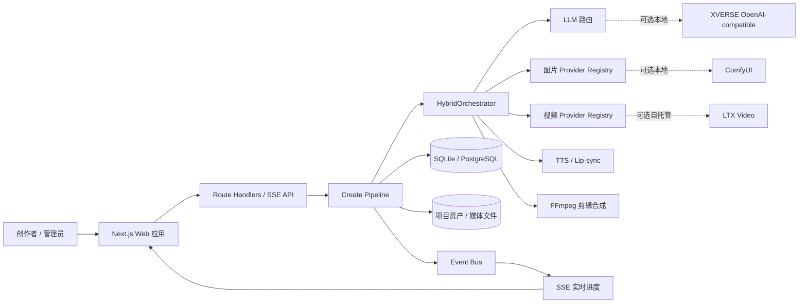
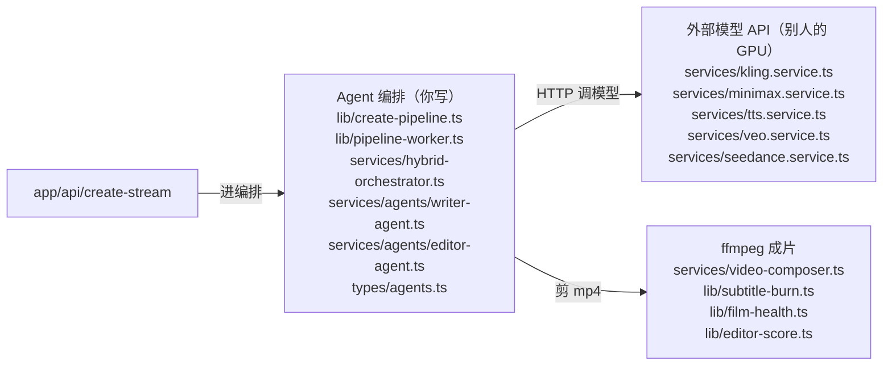
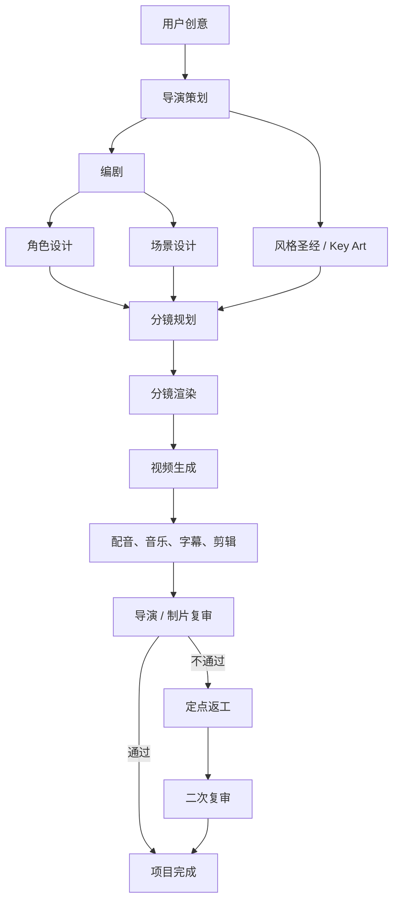
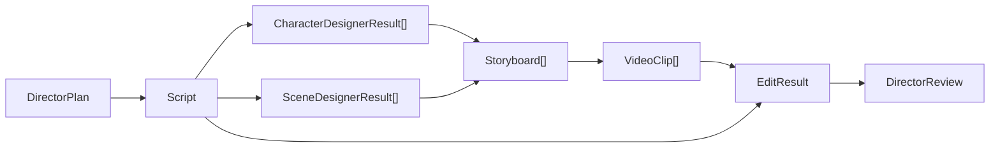

# Wind Comic 项目解析总览

> 面向对象：需要接手项目的后端 / AI 工程师，以及需要用它准备项目面试的人。熟悉 FastAPI / Python 的读者可先读第 6 节，把本仓库的目录对上「浏览器、Nginx、uvicorn、FastAPI、数据库、Agent、模型、ffmpeg」。
>
> 分析口径：以当前仓库代码为准，明确区分“已经实现”“配置后可用”“仅适合作为生产化改进”。

## 1. 一句话定义

Wind Comic（界面品牌名“青枫漫剧”）是一个基于 Next.js 的 AI 漫剧生产平台：用户输入故事创意，系统把它拆成导演策划、剧本、角色与场景设定、分镜、图片、视频、配音、剪辑和导演复审等阶段，最终输出可播放的短剧成片。

它的核心不是普通 CRUD，也不是 LangGraph 式自治 Agent 网络，而是：

**一个以 `HybridOrchestrator` 为领域总控、以结构化资产为阶段契约、以多模型 Provider 为执行能力、支持断点续跑和 SSE 进度反馈的确定性 AI 媒体流水线。**

## 2. 先回答：它是不是“全本地”

答案是：**应用与数据可以本地运行，但默认的 AI 推理并非全本地。**

| 层次 | 默认状态 | 是否可本地 |
|---|---|---|
| Next.js 应用 | Docker / Node 本地运行 | 是 |
| SQLite 数据库 | `data/qfmj.db` | 是 |
| 项目资产与缓存 | `data/` 等本地目录 | 是 |
| FFmpeg 合成 | 容器内执行 | 是 |
| LLM | OpenAI 兼容网关 / OpenRouter / MiniMax | 默认外部；可接本地 XVERSE |
| 图片生成 | GPT Image、Gemini、Midjourney、MiniMax 等 | 默认外部；可接 ComfyUI |
| 视频生成 | MiniMax、Vidu、Kling、Veo、LTX 等 | 多数外部；LTX 可自托管 |
| TTS | MiniMax / VectorEngine 等 | 默认外部；Mock 仅测试 |
| 对口型 | 外部服务、本地 HTTP 服务或 local-2d | 部分可本地 |
| Mock 引擎 | `MOCK_ENGINES=1` | 全本地，但只适合测试 |

因此，Docker 把应用跑在本机，不等于模型也在本机。完全离线需要为 LLM、图片、视频、TTS、对口型逐项配置本地 Provider；当前仓库没有提供一套开箱即用、生产质量的“全模型本地化”组合。

### 2.1 关键术语：ComfyUI、ControlNet 与 TTS

表中两个词经常被误读成“又一个云厂商”。它们在本项目中的口径如下。

**ComfyUI** 不是一个模型，而是可本地部署的开源图片工作流引擎（常见底座是 Stable Diffusion / FLUX）。本机加载模型后，通过 HTTP（默认 `8188`）按节点图出图。Wind Comic 把它当作图片层的可选本地出口：未开启时走 GPT Image、Gemini、Midjourney、MiniMax 等云端 Provider；开启后由 `services/comfyui.service.ts` 把角色图、场景图、分镜图请求转到本机。项目里主要用它做两件事：IP-Adapter 保持角色跨镜头一致；可选 ControlNet（Canny）按分镜草图硬锁构图。仓库只提供接入代码，不把 ComfyUI 和模型打进 Docker，需要 GPU 与自行部署。失败时默认可回落云端。

**ControlNet** 是挂在扩散模型（Stable Diffusion / FLUX 等）旁边的辅助网络：先给一张参考图，用预处理器抽出纯粹的空间条件（边缘、姿态、深度等），再把这张条件图注入生成过程，让出图按期望的构图、姿态或结构走，而不是只听文字 Prompt 的随机发挥。论文是 *Adding Conditional Control to Text-to-Image Diffusion Models*。本仓库的通俗解释采用 Rocky Ding 的专栏文章：[深入浅出完整解析 ControlNet 核心基础知识](https://zhuanlan.zhihu.com/p/660924126)。

按该文的用法：参考图 → 预处理器（Preprocessor）→ 条件图像（Conditioning Image）→ ControlNet 注入底模型，并与文本 Prompt（可选还有图生图）一起做扩散。括号里的 **Canny** 属于边缘/线条类条件——用 Canny 边缘检测把分镜草图抽成线稿，再用这些线条锁构图、机位和主体位置；颜色、细节和画风仍由 Prompt 决定。可以把它想成“描线填色”：草图再糙，只要大轮廓对，正式图也可以画得很完整，但人还站在画面左边、镜头还是俯拍。短剧里这很关键，因为后面视频往往拿分镜图当首帧，构图一漂，角色位置和镜头语言就对不上。

结构上，该文把 ControlNet 拆成三块：**锁定副本**（冻结底模型权重，保住从海量图里学来的画图能力）、**可训练副本**（专门学空间条件）、**零卷积（zero convolution）**（1×1 卷积，权重偏置从 0 起步，训练初期不打扰底模型）。这解释了为什么可以在不大的数据集上学会“按线稿出图”，却不把原来的文生图能力毁掉。

它和把草图当普通参考图不是一回事。多数云端引擎只能做**软参考**（把草图塞进参考图通道，口头说“请跟构图”，模型可以不听）；ControlNet 是**硬锁**（边缘位置更难被改掉）。它也和 **IP-Adapter** 不要混：IP-Adapter 锁的是“这人长什么样”（脸、服装、身份）；ControlNet 锁的是“人站在画面哪里、镜头怎么取”（空间布局）。同一篇文章把 IP-Adapter 列为另一路条件，可与 ControlNet 叠加，而不是互相替代。

这是可选预备能力，不是默认路径：需要自托管 ComfyUI，并配置 `COMFYUI_ENABLED` 与 `COMFYUI_CONTROLNET_MODEL`。有草图时优先走 Canny ControlNet，失败再回落 IP-Adapter / 云端引擎；没配时行为与升级前一致，草图只当普通参考图。代码入口：`lib/storyboard-sketch.ts`、`services/comfyui.service.ts` 的 `buildControlNetWorkflow`。细节见 [02 图片 Provider](./02_AI服务与Provider路由机制.md)。

**TTS** 是 Text-To-Speech（文本转语音）：把剧本对白合成角色说话的音频。它不是 LLM（LLM 写出对白），也不是对口型（Lip-sync 让嘴型跟上这段声音）。流水线在 Editor 阶段按角色音色、对白、情绪和镜头时长调用 TTS，输出音轨后再交给混音、字幕和对口型。默认走 MiniMax / VectorEngine 等外部服务；`MOCK_ENGINES=1` 只生成测试占位音频。镜头若已有可用原生对白（native audio），应跳过重复 TTS，避免盖掉原声。代码入口：`lib/tts-providers/`。

相邻能力不要混用：

| 能力 | 做什么 |
|---|---|
| LLM | 写出对白和结构化策划 |
| ComfyUI / 云端图片 Provider | 画出角色、场景、分镜图 |
| TTS | 把对白念成声音 |
| 对口型 | 让画面嘴型对齐 TTS 或原声音轨 |
| FFmpeg | 把画面、对白、BGM、字幕合成成片 |

更细的路由与媒体链路见 [02_AI服务与Provider路由机制.md](./02_AI服务与Provider路由机制.md) 和 [12_图片视频音频FFmpeg与存储链路深度解析.md](./12_图片视频音频FFmpeg与存储链路深度解析.md)；本地接线见 [14_Docker部署全本地配置与故障排查手册.md](./14_Docker部署全本地配置与故障排查手册.md)。

## 3. 系统上下文



## 4. 技术栈速查

| 领域 | 主要实现 |
|---|---|
| Web 全栈框架 | Next.js 16、React 19、TypeScript |
| API | Next.js Route Handlers，创建流程使用 SSE |
| 数据库 | 默认 better-sqlite3；可切 PostgreSQL |
| AI SDK | OpenAI-compatible client + 各媒体服务适配器 |
| 编排 | `HybridOrchestrator` + `runCreatePipeline` |
| 可配置工作流 | 自研 DAG、拓扑排序、分层并发执行 |
| 媒体处理 | FFmpeg / ffprobe |
| 协作 | WebSocket / Yjs、评论和项目协作者模型 |
| 认证 | JWT + HttpOnly Cookie，也支持 Bearer Token |
| 容器 | Node 20 Alpine、多阶段 Docker 构建、非 root 用户 |
| 观测与成本 | 阶段计时、质量报告、成本日志、预算护栏、可选 Sentry |

## 5. 核心目录地图

```text
wind-comic/
├─ app/
│  ├─ api/                         # 认证、项目、创建、工作流等 HTTP API
│  └─ workflow-studio/             # 可视化 DAG 工作流界面
├─ lib/
│  ├─ create-pipeline.ts           # “一句话到成片”的应用服务主链
│  ├─ pipeline-worker.ts           # 可选后台任务 Worker
│  ├─ pipeline-checkpoints.ts      # 断点资产恢复
│  ├─ workflow-engine.ts           # DAG 执行器
│  ├─ agent-workflow-core.ts       # 节点类型、校验、拓扑分层
│  ├─ image-providers/             # 图片 Provider 注册与选择
│  ├─ video-providers/             # 视频 Provider 注册与选择
│  ├─ tts-providers/               # TTS Provider 注册与选择
│  ├─ repos/                       # 数据访问仓储
│  └─ db*.ts                       # SQLite / PostgreSQL 驱动与方言
├─ services/
│  ├─ hybrid-orchestrator.ts       # AI 制片总控，核心领域逻辑
│  ├─ agents/                      # 已拆出的 Writer / Editor Agent
│  └─ video-composer.ts            # FFmpeg 成片合成
├─ types/agents.ts                 # Agent、剧本、资产等结构定义
├─ data/                           # 默认本地数据库和生成资产
├─ Dockerfile
└─ docker-compose.pg.yml           # PostgreSQL 服务，不是完整应用编排
```

## 6. 从 FastAPI 视角对照仓库（请求流与目录）

本节把「静态页面 + JSON 接口」的心智模型落到本仓库路径上。Wind Comic **没有** FastAPI / uvicorn 包：页面和 `/api` 都在同一个 Next.js / Node 进程里。图上的 FastAPI ≈ `app/api/**/route.ts`，uvicorn ≈ `npm run start`（Node 跑 Next）。

静态资源和接口数据在哪里合并：**是客户端浏览器，不是 Nginx。** Nginx 只按路径把两类请求分别送到两个地方；它既不执行 React，也不把 JSON 填进页面。

### 6.1 这个仓库没有 FastAPI / uvicorn 文件夹

| 图上的格子 | 本仓库位置 | 先打开这些文件 | FastAPI 项目里相当于 |
|---|---|---|---|
| 客户端浏览器 | 不在仓库里（用户电脑） | 打开 localhost 后跑的是 `next build` 产物 | 浏览器 |
| Nginx | 常省略。Docker / 云前面可加 | `Dockerfile` · `docs/DEPLOYMENT.md` | Nginx / Caddy |
| 前端页面（第 1 趟） | `app/**/page.tsx` · `components/` · `hooks/` · `public/` | `app/create/page.tsx` · `app/auth/page.tsx` · `components/project/` | `frontend/src/` |
| Node ≈ uvicorn | `package.json` 的 start 脚本 | `next start`；没有 uvicorn 包 | `uvicorn main:app` |
| 接口 ≈ FastAPI | `app/api/**/route.ts` | `app/api/create-stream/route.ts` · `app/api/auth/login/route.ts` | `app/routers/*.py` |
| 数据库 | `lib/db.ts` · `lib/repos/` · `db/schema.pg.sql` · `data/` | `lib/db.ts`（建表）· `lib/repos/user-repo.ts` · `data/qfmj.db` | `models.py` · alembic |
| Agent 编排 | `lib/create-pipeline.ts` · `services/hybrid-orchestrator.ts` · `services/agents/` | `create-pipeline.ts` · `writer-agent.ts` · `editor-agent.ts` | `app/agents/` 或 `services/` |
| 外部模型 API | `services/*.service.ts` | `kling.service.ts` · `minimax.service.ts` · `tts.service.ts` · `veo.service.ts` | 调 OpenAI SDK 的 client 文件 |
| ffmpeg | `services/video-composer.ts` · `lib/subtitle-burn.ts` | `video-composer.ts` | `subprocess` 调 ffmpeg |

后端没有搬到浏览器，只是原来混在「后端服务」里的职责拆成了四格：听端口、写接口、查库、跑 Agent。登录和 CRUD 仍在接口 + 数据库；Agent 是从接口里长出来的业务。OpenAI / Kling 从来不是你的后端，是你的后端去访问的别人家的 API。

| 原来混在「后端」里的职责 | 现在图上的位置 | 还算不算你的后端 |
|---|---|---|
| 打开端口、接 HTTP | uvicorn / `next start` | 后端进程，不是你写的业务代码 |
| 登录、建项目、鉴权、返回 JSON | FastAPI / `app/api` | 是。传统后端还在这里 |
| users / projects 表 | 数据库 | 是。表结构仍在后端仓库 |
| Writer → 分镜 → 成片 这种流程 | Agent 编排 | 是。仍是你仓库里的 TypeScript |
| 剪 mp4、烧字幕 | ffmpeg（你的机器上） | 是后端侧调用的本地程序 |
| 真正算文本 / 出视频 | 外部模型 API | 不是。别人的 GPU，你只发 HTTP |
| 页面、按钮、合并 JSON | 浏览器 React | 不是后端。从来都在前端 |
| HTTPS、分流 `/` 和 `/api` | Nginx | 网关，不是业务后端 |

### 6.2 两趟请求：程序和数据分开拿，浏览器合并

```mermaid
flowchart TB
  subgraph trip1["第 1 趟 · 拿程序"]
    B1["客户端浏览器<br/>不在仓库；跑 next build 产物<br/>打开 /create /auth"] -->|GET /| N1["Nginx（常省略）<br/>Dockerfile · docs/DEPLOYMENT.md<br/>单机由 next start 兼做"]
    N1 -->|取页面 JS| F1["前端页面<br/>app/create/page.tsx<br/>app/auth/page.tsx<br/>app/dashboard/page.tsx<br/>components/ · hooks/ · public/"]
    F1 -.->|文件返回| N1
    N1 -.->|浏览器执行 React| B1
  end

  subgraph trip2["第 2 趟 · 拿 JSON · 虚线框 = 你的后端"]
    B2["浏览器里的 React<br/>hooks/useProjects.ts<br/>hooks/useSettings.ts<br/>fetch /api/create-stream<br/>EventSource SSE"] -->|POST /api| N2["Nginx / 同域 /api<br/>单机：Node 自己接"]
    N2 --> UV["Node ≈ uvicorn<br/>package.json<br/>next start / npm run dev"]
    UV -->|进 route.ts| API["接口 ≈ FastAPI<br/>app/api/create-stream/route.ts<br/>app/api/auth/login/route.ts<br/>app/api/projects/[id]/route.ts"]
    API -->|SQL| DB["数据库<br/>lib/db.ts<br/>lib/repos/user-repo.ts<br/>lib/repos/project-repo.ts<br/>lib/repos/asset-repo.ts<br/>data/qfmj.db · db/schema.pg.sql"]
    DB -.->|行数据| API
    API -.->|JSON / SSE 回浏览器合并渲染| B2
  end
```



| 趟 | 浏览器要什么 | 谁给 | 回到浏览器后是什么 |
|---|---|---|---|
| 第 1 趟 | 网站程序 | 前端服务器（经 Nginx；本仓库常由 Next 兼做） | HTML + JS + CSS。React 开始跑，列表还是空的 |
| 第 2 趟 | 业务数据 | 接口层（经 Nginx → Node） | JSON，例如 `{"projects": [...]}`。还不是画面 |
| 合并 | 把数据和程序接到一起 | **浏览器里的 React，不是 Nginx** | 组件读取 JSON，画出列表、按钮、文案 |

Nginx 把每一次请求当成独立快递：这次送 JS 文件，下次送 JSON 包，两次之间不记得、不解析、不拼页面。拼页面需要「已经加载的 React 程序」在内存里等着 JSON——这段程序只活在用户电脑的浏览器进程里。对应代码就是前端里的 `const data = await fetch("/api/projects")`，然后 `setProjects(data)`。那一行跑在浏览器，不跑在 Nginx，也不跑在 FastAPI / `route.ts`。

开发时通常还没有 Nginx：`next dev` 代替远端前端服务器，接口也在同一 Node 进程。浏览器仍是合并地点。生产拆栈时才是 Nginx 分流 `/` 与 `/api`。

### 6.3 每一跳在做什么

| 组件 | 类别 | 这一跳做什么 | 不做什么 |
|---|---|---|---|
| 客户端浏览器 | 合并发生地 | 执行 JS、发第二趟 API、把 JSON 填进组件并画 UI | 不直接连数据库 |
| Nginx | 入口 | 证书、域名、按路径分流，响应原路送回 | 不执行 React，不合并 JSON 和 HTML |
| 远端前端服务器 / Next 页面 | 静态资源 | 提供 build 后的 HTML / JS / CSS | 不处理业务 JSON（本仓库同进程时例外） |
| uvicorn / `next start` | 进程 | 监听端口，把 HTTP 交给应用 | 不提供页面模板合并 |
| FastAPI / `app/api` | 应用 | 查库、算业务、返回 JSON / SSE | 不把 JSON 画成按钮 |
| 数据库 | 存储 | 存表、返回行 | 不管页面长什么样 |

**uvicorn 和 React 不像。** 容易混是因为两边都「让一份你写的代码跑起来」，但层次不同：

| 角色 | 客户端 | 服务端 |
|---|---|---|
| 你写的应用（业务） | React 组件 | FastAPI 路由 / `route.ts` |
| 真正执行这份应用的环境 | 浏览器（JS 引擎） | uvicorn / Node（听端口的进程） |
| 它产出什么 | 屏幕上的 DOM / 画面 | HTTP 响应（通常是 JSON） |
| 它管不管界面 | 管 | 不管 |

若硬要找「像 React 的那一个」，应该是 **FastAPI / `app/api`**，不是 uvicorn。React 描述「页面长什么样」；FastAPI 描述「哪个 URL 返回什么数据」。uvicorn 更接近「让 FastAPI 能被网络访问」，类似浏览器让 React 能跑，而不是 React 本身。一次请求里 uvicorn 做三步：从 Nginx 接下 TCP/HTTP；按 ASGI（本仓库是 Node 调 Route Handler）调用 `app`；把 JSON 写回 Nginx。全程不碰 React。

### 6.4 Agent / 模型 / ffmpeg：从 create-stream 再往下



Agent 开发和 AI 服务端都不在 Nginx，也不在 uvicorn。入口是接口层（FastAPI / `app/api`），核心代码是它下面的 Agent 编排。模型（GPT、Kling）和 ffmpeg 是你调用的外部程序，通常不是你从零实现。

| 你听到的说法 | 图上的节点 | 你实际在写什么 | 常用框架 / 服务 |
|---|---|---|---|
| AI 服务端 | FastAPI + uvicorn / `app/api` + Node | HTTP 路由、鉴权、存项目、返回 JSON / SSE 进度 | FastAPI · pydantic · SQLAlchemy · uvicorn；本仓库是 Next Route Handlers |
| Agent 开发 | Agent 编排（接口内部） | 系统提示词、工具（查库/出图）、多步循环、失败重试、把结果写回数据库 | 自研循环 · LangGraph · OpenAI Agents SDK；本仓库是 `HybridOrchestrator` |
| 调大模型 | 外部模型 API | SDK 调用、拼 prompt、解析 JSON。不训练模型 | OpenAI / Anthropic / DeepSeek API |
| 出图出视频 | 外部模型 API | 提交任务、轮询、下载 mp4/png | Kling · Seedance · Veo · Midjourney HTTP API |
| 成片剪辑 | ffmpeg / 本地 GPU | 拼片段、字幕、音轨。ffmpeg 本身是 C 程序 | ffmpeg-python / subprocess；本仓库 `video-composer.ts` |
| 本地推理（可选） | 与 ffmpeg 同一侧 | 一般不写内核，只起服务再 HTTP 调用 | vLLM · Ollama · TensorRT-LLM |
| 长任务排队（可选） | 挂在接口之后 | 生成要几分钟时先返回 jobId，Worker 后台跑 Agent | Redis + Celery / arq；本仓库 `PIPELINE_QUEUE=1` + `pipeline-worker.ts` |
| Agent 界面 | 浏览器里的 React | 输入框、进度条、SSE。不写 prompt 循环 | React · EventSource · fetch |

不要把训练模型和 Agent 开发当成同一件事。训练 / 微调大模型才是 GPU 上的机器学习岗（PyTorch、CUDA）。这里说的 Agent / AI 服务端是编排器：写代码去调已经训练好的模型。和这个短剧平台是同一类工作。

### 6.5 `lib/` 被 Agent 调用的四环零件

`lib/pipeline-stages.ts` 只定义四环名字和状态，真正干活的是下面这些纯逻辑文件。

| 环节 | 主要文件 |
|---|---|
| 剧本 | `lib/script-parser.ts` · `lib/mckee-skill.ts` · `lib/idea-normalizer.ts` · `lib/drama-tropes.ts` |
| 角色 / 场景 | `lib/character-studio.ts` · `lib/character-dna.ts` · `lib/style-bible.ts` · `lib/scene-enrich.ts` · `lib/locked-characters.ts` |
| 分镜 | `lib/vision-audit.ts` · `lib/pull-sheet.ts` · `lib/storyboard-sketch.ts` · `lib/heal-shots.ts` |
| 成片质检 | `lib/oneclick-film.ts` · `lib/quality-gate.ts` · `lib/pacing-audit.ts` · `lib/editor-score.ts` · `lib/film-health.ts` · `lib/subtitle-burn.ts` |
| 环节地图本身 | `lib/pipeline-stages.ts` |

### 6.6 点「生成短剧」会经过哪些文件

从左到右：

`app/create/page.tsx` → `app/api/create-stream/route.ts` → `lib/pipeline-worker.ts` + `lib/create-pipeline.ts` → `services/hybrid-orchestrator.ts` → `writer-agent.ts` / `lib/mckee-skill.ts` → `kling.service.ts` · `minimax.service.ts` → `video-composer.ts` → SSE 回 create 页。

贯穿全程：类型契约 `types/agents.ts`；落库 `lib/repos/asset-repo.ts` · `project-repo.ts`；四环状态 `lib/pipeline-stages.ts`。

| 顺序 | 图上节点 | 文件 | 干什么 |
|---|---|---|---|
| 1 | React | `app/create/page.tsx` · `hooks/` | 用户点生成，`fetch /api/create-stream` |
| 2 | Node 接口 | `app/api/create-stream/route.ts` | 收请求，相当于 `@app.post` |
| 3 | 队列 / 工人 | `lib/pipeline-worker.ts` · `lib/create-pipeline.ts` | 后台跑整条流水线 |
| 4 | Agent | `services/hybrid-orchestrator.ts` | `runDirector` / `runWriter` / 分镜 / `runEditor` |
| 5 | 编剧 Agent | `services/agents/writer-agent.ts` · `lib/mckee-skill.ts` · `lib/script-parser.ts` | 写剧本 |
| 6 | 剪辑 Agent | `services/agents/editor-agent.ts` | 成片策略 |
| 7 | 类型契约 | `types/agents.ts` | Script / Character / Storyboard 结构 |
| 8 | 落库 | `lib/repos/asset-repo.ts` · `lib/repos/project-repo.ts` · `lib/db.ts` | 存剧本、角色、镜头 |
| 9 | 出图出视频 | `services/kling.service.ts` · `minimax.service.ts` · `seedance.service.ts` | 调别人 GPU |
| 10 | 成片 | `services/video-composer.ts` | ffmpeg 拼接 mp4 |
| 11 | 回到 React | create 页收 SSE | 进度条、镜头缩略图更新 |

一次生成在节点上怎么走：React 点生成 → Nginx（或同域 Node）→ 接口建任务并落库 → Agent 编排按 Writer → 角色 → 分镜 → 成片逐步 `await` 外部 API → 需要时喊 ffmpeg → 状态写数据库 → SSE/JSON 回到浏览器，React 更新进度。你写的是路由 + Agent 步骤；Kling 和 GPT 是别人的服务。

### 6.7 先不要当主流程看的目录

| 路径 | 实际是什么 |
|---|---|
| `.agents/` | 给 AI 助手做宣传片的说明书，不是短剧引擎 |
| `tests/` · `e2e/` | 单测和端到端测试 |
| `docs/` | 文档；`DEPLOYMENT.md` 才和上线有关 |
| `skills/` | 提示词 / 技能文案，不是 Next 路由 |
| `videos/` | 宣传片成品 |

更细的成片阶段见 [05_一句话到成片完整调用链.md](./05_一句话到成片完整调用链.md)；Agent 岗位见第 8 节与 [03_Agent体系与HybridOrchestrator编排.md](./03_Agent体系与HybridOrchestrator编排.md)。

## 7. 两层“编排”不要混淆

项目中有两套互补但不同的编排概念。

### 7.1 固定生产主链

`lib/create-pipeline.ts` 调用 `HybridOrchestrator`，负责真正的完整成片流程、持久化、恢复、SSE 事件和人工关卡。



### 7.2 可配置 DAG 工作流

`agent-workflow-core.ts`、`workflow-engine.ts` 和 Workflow Studio 提供可视化节点编排。它支持依赖校验、环检测、拓扑分层、同层并发、失败中止或继续，以及 dry-run / real-run。

它不是主生产链的完全替代品：真实成片流程仍以 `runCreatePipeline` 为最完整实现；DAG 更适合流程实验、能力组合和工作流演示。

## 8. Agent 的真实含义

仓库定义了八种岗位角色：

1. Director：生成整体制作方案并在末尾审核。
2. Writer：把方案写成结构化剧本。
3. Character Designer：生成角色视觉设定和参考图。
4. Scene Designer：生成场景视觉设定。
5. Storyboard：规划并渲染镜头分镜。
6. Video Producer：按镜头生成视频片段。
7. Editor：完成配音、音乐、字幕、转场与合成。
8. Producer：代表最终质量确认语义。

这些 Agent 的通信方式不是自由对话，而是上游返回结构化对象，下游消费对象；共享上下文由 orchestrator 内存状态和项目资产承担。



## 9. 后端的关键职责

后端并不只是把请求转发给大模型，它承担了六类关键职责：

- 身份与租户边界：JWT、Cookie、项目 owner 校验。
- AI 任务治理：输入安全检查、预算预估、Provider 降级、超时与重试。
- 长任务执行：同步 SSE 或数据库任务队列 + Worker。
- 状态持久化：项目、资产、时间线、审查结果、成本和任务事件。
- 媒体工程：下载、转码、时长探测、字幕、音频混合和最终合成。
- 可恢复性：按资产类型恢复检查点，只补跑缺失镜头。

## 10. 关键运行模式

| 模式 | 开关 / 条件 | 特点 |
|---|---|---|
| 同请求 SSE | 默认 | HTTP 请求内执行流水线，事件直接写给浏览器 |
| 队列模式 | `PIPELINE_QUEUE=1` | 任务写数据库，进程内 Worker 异步认领，SSE 订阅事件 |
| SQLite | 默认 | 零配置、单机友好 |
| PostgreSQL | `DB_DRIVER=pg` + `DATABASE_URL` | 更适合多实例，但仍需审视任务和事件架构 |
| 真实模型 | 配置相应 API Key | 输出真实媒体并产生费用 |
| Mock 模式 | `MOCK_ENGINES=1` | 可重复、低成本、适合测试，不代表真实质量 |
| 人工关卡 | 创建参数启用 gates | 在剧本等阶段等待确认，再继续生产 |

## 11. 已实现能力与边界

### 已实现

- 从创意到成片的端到端流水线。
- 多 LLM / 图片 / 视频 / TTS Provider 路由。
- SSE 进度事件、心跳和阶段耗时。
- 数据库任务队列、重试、死信、孤儿任务恢复。
- 资产级检查点与缺失镜头补跑。
- 导演审核、自动返工和二次复审。
- SQLite / PostgreSQL 双驱动抽象。
- 预算前置拦截、真实成本归因、内容安全处理。
- 自研 DAG 工作流与可视化工作室。

### 不应夸大

- 不是开箱即用的全本地 AI 系统。
- 不是基于 LangGraph 的自治、多轮协商式 Multi-Agent。
- 队列 Worker 默认仍在 Web 进程内，不等于独立分布式任务平台。
- EventEmitter 只覆盖单进程；多实例实时事件需要额外桥接能力。
- Provider 多不代表任意 Provider 都具备完全相同的能力与输出质量。
- 规则安全检查不等于完整内容审核系统。

## 12. 文档体系与推荐阅读顺序

整套资料分三层：

- 第 0 层：本文第 6 节，给 FastAPI / Python 背景读者把目录对上请求流。
- 第一层：00–07，建立主架构、完整成片链路和面试口径。
- 第二层：08–12，下钻业务、API、数据库、Agent 字段和媒体工程。
- 第三层：13–15，集中处理问题、部署排障和测试验收。

### 第 0 层：对照地图

0. 本文 [第 6 节：从 FastAPI 视角对照仓库](#6-从-fastapi-视角对照仓库请求流与目录)

### 第一层：架构主线

1. [01_后端架构与数据层深度解析.md](./01_后端架构与数据层深度解析.md)
2. [02_AI服务与Provider路由机制.md](./02_AI服务与Provider路由机制.md)
3. [03_Agent体系与HybridOrchestrator编排.md](./03_Agent体系与HybridOrchestrator编排.md)
4. [04_可配置DAG工作流引擎解析.md](./04_可配置DAG工作流引擎解析.md)
5. [05_一句话到成片完整调用链.md](./05_一句话到成片完整调用链.md)
6. [06_可靠性安全成本与生产化边界.md](./06_可靠性安全成本与生产化边界.md)
7. [07_WindComic完整面试问答.md](./07_WindComic完整面试问答.md)

### 第二层：源码级细节

8. [08_业务域产品流程与商业逻辑深度解析.md](./08_业务域产品流程与商业逻辑深度解析.md)
9. [09_API接口认证权限与SSE协议详细参考.md](./09_API接口认证权限与SSE协议详细参考.md)
10. [10_数据库表结构资产版本与状态机源码级解析.md](./10_数据库表结构资产版本与状态机源码级解析.md)
11. [11_Agent数据契约Prompt上下文与返工机制源码级解析.md](./11_Agent数据契约Prompt上下文与返工机制源码级解析.md)
12. [12_图片视频音频FFmpeg与存储链路深度解析.md](./12_图片视频音频FFmpeg与存储链路深度解析.md)

### 第三层：问题与落地

13. [13_已知问题技术债风险清单与改进方案.md](./13_已知问题技术债风险清单与改进方案.md)
14. [14_Docker部署全本地配置与故障排查手册.md](./14_Docker部署全本地配置与故障排查手册.md)
15. [15_测试体系质量门禁与验收用例详细解析.md](./15_测试体系质量门禁与验收用例详细解析.md)

## 13. 30 秒项目介绍

> Wind Comic 是一个 AI 漫剧生产平台。后端采用 Next.js Route Handlers，默认 SQLite、可切 PostgreSQL；核心由 `runCreatePipeline` 和 `HybridOrchestrator` 组成，把导演、编剧、角色场景、分镜、视频、配音剪辑和复审串成一条可恢复的媒体流水线。系统通过 Provider Registry 接入多种模型，具备超时降级、预算拦截、成本归因、检查点续跑和 SSE 进度反馈。它把每个 Agent 设计成有明确输入输出契约的岗位节点，而不是自由聊天式自治 Agent，从而更适合高成本、长耗时、需要可追踪和定点返工的 AI 视频生产。

## 14. 代码入口

- 创建接口：[`app/api/create-stream/route.ts`](../app/api/create-stream/route.ts)
- 应用流水线：[`lib/create-pipeline.ts`](../lib/create-pipeline.ts)
- 核心总控：[`services/hybrid-orchestrator.ts`](../services/hybrid-orchestrator.ts)
- Agent 类型：[`types/agents.ts`](../types/agents.ts)
- DAG 引擎：[`lib/workflow-engine.ts`](../lib/workflow-engine.ts)
- 数据库驱动：[`lib/db-driver.ts`](../lib/db-driver.ts)
- Docker 构建：[`Dockerfile`](../Dockerfile)

---

本文是全套文档的导航与统一口径；实现细节以对应专题和仓库代码为准。
