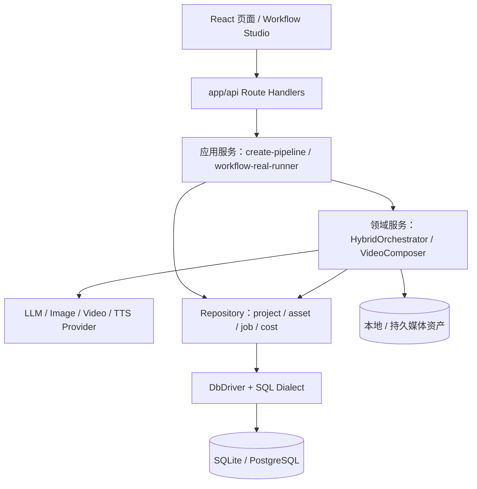
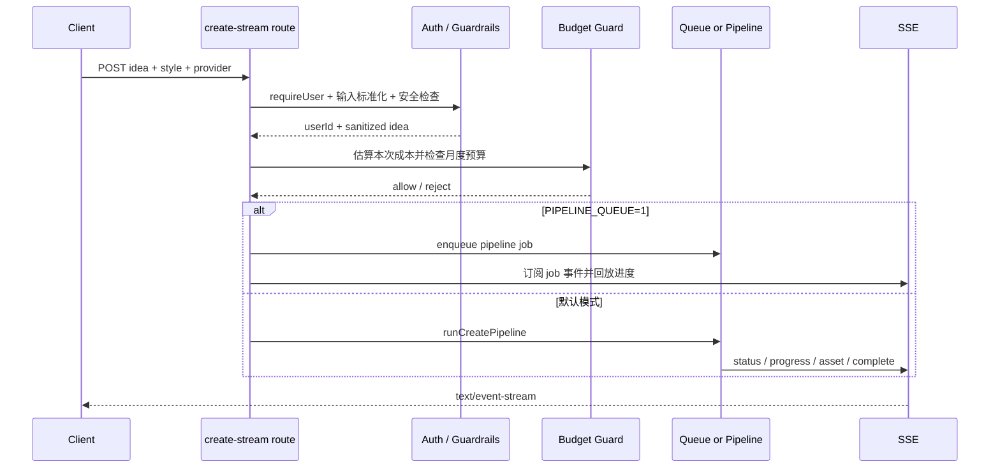
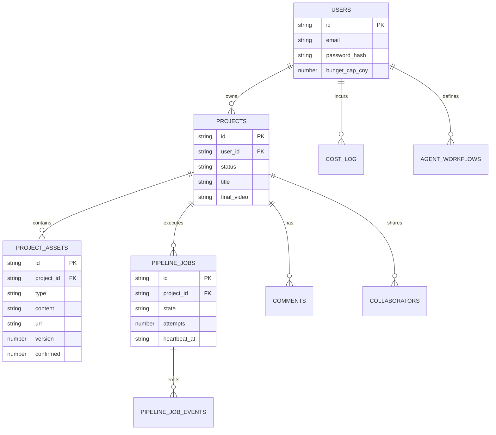
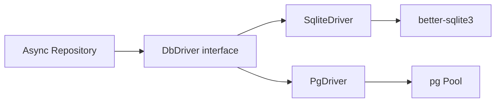
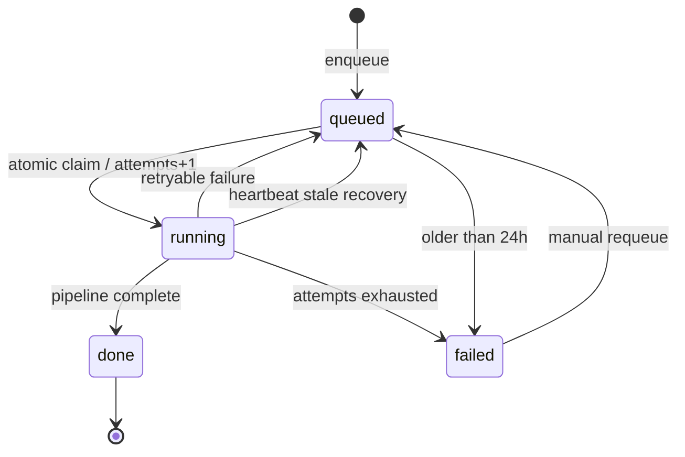
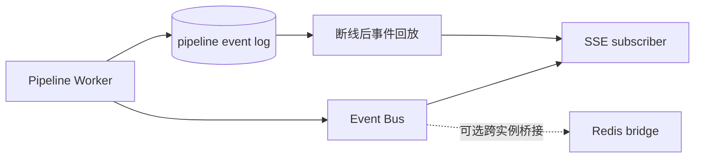
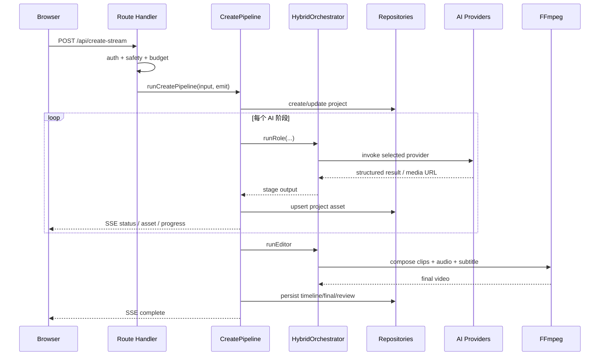
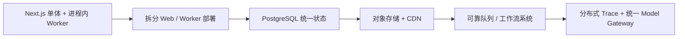

# Wind Comic 后端架构与数据层深度解析

## 1. 后端形态

Wind Comic 是一个 Next.js 全栈单体应用。后端入口不是单独的 Java / Python 服务，而是 `app/api/**/route.ts` 中的 Route Handlers。业务逻辑继续下沉到 `lib/`、`services/` 和 `lib/repos/`。

这种结构对当前项目有三个直接收益：

- 前端、认证、SSE 和业务类型共享一套 TypeScript。
- 单容器即可部署，适合个人或小团队快速迭代。
- 媒体流水线能直接调用本地文件、SQLite 和 FFmpeg。

代价是 Web 请求、后台任务和重型媒体处理默认处于同一 Node 进程，需要特别控制并发、内存、任务恢复和扩容方式。

## 2. 分层模型



### 各层职责

| 层 | 典型文件 | 职责 |
|---|---|---|
| 接口层 | `app/api/create-stream/route.ts` | 鉴权、参数校验、预算、安全、SSE 协议 |
| 应用层 | `lib/create-pipeline.ts` | 串联用例、保存阶段资产、恢复、发事件 |
| 领域层 | `services/hybrid-orchestrator.ts` | 生成策略、岗位执行、上下文一致性、返工 |
| 基础设施层 | Provider、FFmpeg、Event Bus | 调模型、处理媒体、传输事件 |
| 持久层 | `lib/repos/*` | 读写项目、资产、任务、成本等数据 |
| 驱动层 | `lib/db-driver.ts` | 屏蔽 SQLite / PostgreSQL 差异 |

## 3. HTTP 与 SSE 创建入口

完整创作入口是 `POST /api/create-stream`。它不是收到请求后立即盲目调用模型，而是先做一系列后端治理：



关键点：

- 必须先登录，服务端从 Cookie 或 Bearer Token 恢复用户。
- 创意会经过规范化、过短输入判断、Prompt 安全检查和模板增强。
- 成本预算判断发生在昂贵模型调用之前。
- 默认在请求内执行；队列模式把任务写入数据库后由 Worker 处理。
- SSE 是进度视图，不应被当作唯一事实来源；资产和任务表才是可恢复状态。

## 4. 认证与身份边界

认证逻辑位于 `app/api/auth/lib.ts`，核心设计如下：

- JWT 默认有效期为 7 天。
- Cookie 名为 `qfmj-session`，使用 HttpOnly 和 SameSite=Lax。
- 请求同时携带 Bearer 和 Cookie 时，Bearer Token 优先。
- 生产环境要求强 `JWT_SECRET`，弱密钥会被拒绝。
- 登录返回体中也可返回 Token，便于非浏览器客户端调用。

后端访问项目时仍需要 owner / collaborator 约束。面试时不能只说“有 JWT 就安全”，因为 JWT 只解决“你是谁”，资源查询条件中的 `user_id` / owner 校验才解决“你能访问什么”。

## 5. 数据模型：项目资产是流水线的事实载体

数据库不只存账号和项目列表，还承担了 AI 流水线检查点的职责。



### 关键资产类型

| 资产 | 作用 |
|---|---|
| `plan` | 导演方案，决定风格、角色和场景 |
| `script` | 结构化剧本和镜头叙事依据 |
| `style_bible` / Key Art | 统一画风锚点 |
| `character` | 角色视觉定义、参考图和一致性信息 |
| `scene` | 场景视觉定义 |
| `storyboard` | 镜头计划与渲染图 |
| `video` | 单镜头视频片段 |
| `timeline` | 剪辑时间线 |
| `music` | 背景音乐资产 |
| `final_video` | 最终成片 |
| `quality_report` | 质量与降级事件记录 |

资产仓储支持 upsert、版本、确认状态、stale 标记和持久 URL。这样同一项目可以局部重生成，而不必每次从创意重新开始。

## 6. SQLite 与 PostgreSQL 双驱动

### 6.1 默认 SQLite

默认数据库是 `data/qfmj.db`，由 better-sqlite3 提供同步访问。优势是部署简单、事务直观、备份方便，非常适合单机 Docker 和演示环境。

### 6.2 可选 PostgreSQL

设置 `DB_DRIVER=pg` 或 `postgres`，并提供 `DATABASE_URL` 后，仓储可以通过 `PgDriver` 访问 PostgreSQL。`db/schema.pg.sql` 提供相应结构，`docker-compose.pg.yml` 只负责 PostgreSQL 服务。

### 6.3 抽象方式

```typescript
interface DbDriver {
  get<T>(sql: string, params?: unknown[]): Promise<T | undefined>;
  all<T>(sql: string, params?: unknown[]): Promise<T[]>;
  run(sql: string, params?: unknown[]): Promise<RunResult>;
  transaction<T>(fn: (tx: DbExecutor) => Promise<T>): Promise<T>;
}
```

SQLite 的同步调用被包装为 Promise；PostgreSQL 使用连接池并做占位符方言转换。业务仓储尽量只依赖 `DbDriver`。



### 6.4 迁移边界

双驱动并不表示整个历史代码天然数据库无关。仓库自身注释指出，早期存在大量 `db.prepare().get()` 同步调用，真正迁移的难点是把业务访问统一收口到异步 Repository，而不仅是换一份建表 SQL。评估 PostgreSQL 完成度时，应以真实调用路径测试为准。

## 7. 后台任务模型

设置 `PIPELINE_QUEUE=1` 后，创建请求先写入 `pipeline_jobs`。`instrumentation.ts` 在 Node runtime 启动 Worker；创建接口也可确保 Worker 已运行。

### 任务状态机



### 当前实现参数

- Tick 间隔：1.5 秒。
- 单进程最大活跃任务：2。
- 心跳间隔：15 秒。
- 运行心跳超过约 90 秒未更新：视为孤儿并重新入队。
- 最大尝试次数：3。
- 超过 24 小时未完成：标记失败。
- 事件日志有上限，防止任务行无限膨胀。
- 认领通过 `UPDATE ... WHERE state='queued'` 乐观条件避免双拿。

### 重要边界

这是一套“数据库持久任务 + 进程内轮询 Worker”，不是 BullMQ、Temporal 或独立消息队列集群。它解决了请求断开和进程重启后的大部分恢复问题，但 Web 与媒体任务仍共享部署单元；生产高并发时建议拆 Worker 服务。

## 8. Event Bus 与实时状态

事件总线至少承载评论、通知、流水线和人工关卡等频道。



单进程 EventEmitter 延迟低，但不能天然跨容器。多实例部署至少需要：

- 使用 PostgreSQL 共享任务状态；
- 为实时事件启用跨实例桥接；
- 保留数据库事件回放，避免只依赖瞬时 Pub/Sub；
- 保证同一任务的事件序号与幂等消费。

## 9. 事务、一致性与幂等

AI 媒体任务不能用一个长数据库事务包住，因为模型调用和视频生成可能持续数分钟。项目采用的是“阶段性提交 + 可重算”的最终一致性策略：

1. 每个阶段完成后立即保存资产。
2. 检查点从资产表重建上下文。
3. 恢复时只找缺失镜头或缺失阶段。
4. 任务认领和状态更新使用短事务 / 条件更新。
5. 外部模型调用失败时保留已完成结果。

这是 Saga 思想的简化实现：没有通用补偿框架，而是通过资产幂等、局部重生成和状态机完成恢复。

## 10. Docker 部署解析

Dockerfile 使用 Node 20 Alpine 多阶段构建，安装 FFmpeg 和 DejaVu 字体，以非 root `nextjs` 用户运行，并在 3100 端口提供健康检查。

容器部署时需持久化的重点不是镜像，而是：

- `/app/data` 中的 SQLite 与本地媒体；
- `.env` / Secret 中的 JWT 和 Provider Key；
- 如果使用 PostgreSQL，则数据库卷和连接信息；
- 如果最终 URL 指向容器本地文件，则要确保卷、反向代理和 URL 生命周期一致。

`docker-compose.pg.yml` 只提供 PostgreSQL，不代表一条命令会同时启动完整 Web 应用和所有 AI 模型。

## 11. 一次创建请求的后端时序



## 12. 后端优点与技术债

### 优点

- 流程状态与媒体资产显式持久化，适合昂贵的长任务。
- 单体结构降低早期部署和类型共享成本。
- Provider、Repository 和工作流引擎已经出现清晰抽象边界。
- 任务心跳、孤儿恢复、死信重投体现了真实生产问题意识。

### 技术债 / 风险

- `HybridOrchestrator` 文件非常大，领域策略、Provider 调用和媒体流程耦合较重。
- Web 与 Worker 默认同进程，资源隔离有限。
- SQLite 路径适合单机，不适合共享文件系统上的多副本写入。
- 双数据库支持需要持续清理直接依赖 better-sqlite3 的旧代码。
- 本地文件 URL、对象存储与 CDN 的最终一致性需要部署级约束。

## 13. 推荐的生产化演进



演进优先级建议：

1. 先把媒体文件迁到对象存储，避免容器本地状态。
2. 将创建 Worker 与 Web 进程分离，配置 CPU / 内存 / 并发上限。
3. 全面收口 Repository，完成 PostgreSQL 集成和并发测试。
4. 增加任务幂等键、Provider 请求 ID 和出站调用审计。
5. 规模继续增长后，再评估 Temporal / 队列系统，而不是过早重写。

## 14. 面试表达

> 这个项目后端最重要的设计不是接口数量，而是如何管理一个分钟级、会产生真实费用、会部分成功的 AI 媒体任务。我们没有用长事务，而是把每个阶段结果落成项目资产，用数据库任务状态机管理重试和孤儿恢复，用 SSE 做实时体验，用检查点做断点续跑。这让“浏览器断开”“模型超时”“只坏一个镜头”都不必推翻整条流水线。

## 15. 源码索引

- [`app/api/create-stream/route.ts`](../app/api/create-stream/route.ts)
- [`app/api/auth/lib.ts`](../app/api/auth/lib.ts)
- [`lib/create-pipeline.ts`](../lib/create-pipeline.ts)
- [`lib/pipeline-worker.ts`](../lib/pipeline-worker.ts)
- [`lib/repos/pipeline-job-repo.ts`](../lib/repos/pipeline-job-repo.ts)
- [`lib/pipeline-checkpoints.ts`](../lib/pipeline-checkpoints.ts)
- [`lib/event-bus.ts`](../lib/event-bus.ts)
- [`lib/db-driver.ts`](../lib/db-driver.ts)
- [`lib/db-dialect.ts`](../lib/db-dialect.ts)
- [`lib/db.ts`](../lib/db.ts)
- [`Dockerfile`](../Dockerfile)
