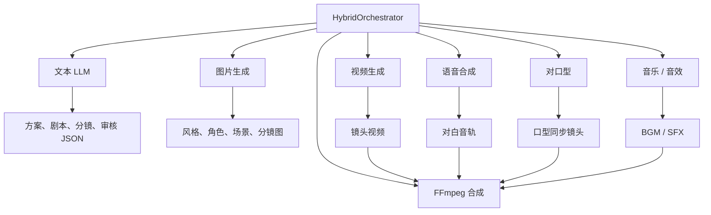
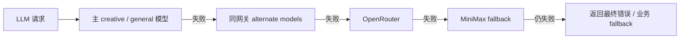
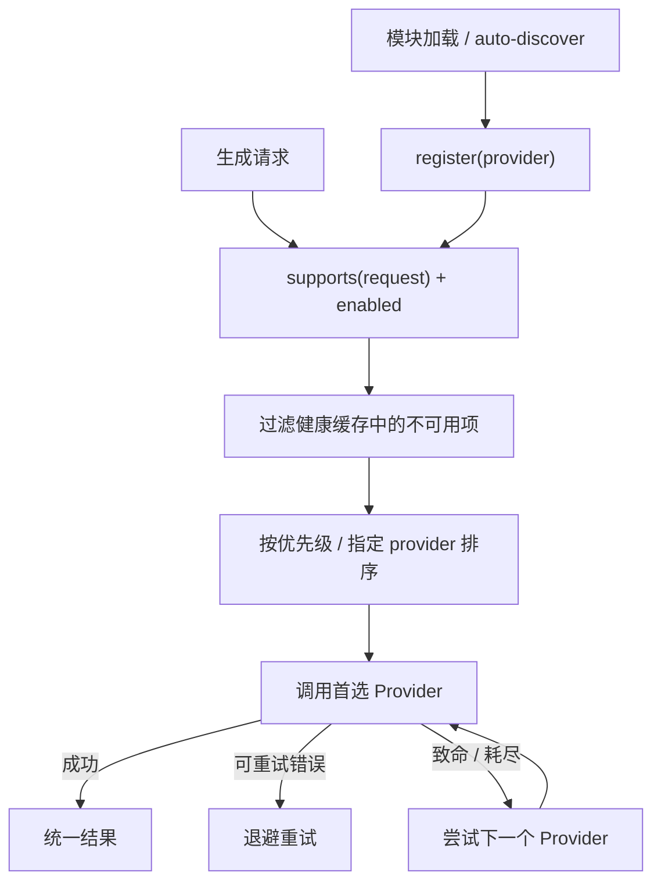
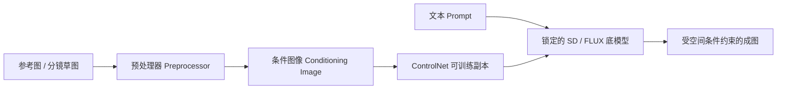
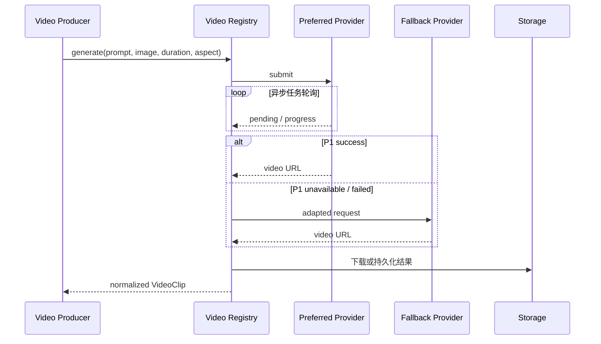
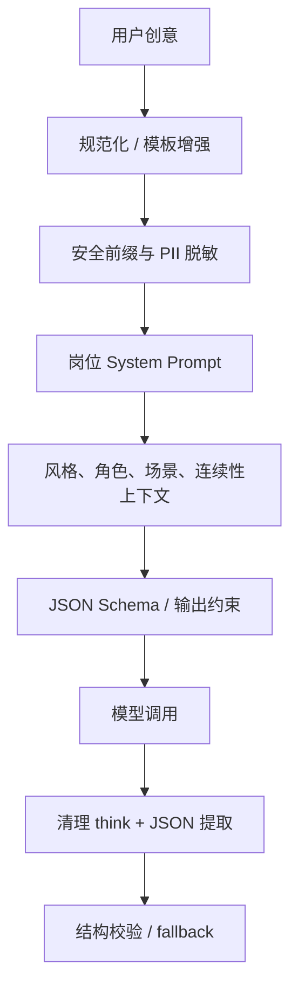
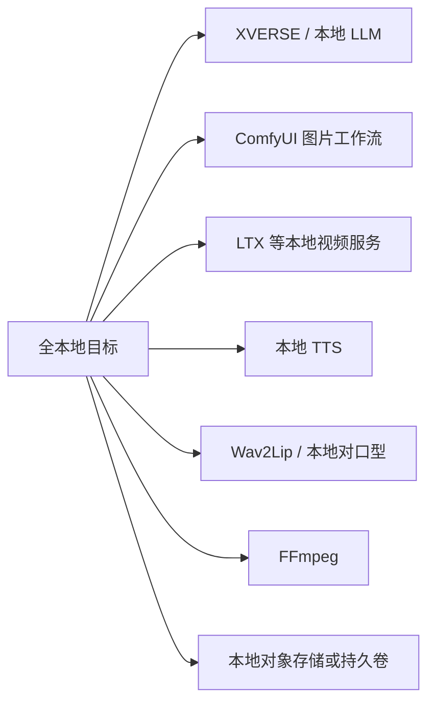

# Wind Comic AI 服务与 Provider 路由机制

## 1. AI 服务全景

Wind Comic 不是“调用一次大模型生成视频”，而是把不同模态交给不同能力层：



系统的难点是为每种模态提供统一契约，同时保留 Provider 差异、降级策略、健康状态和成本信息。

## 2. 配置中心与模型层次

`lib/config.ts` 汇总环境变量，主要配置族包括：

- 通用 / 创作 LLM：主模型、快速模型、同网关备选模型。
- OpenRouter：跨厂商备用路由。
- MiniMax：LLM、图片、视频和 TTS 能力。
- 图片：GPT Image、Gemini、Midjourney、MiniMax、Kontext、ComfyUI。
- 视频：Vidu、MiniMax、Kling、Veo、Seedance、Grok Imagine、LTX 等。
- 本地 LLM：XVERSE-Ent 的 OpenAI-compatible 地址与模型名。
- 对口型：本地 / 自托管 HTTP / 外部 Provider。

配置的真实含义不是“同时调用所有模型”，而是生成一个有顺序的候选集合，运行时选择或回退。

## 3. LLM 路由

### 3.1 候选链

`lib/llm-client.ts` 的思路是构建 attempts：



每次 attempt 包含 base URL、API key、model 和来源名称。路由时会跳过处于冷却期的失败端点，并对 429、5xx 等瞬时错误做有限重试和退避。

### 3.2 健康和预算熔断

系统有两类短期记忆：

- LLM 健康状态：请求失败后暂时避开相关 Provider，默认冷却约 90 秒。
- 网关余额状态：识别余额不足后按 host 冷却，避免连续发送注定失败的请求。

这不是完整的 Hystrix 断路器，但能显著减少一条流水线内的重复失败和无效等待。

### 3.3 输出处理

文本 Agent 大多要求 JSON 输出。调用层会：

- 设置角色 Prompt、温度、Token 与超时。
- 清理部分模型输出的 `<think>` 内容。
- 对 JSON 做提取、解析和回退。
- 当模型不可用或格式错误时，某些角色使用内置 fallback 结构继续流程。

### 3.4 重要实现边界

`HybridOrchestrator.callLLM()` 内部保留了一套相似但独立的调用逻辑，用于规避打包 / 运行时问题。因此“统一 LLM Client”在架构上已经存在，但并未让所有核心路径只经过唯一入口。后续应进一步收口，否则重试、健康、日志和成本策略容易漂移。

## 4. 本地 XVERSE LLM

项目支持把 XVERSE-Ent 以 vLLM / SGLang 等方式启动成 OpenAI-compatible 服务，再通过以下配置接入：

```dotenv
XVERSE_ENABLED=true
XVERSE_BASE_URL=http://host.docker.internal:8000/v1
XVERSE_API_KEY=
XVERSE_MODEL=xverse/XVERSE-Ent-A5.7B
XVERSE_FAST_MODEL=xverse/XVERSE-Ent-A4.2B
```

注意：容器中的 `localhost` 指容器自己。如果 XVERSE 跑在 Windows 宿主机，Docker Desktop 通常需要使用 `host.docker.internal`，不能照搬本机命令中的 `localhost`。

XVERSE 解决的是导演 / 编剧等文本推理，不会自动让图片、视频、TTS 也本地化。

## 5. Provider Registry 通用模式

图片、视频、TTS 等能力采用“注册表 + 能力判断 + 优先级选择”的模式。



统一接口通常包含：

- `id` / `name`：稳定 Provider 标识。
- `priority`：自动选择时的优先级。
- `supports()`：判断输入、模型或能力是否匹配。
- `isAvailable()`：检查配置和健康。
- `generate()`：执行真实生成并返回统一结构。

这种模式比在业务流程中写大量 `if (provider === ...)` 更容易扩展和测试。

## 6. 图片 Provider

仓库内置或接入的图片能力包括：

| Provider | 典型用途 | 本地性 |
|---|---|---|
| GPT Image | 通用高质量图片 | 云端 |
| Gemini / Nano Banana | 图片生成与参考图能力 | 云端 |
| Midjourney | 风格化图片 | 云端 / 网关 |
| MiniMax Image | 中文内容与多主体尝试 | 云端 |
| Kontext | 参考图编辑 / 一致性 | 云端 |
| ComfyUI | 自定义工作流、可本地部署 | 可本地 |
| Mock Image | 测试占位图 | 本地测试 |

### ComfyUI 是什么、在本项目里干什么

ComfyUI 是一套可本地（或内网）部署的开源图片生成工作台，不是某个云厂商的模型名。常见用法是：本机安装 ComfyUI，加载 SD / FLUX / IP-Adapter / ControlNet 等模型，用节点图拼出「文生图、图生图、参考图、边缘约束」流水线，再通过 HTTP（默认 `http://localhost:8188`）对外出图。

和云端图片 API 的对比：

| | Midjourney / GPT Image 等 | ComfyUI |
|---|---|---|
| 推理发生在哪 | 外部云 | 本机或内网 GPU |
| 费用形态 | 按次 / 按 token 计费 | 主要是显卡与运维成本 |
| 数据路径 | 角色图出公网 | 可不出内网 |
| 本仓库默认 | 走这些 Provider | 关闭；`COMFYUI_ENABLED=true` 才启用 |

Wind Comic 不把 ComfyUI 当唯一出图引擎，而是图片候选链上的本地接入点。`HybridOrchestrator` 决定“这一镜要出什么图、带哪些参考约束”；ComfyUI 负责真正画图。接入实现是 `services/comfyui.service.ts`，配置在 `lib/config.ts` 的 `comfyui` 段：

```dotenv
COMFYUI_ENABLED=true
COMFYUI_URL=http://localhost:8188
```

当前代码用它承载两类业务约束（配置后可用，不是开箱默认）：

1. **角色跨镜头一致（IP-Adapter）**：把已生成的角色参考图喂进工作流，后续镜头尽量保持同一张脸、同一套服装。需要 ComfyUI-IPAdapter-Plus 节点和对应模型。
2. **草图构图硬锁（ControlNet，预备态）**：镜头带分镜草图且配置了 `COMFYUI_CONTROLNET_MODEL` 时，用 Canny 边缘图刚性约束构图、机位和主体位置。比把草图当普通参考图更硬。需要 `comfyui_controlnet_aux` 与 canny 模型；未配置时行为与升级前一致。

#### ControlNet（Canny）是什么

本节的原理口径对齐 Rocky Ding 的专栏：[深入浅出完整解析 ControlNet 核心基础知识](https://zhuanlan.zhihu.com/p/660924126)（对应论文 *Adding Conditional Control to Text-to-Image Diffusion Models*）。原文把 ControlNet 定义成挂在 Stable Diffusion / FLUX 旁边的**辅助网络**：给扩散模型加一条额外约束，引导它按期望的构图、姿态或结构出图，减少纯文生图的随机性。

按该文的推理流程：



预处理器用传统视觉算法从参考图里抽出“纯粹的控制信息”。Canny、MLSD、Scribble、SoftEdge、Lineart 同属**边缘与线条类**；Depth / Normal 是几何类；OpenPose / Segmentation 是语义类。Wind Comic 当前接入的是 **Canny**：把分镜草图抽成边缘线稿，再按这些线条锁构图。业务含义是：这一镜已经有手绘或 AI 线稿时，正式分镜图不要只“参考一下”，而要尽量按草图的机位、人物站位、景别来画。后面视频常拿分镜图当 image-to-video 首帧，构图一漂，角色位置和镜头语言就对不上。

可以把它想成“描线填色”：草图再糙，只要大轮廓对，正式图也可以画得很完整，但人还站在画面左边、镜头还是俯拍。颜色、细节、画风仍由 Prompt 决定。

该文对最小单元的拆法，有助于理解“硬锁为什么不会把底模型画崩”：

| 模块 | 作用 |
|---|---|
| 锁定副本 locked | 冻结底模型权重，保住从海量图学来的生成能力 |
| 可训练副本 trainable copy | 专门学习空间条件（边缘、姿态、深度等） |
| 零卷积 zero convolution | 1×1 卷积，权重和偏置从 0 起步；训练刚开始输出全 0，不把噪声灌进底模型 |

这也解释了为什么用常规规模数据就能学会条件控制，而不必重训整个扩散模型。加载 ControlNet 时要同时加载底模型和 ControlNet 权重，显存会比只跑 SD / FLUX 更高（该文量级约多 0.7B 参数）。

| | 软参考（默认、多数云端引擎） | ControlNet 硬锁（可选） |
|---|---|---|
| 做法 | 把草图当参考图塞进 Prompt，口头说“请跟构图” | 抽出草图边缘，当作生成时的空间条件 |
| 力度 | 模型可以不听 | 线条位置更难被改掉 |
| 锁什么 | 构图倾向 | 构图、机位、主体位置 |
| 不锁什么 | — | 颜色、细节、画风仍由 Prompt 决定 |

不要和 IP-Adapter 混用：IP-Adapter 锁身份（这人长什么样），ControlNet 锁空间（人站在画面哪里、镜头怎么取）。`sketchApplyMode` 在 `lib/storyboard-sketch.ts`：ComfyUI 且启用 ControlNet 时为 `controlnet`，主流云端图片引擎为 `reference`，其余为 `none`。

工作流在 `services/comfyui.service.ts` 的 `buildControlNetWorkflow`：Checkpoint → CLIP → 加载草图 → `CannyEdgePreprocessor` 取边缘 → `ControlNetLoader` + `ControlNetApplyAdvanced` 硬约束正/负条件 → KSampler 出图。`HybridOrchestrator` 在有 `sketchUrl` 且 `hasComfyUIControlNet()` 时优先 `generateWithControlNet`，失败回落 IP-Adapter，再回落云端引擎链。

门控是 `COMFYUI_ENABLED=true` 且配置 `COMFYUI_CONTROLNET_MODEL`。这是预备态：需要自托管 ComfyUI、`comfyui_controlnet_aux` 和对应 canny 模型，仓库无法代替 live 验证。未配置时与升级前逐字节一致。

没有开启或调用失败时，系统回落到 Midjourney、MiniMax、Gemini 等云端引擎。私有化环境若不允许出公网，应关闭外网 fallback。仓库只提供接入，不把 ComfyUI 本体和模型打进 Docker。

### 图片链路中的业务约束

图片生成不是孤立调用。系统会将以下上下文写入 Prompt 或参考图：

- 全局风格圣经 / Key Art。
- 角色外观、服装、颜色和身份特征。
- 场景地点、光照和美术风格。
- 前序参考图、首帧或多参考图。
- 镜头景别、机位和构图。

这正是“模型能力”与“Agent 编排”的分工：Provider 负责生成一张图，orchestrator 负责让所有图属于同一部片。

## 7. 视频 Provider

视频注册表覆盖 Vidu、MiniMax、Kling、Veo、LTX、Seedance、Grok Imagine 等实现。不同 Provider 能力并不等价：

| 差异维度 | 示例 |
|---|---|
| 输入方式 | 文生视频、图生视频、首尾帧、主体参考 |
| 时长 | 固定 5/10 秒或可配置 |
| 比例与分辨率 | 横屏、竖屏、720p / 1080p |
| 主体一致性 | 单主体、多主体、参考图限制 |
| 任务协议 | 同步返回或 submit + polling |
| 结果形式 | URL、任务 ID、本地文件 |
| 成本与限流 | 按次、按秒、并发限制 |

### 视频引擎链



对昂贵视频任务，系统会尽量保留成功镜头；恢复或返工时只重新生成缺失 / 指定镜头。

## 8. TTS、对口型与音乐

### TTS

TTS 是 Text-To-Speech（文本转语音）：输入对白文字，输出角色说话的音频文件。短剧成片不能只有画面，Editor 阶段会按角色、对白、情绪调用 TTS，生成每句台词的音轨，再交给混音、字幕和对口型。

不要和相邻能力混为一谈：

| 能力 | 职责 |
|---|---|
| LLM | 写出这句对白 |
| TTS | 把对白念成声音 |
| 对口型（Lip-sync） | 让画面里的嘴型跟上这段声音 |
| FFmpeg | 把声音、画面、字幕、BGM 合成成片 |

TTS 还要区分三个独立维度：音色是“谁在说”，情绪是“怎么说”，时长是“多长说完”。历史实现曾用台词情绪猜性别并忽略镜头时长，会造成角色声音漂移或后半句被下一镜切掉。

Provider 包含 MiniMax、VectorEngine 等真实服务，以及仅在 `MOCK_ENGINES=1` 时启用的 Mock。默认走外部 API；Mock 只适合测试，不代表生产音质。仓库没有一套开箱即用、生产级的本地 TTS。输出需要与角色对白、真实音频时长和字幕对齐。镜头若已有可用原生对白（native audio），应跳过重复 TTS，避免覆盖原声。代码入口：`lib/tts-providers/`。

### Lip-sync

- `local-2d`：无需外部 Key，主要针对静态脸部做本地二维处理。
- 自托管 HTTP：通过 `LIPSYNC_API_URL` 接 Wav2Lip 等服务，可处理视频。
- 外部服务：按配置使用云端能力。

本地二维方案和真实视频口型模型不是同一个质量等级，Provider 选择必须保留能力声明。

### 音乐与音效

Editor 负责将对白、BGM、音效和视频组合。最终由 FFmpeg 做转码、响度处理、字幕与拼接；AI 只负责素材生成，确定性的媒体工具负责交付文件。

## 9. Provider 健康分类

错误至少应区分两类：

### 瞬时错误

- 429 限流。
- 5xx 服务异常。
- 网络超时或连接重置。
- 异步任务短时未完成。

策略：有限重试、指数退避、切下一个 Provider。

### 致命错误

- API Key 无效。
- 账号欠费 / 余额不足。
- 模型或接口不存在。
- 请求能力根本不支持。

策略：立即标记 Provider 暂不可用并降级，避免在同一项目中反复付出超时成本。

## 10. Prompt 工程不是一段模板

项目 Prompt 分为多个层次：



关键经验是：影视生产需要在每一阶段重复注入“不可丢失的锚点”，不能期待模型自动记住上一步。角色发型、服装、色彩、场景光照和镜头方向都应结构化传递。

## 11. 成本、延迟和质量的三角关系

| 策略 | 成本 | 延迟 | 质量 / 风险 |
|---|---:|---:|---|
| 全部首选高端模型 | 高 | 中到高 | 单次质量高，但限流敏感 |
| 快速模型做规划，高端模型做关键帧 | 中 | 中 | 通常最平衡 |
| 多 Provider 盲目重试 | 不可控 | 高 | 可能重复计费 |
| 按阶段落盘、只补失败镜头 | 低于全量重跑 | 中 | 推荐 |
| Mock | 近零 | 低 | 只验证流程，不验证审美 |
| 全本地小模型 | 机器成本固定 | 依硬件 | 隐私好，质量与运维压力上升 |

## 12. “全本地”部署需要什么

要让项目在无外网环境生成真实成片，需要补齐以下矩阵：



当前代码已有 A、B、C、E、F 的接入点或部分实现，但缺少一套经过验证的默认组合，尤其是生产质量本地 TTS、GPU 调度、模型下载和显存规划。因此应表述为“支持若干本地 Provider”，而不是“默认全本地”。

## 13. 设计优点与改进点

### 优点

- 多模态能力通过 Provider 契约隔离。
- 具备优先级、健康缓存、重试和降级意识。
- 业务一致性逻辑位于 orchestrator，而不是散落在 Provider 中。
- Mock 引擎使端到端测试不依赖昂贵外部 API。

### 改进点

1. 将 `HybridOrchestrator.callLLM` 与 `lib/llm-client` 合并为唯一 Model Gateway。
2. 为所有 Provider 统一错误码、计费单位、请求 ID 和可重试分类。
3. 把 capability 从布尔判断升级为结构化声明，如 `i2v`、`firstLastFrame`、最大时长。
4. 引入按用户 / Provider 的并发限流与队列，而不只依赖全局 Worker 并发。
5. 对同一请求使用幂等键，避免超时后重试产生双份计费任务。
6. 在输出层记录模型版本、Prompt 哈希、Seed 和参考资产版本，增强可复现性。

## 14. 面试表达

> 项目的 AI 层采用多 Provider 路由，而不是把业务绑死在单一模型上。LLM 负责结构化策划和审核，图片、视频、TTS、对口型各有独立注册表；运行时根据配置、能力、优先级和健康状态选择，并对限流和服务异常做退避或降级。真正保证成片一致性的不是某个 Provider，而是 orchestrator 持续把风格、角色、场景和前序资产作为约束传给下游。这样既能替换模型，也能把失败控制在单个阶段或单个镜头。

## 15. 源码索引

- [`lib/config.ts`](../lib/config.ts)
- [`lib/llm-client.ts`](../lib/llm-client.ts)
- [`lib/llm-health.ts`](../lib/llm-health.ts)
- [`lib/gateway-budget.ts`](../lib/gateway-budget.ts)
- [`lib/image-providers`](../lib/image-providers)
- [`services/comfyui.service.ts`](../services/comfyui.service.ts)
- [`lib/video-providers`](../lib/video-providers)
- [`lib/tts-providers`](../lib/tts-providers)
- [`lib/lipsync-providers`](../lib/lipsync-providers)
- [`lib/mock-providers.ts`](../lib/mock-providers.ts)
- [`services/video-composer.ts`](../services/video-composer.ts)
- [`.env.example`](../.env.example)
