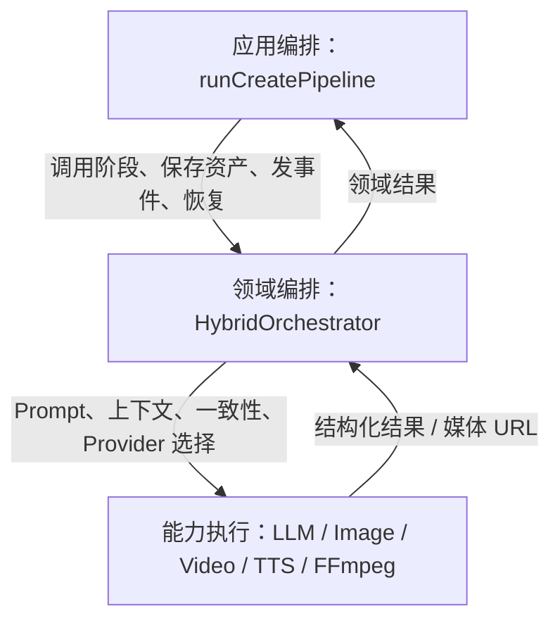
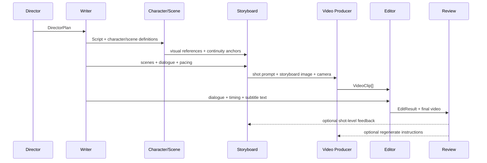
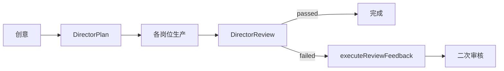
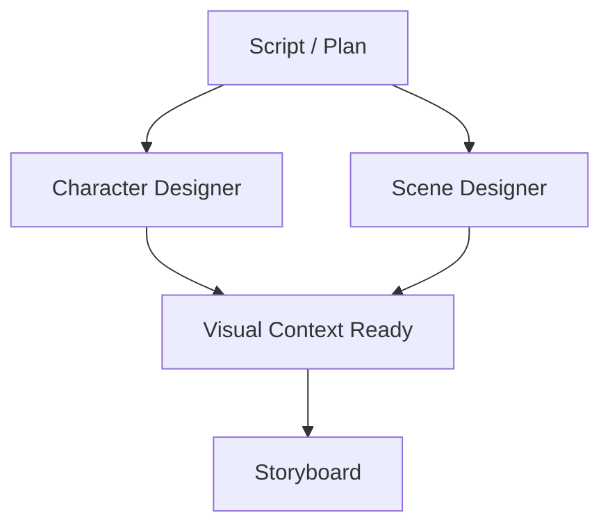
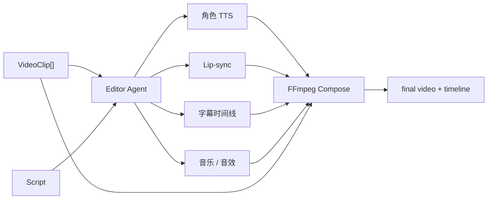
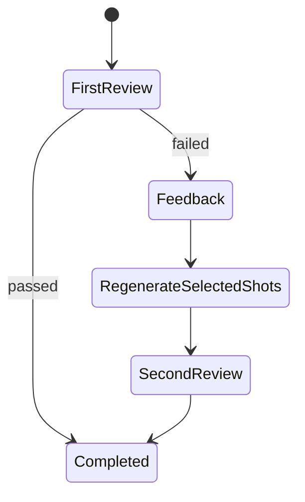
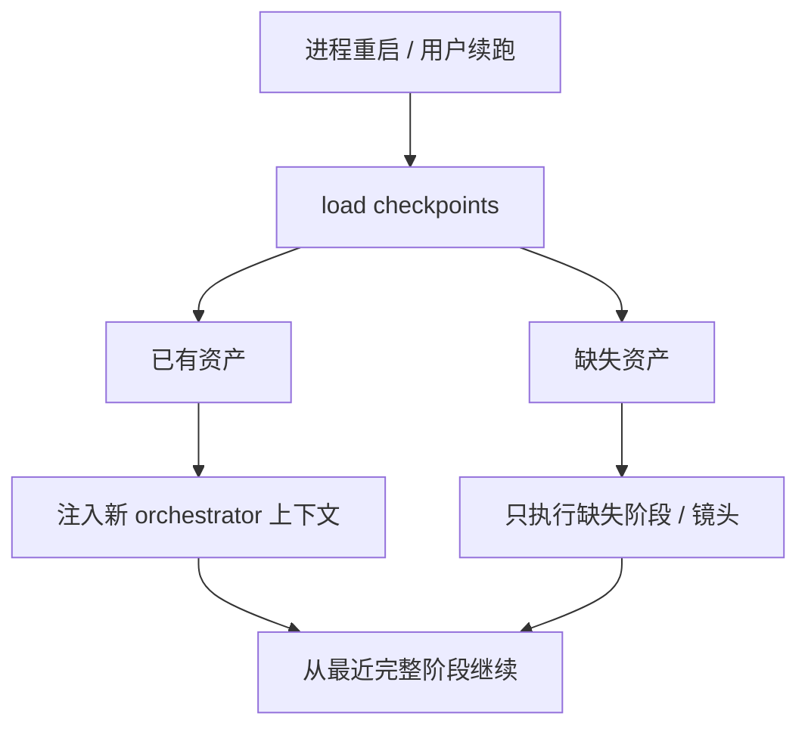
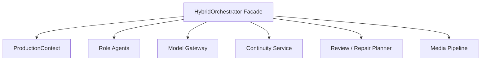

# Wind Comic Agent 体系与 HybridOrchestrator 编排

## 1. 核心结论

Wind Comic 的 Agent 是“影视岗位能力对象”，不是独立进程，也不是彼此自由聊天的自治智能体。核心执行方式是：

1. `runCreatePipeline` 决定阶段顺序、持久化和恢复。
2. `HybridOrchestrator` 保存项目级上下文并执行各岗位方法。
3. 每个岗位消费结构化输入，输出下一阶段可以复用的结构化对象或媒体资产。
4. UI 中的 Agent 状态用于展示 `idle / thinking / working / completed / error`。

这种设计更接近“类型化的 AI 生产流水线”，优势是可预测、可持久化、可局部返工。

## 2. 八个岗位角色

`types/agents.ts` 定义了八个 `AgentRole`：

| 角色 | 核心输入 | 核心输出 | 主要职责 |
|---|---|---|---|
| Director | 用户创意 | `DirectorPlan` | 主题、风格、结构、角色、场景和制作规划 |
| Writer | `DirectorPlan` | `Script` | 将策划变为结构化剧情、场次、对白和节奏 |
| Character Designer | 角色定义 | `CharacterDesignerResult[]` | 角色视觉 Prompt、参考图和一致性锚点 |
| Scene Designer | 场景定义 | `SceneDesignerResult[]` | 场景气氛、构图、光照和参考图 |
| Storyboard | 剧本 + 角色 + 场景 | `Storyboard[]` | 镜头规划、画面 Prompt 和分镜图 |
| Video Producer | 分镜 + 上下文 | `VideoClip[]` | 将镜头图转为视频片段 |
| Editor | 视频 + 剧本 | `EditResult` | 配音、口型、音乐、字幕、转场和合成 |
| Producer | 成片与各阶段结果 | `DirectorReview` 等 | 最终质量确认和返工决策语义 |

说明：最终审核在当前主链中主要通过 `runDirectorReview` 落地；“Producer”同时是领域角色和 UI / 类型语义，不能理解成另一个独立运行服务。

## 3. Agent 不是怎样工作的

以下说法不符合当前源码：

- “八个 Agent 各自拥有独立进程、数据库和长期记忆。”
- “Agent 之间通过消息总线自主协商任务。”
- “系统使用 LangGraph 状态图和 checkpoint saver。”
- “Agent 会自由选择下一步和动态调用任意工具。”
- “导演 Agent 是一个独立部署的 Supervisor 服务。”

更准确的说法是：岗位由 orchestrator 方法实现，调用顺序大部分由应用流水线预先定义；共享上下文通过对象参数、orchestrator 状态和项目资产传递。

## 4. 三层编排职责



### 4.1 应用编排层

`lib/create-pipeline.ts` 负责：

- 创建 / 更新项目。
- 从资产加载检查点。
- 决定阶段先后和并行。
- 保存每个阶段的结果。
- 发 SSE / 任务事件。
- 等待人工关卡。
- 最终完成或失败状态。

### 4.2 领域编排层

`HybridOrchestrator` 负责：

- 初始化各岗位的 UI 状态。
- 维护项目 ID、用户 ID、语言、画幅、风格和参考图。
- 为岗位构建 Prompt 和结构化输出约束。
- 调用 LLM 与媒体 Provider。
- 维护角色 / 场景 /风格连续性。
- 在视频阶段做镜头级生成。
- 在编辑阶段委托媒体合成。
- 根据审核反馈执行局部返工。

### 4.3 能力执行层

Provider 和 FFmpeg 不决定业务步骤，只负责把一个明确请求执行成文本、图片、视频或音频。

## 5. HybridOrchestrator 的状态

它是每次项目生产创建的有状态对象，典型状态可以抽象为：

```typescript
type ProductionContext = {
  projectId: string;
  userId: string;
  language: string;
  style: string;
  aspectRatio: string;
  previewSeedImage?: string;
  referenceAssets: unknown[];
  lockedCharacters: unknown[];
  enableGates: boolean;
  agents: Map<AgentRole, AgentStatus>;
  qualityEvents: unknown[];
};
```

具体字段以源码为准，但架构含义是：orchestrator 把一次制片所需的稳定约束保存在同一个上下文中，避免每个方法重新猜测。

### 状态边界

- 内存状态只对当前执行实例有效。
- 进程重启后由项目资产恢复，而不是序列化整个 orchestrator 对象。
- 可恢复的关键事实必须落数据库 / 资产，不能只留在 Map 或闭包中。

## 6. Agent 间的结构化交接



这种“数据契约”比自然语言消息更重要。它带来四个工程收益：

1. 上下游字段可以用 TypeScript 检查。
2. 阶段输出可以直接持久化成检查点。
3. 失败时能明确定位到资产或镜头。
4. UI 可以展示真实阶段状态和中间产物。

## 7. Director：总策划而非万能 Supervisor

`runDirector(idea)` 负责把松散创意变成 `DirectorPlan`。通常包括：

- 故事主题、类型、受众和调性。
- 视觉风格与色彩方向。
- 角色列表及身份关系。
- 场景列表和叙事结构。
- 时长、节奏或制作建议。

当 LLM 不可用或输出无法解析时，`fallbackDirectorPlan` 会生成可继续执行的保底结构。它保证流程可运行，但不能等价于真实导演质量。

导演角色在末尾还有 `runDirectorReview`：根据剧本、分镜、视频和剪辑结果生成质量判断与返工建议。因此它形成“前置计划 + 后置验收”的闭环。



## 8. Style Bible：跨阶段一致性的第一根锚

`runStyleBibleArtist(plan)` 在导演与后续视觉生产之间生成风格 Key Art。它的意义不是多生成一张漂亮图，而是给角色、场景、分镜和视频提供共同参考。

风格锚点通常承载：

- 画材 / 渲染风格。
- 色板、光照与质感。
- 人物比例和线条语言。
- 世界观的美术统一性。
- 可作为 image-to-image 或 style reference 的媒体 URL。

如果下游只拿文本风格词而没有复用参考图，跨镜头漂移会明显增加。

## 9. Writer：从方案到可拍摄剧本

`runWriter(plan)` 已委托到 `services/agents/writer-agent.ts`，说明项目正在从超大 orchestrator 中抽离岗位实现。

Writer 的重要性不只是“写故事”，而是把文本变成下游可执行的结构：

- 场次顺序与地点。
- 动作、对白、情绪。
- 角色在场信息。
- 镜头节奏和时长依据。
- 可供字幕、TTS、分镜使用的文本。

当生成失败时，`fallbackScript` 提供保底剧本。系统选择“降级继续”而不是一律中止，是为了让开发和演示环境仍能验证后续媒体链路；生产环境应把 fallback 标记写入质量报告，避免用户误认为这是正常输出。

## 10. Character / Scene：可并行的视觉资产准备

角色与场景都依赖剧本 / 导演方案，但二者互不直接依赖。因此在未启用人工关卡时，主链使用 `Promise.all` 并行执行。



启用 gates 时可以改为串行，以便用户逐阶段确认。这里体现了一个典型权衡：

- 自动模式优先吞吐与延迟。
- 人工审核模式优先可控性与成本止损。

## 11. Storyboard：规划与渲染分离

分镜阶段被拆成两步：

1. `runStoryboardArtist`：生成镜头文本计划，包括画面、动作、对白、景别、机位和运动。
2. `runStoryboardRenderer`：把待生成计划渲染成分镜图。

分离的价值是：文本分镜便宜且易改，用户或导演可以先审计划，再支付图片 / 视频成本；恢复时也能只渲染缺图镜头。

## 12. Video Producer：镜头级昂贵执行器

`runVideoProducer` 是成本和时延最高的阶段之一。它按分镜组织请求，将分镜图、角色参考、场景参考、镜头运动和 Provider 能力合并成视频任务。

镜头级处理带来的优势：

- 单个 Provider 失败不会丢失全部视频。
- 可以并行或限流执行镜头。
- 导演复审可指定镜头重生成。
- 检查点能识别已存在的 clip，仅补缺失项。
- 不同镜头可以按能力选择不同策略。

风险是镜头之间可能出现人物、光照和运动连续性漂移，所以系统需要反复注入同一批锚点，并在首尾帧、参考图和 Prompt 中建立约束。

## 13. Editor：AI 素材到确定性交付

`runEditor` 已委托到 `services/agents/editor-agent.ts`。它不是再次生成一段文本，而是协调一系列媒体工程任务：



这一步把概率性 AI 输出转成确定性媒体文件。FFmpeg / ffprobe 用于：

- 检查素材完整性和时长。
- 统一编码、分辨率、帧率和音频格式。
- 拼接镜头与转场。
- 混合对白、BGM、音效。
- 添加字幕和响度标准化。

## 14. Review 与定点返工

`runDirectorReview` 产生 `DirectorReview`，其中会包含通过状态、问题、建议和可能的阶段 / 镜头定位。

当首次审核不通过时：

1. `executeReviewFeedback` 解析需要处理的项。
2. 可能调用 `regenerateShot` 或 cameo 单镜头重试。
3. 保留无需修改的分镜和视频。
4. 再运行一次导演审核。
5. 更新项目的导演备注与最终状态。



当前主链只明确执行有限轮复审，避免无限自我修正导致费用失控。

## 15. 人工关卡（Human-in-the-loop）

启用 `enableGates` 后，流水线可以在特定阶段暂停，等待用户确认或调整。关卡事件通过项目频道传播，运行中的 orchestrator / pipeline 接收继续信号。

人工关卡适用于：

- 剧本确认后再生成昂贵视觉资产。
- 角色形象确认后再批量生成分镜。
- 分镜确认后再调用视频模型。

其商业价值是成本止损：越早发现方向错误，浪费的图片和视频调用越少。

生产上需要注意关卡状态必须持久化，不能只依赖进程内订阅；否则重启后可能出现“任务在等，但无人知道等什么”的状态。

## 16. 检查点如何代替 Agent 长期记忆

`pipeline-checkpoints.ts` 会从项目资产恢复：

- plan、script、style bible；
- characters、scenes；
- storyboard plans 和已渲染分镜；
- 已生成视频；
- edit result、final video、review。



这比保存 Agent 的自然语言对话更可靠，因为下游真正需要的是可验证的剧本、参考图和 clip，而不是一段聊天历史。

## 17. 为什么没有直接采用完全自治 Agent

AI 视频生产有三个现实约束：

1. 每次图片 / 视频调用可能真实计费。
2. 一个错误决策会沿下游放大，形成大量废片。
3. 最终输出必须满足时长、编码、音轨等确定性约束。

因此固定阶段、类型化输入输出和有限返工比“让 Agent 自己决定下一步”更容易治理。自治能力可以用于创意讨论或诊断，但不应无边界地控制昂贵生成工具。

## 18. 与 LangGraph Supervisor 模式对比

| 维度 | Wind Comic 当前实现 | LangGraph / 自治 Supervisor 常见实现 |
|---|---|---|
| 流程 | 主链固定，另有自研 DAG | 状态图动态路由 |
| Agent 交互 | 函数调用 + 结构化对象 | 消息 / State 更新 |
| 状态 | orchestrator 内存 + 数据库资产 | Graph State + Checkpointer |
| 工具选择 | 由岗位方法预定 | Agent 可动态选择 Tool |
| 恢复粒度 | 阶段资产 / 镜头 | 图节点 / State checkpoint |
| 成本治理 | 固定阶段、有限审核轮次 | 需额外限制循环和工具预算 |
| 可解释性 | 调用路径稳定 | 灵活但动态路径更难预测 |

两种方式没有绝对优劣。对 Wind Comic 这种高成本媒体流水线，当前确定性设计是合理取舍。

## 19. 当前重构方向

`writer-agent.ts` 和 `editor-agent.ts` 已从大文件抽出，但 `hybrid-orchestrator.ts` 仍有四千余行。推荐按以下边界继续拆分：



- Agent 只负责岗位 Prompt 与结构化结果。
- Model Gateway 统一重试、成本、日志和健康。
- Continuity Service 管理角色 / 场景 / 风格锚点。
- Repair Planner 把审核问题映射为最小返工集合。
- Orchestrator 仅协调，不直接堆积所有 Provider 细节。

## 20. 面试回答模板

### 30 秒版

> 我们把 AI 漫剧生产拆成导演、编剧、角色场景、分镜、视频、剪辑和复审八类岗位。Agent 不是独立聊天机器人，而是有明确输入输出契约的领域节点，由 `HybridOrchestrator` 维护共同上下文，`runCreatePipeline` 负责编排、落盘和恢复。阶段产物会保存成资产，所以失败后可以只补缺失镜头，审核不通过也只做定点返工。这样比完全自治 Agent 更容易控制视频生成的成本、时延和一致性。

### 深挖版

> 编排分三层：应用层处理状态机、SSE、关卡与检查点；领域层构建 Prompt、维护角色风格连续性并选择 Provider；能力层执行 LLM、图片、视频、TTS 和 FFmpeg。Agent 间不传自由消息，而是传 `DirectorPlan`、`Script`、`Storyboard[]`、`VideoClip[]` 等结构。进程重启后不恢复 Agent 对话，而是从资产表重建上下文。这是面向长耗时、高成本 AI 任务的可恢复流水线设计。

## 21. 源码索引

- [`types/agents.ts`](../types/agents.ts)
- [`lib/create-pipeline.ts`](../lib/create-pipeline.ts)
- [`services/hybrid-orchestrator.ts`](../services/hybrid-orchestrator.ts)
- [`services/agents/writer-agent.ts`](../services/agents/writer-agent.ts)
- [`services/agents/editor-agent.ts`](../services/agents/editor-agent.ts)
- [`lib/pipeline-checkpoints.ts`](../lib/pipeline-checkpoints.ts)
