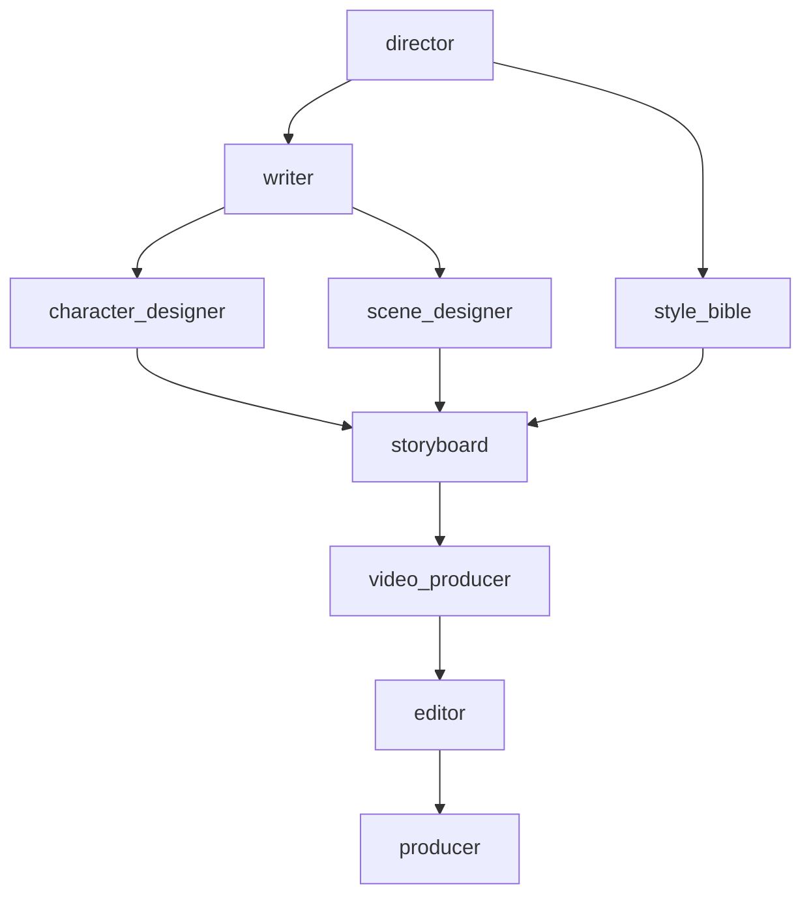
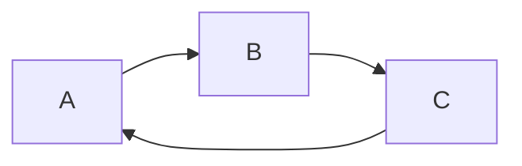
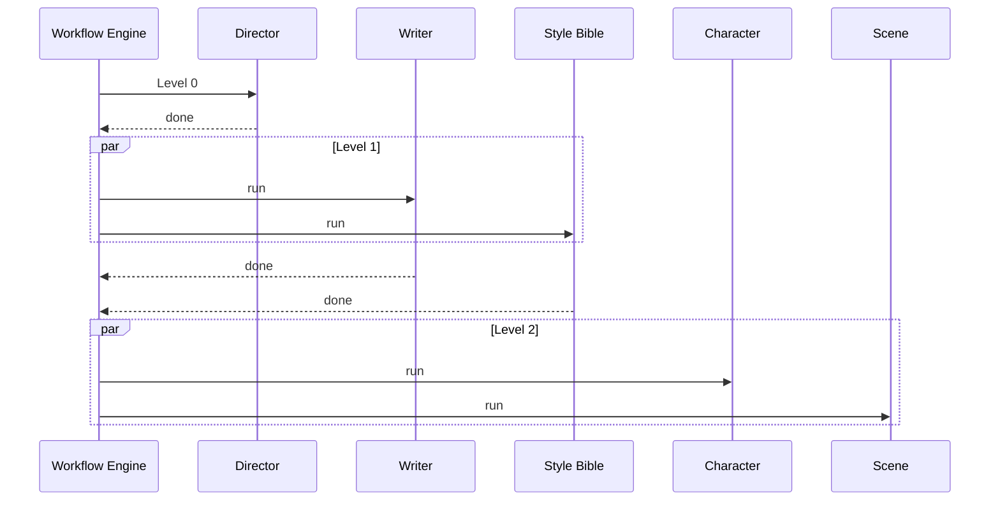
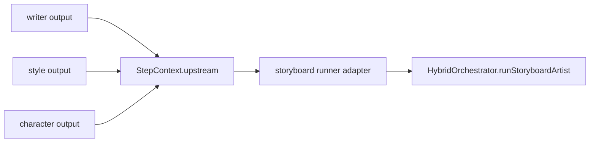
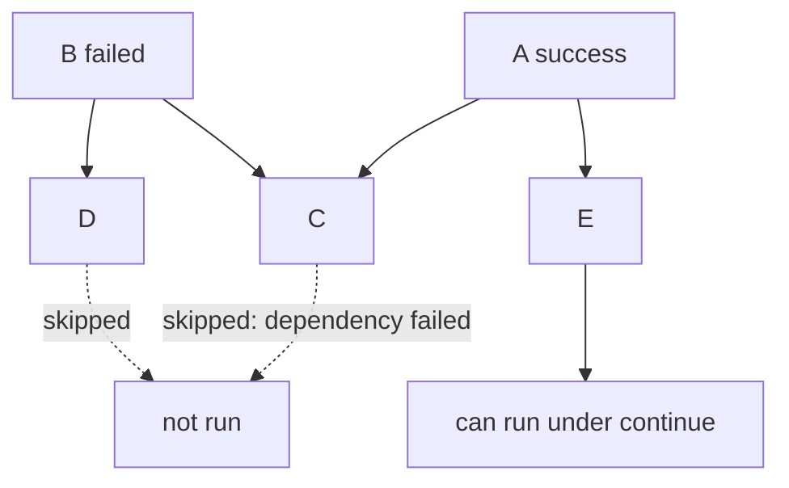
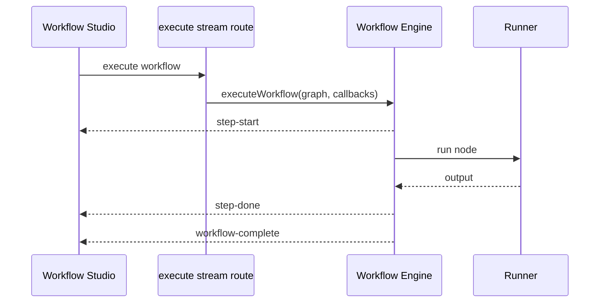
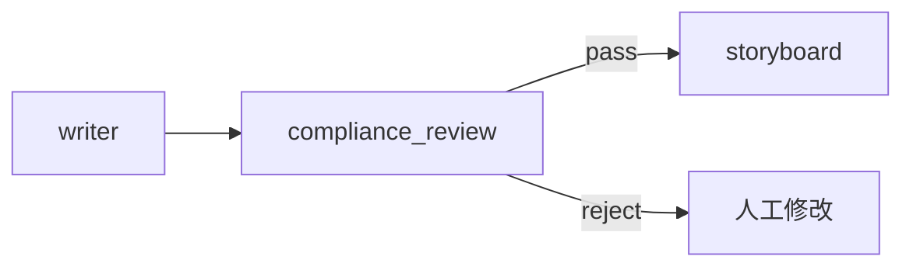

# Wind Comic 可配置 DAG 工作流引擎解析

## 1. 为什么还有一套工作流引擎

固定的 `runCreatePipeline` 适合正式成片，而产品还需要让用户可视化调整岗位依赖、做流程实验和 dry-run。为此仓库实现了一个轻量 DAG 引擎：

- `agent-workflow-core.ts`：图模型、节点目录、校验与拓扑分层。
- `agent-workflow.ts`：工作流数据库持久化。
- `workflow-engine.ts`：运行时调度。
- `workflow-builtins.ts`：dry-run 节点。
- `workflow-orchestrator-runners.ts`：将节点适配到 `HybridOrchestrator`。
- `workflow-real-runner.ts`：真实执行入口。
- `app/workflow-studio`：React Flow 可视化编辑器。

## 2. 图模型

一个工作流包含节点列表，每个节点声明 `id`、`kind`、`dependsOn` 和配置。

```typescript
type StepKind =
  | 'director'
  | 'writer'
  | 'style_bible'
  | 'character_designer'
  | 'scene_designer'
  | 'storyboard'
  | 'video_producer'
  | 'editor'
  | 'producer'
  | 'custom';

interface WorkflowNode {
  id: string;
  kind: StepKind;
  label?: string;
  dependsOn: string[];
  config?: Record<string, unknown>;
}
```

`STEP_CATALOG` 给每种节点提供展示名称和元信息。工作流本身是声明式数据，不直接保存可执行函数。

## 3. 默认 DAG



这张图表达的是偏序关系，而不是把所有节点排成单链。Writer 和 Style Bible 可在依赖满足后并行；Character 与 Scene 也可并行。

## 4. 校验规则

`validateWorkflow` 在执行前检查：

- 图和节点结构是否合法。
- 节点 ID 是否为空或重复。
- `kind` 是否存在于目录中。
- `dependsOn` 指向的节点是否存在。
- 节点是否依赖自己。
- 图中是否存在环。

### 环检测

环检测复用拓扑排序。若最终处理的节点数小于总节点数，说明至少存在一条环。



以上工作流永远没有入度为 0 的起点，因此不能执行。

## 5. Kahn 拓扑分层

引擎不是只返回一维拓扑序，而是返回执行层级：

```text
Level 0: [director]
Level 1: [writer, style_bible]
Level 2: [character_designer, scene_designer]
Level 3: [storyboard]
Level 4: [video_producer]
Level 5: [editor]
Level 6: [producer]
```

算法过程：

1. 计算每个节点入度。
2. 把入度为 0 的节点作为当前层。
3. 移除当前层对下游的边。
4. 新产生的入度 0 节点进入下一层。
5. 重复直到全部处理或发现环。

复杂度约为 `O(V + E)`。

## 6. 分层并发执行

`executeWorkflow` 按层串行、层内 `Promise.all` 并行：



这种方式实现简单，并且天然保证依赖先完成。但它只有“节点级并发”，没有内建的 Provider 级并发配额。若同层出现多个昂贵节点，Runner 仍需自行限流。

## 7. Runner 注册表

引擎通过 Runner 执行节点，而不是在核心调度器中写死各岗位逻辑。

```typescript
type WorkflowRunner = (context: StepContext) => Promise<unknown>;
```

Runner 可以来自：

- 全局注册表：适合稳定内置实现。
- 单次调用覆盖：适合每个项目独立的 orchestrator 实例。
- dry-run builtins：不调用真实模型，只返回模拟结果。

单次 Runner 覆盖很重要。若把携带用户 / 项目上下文的 orchestrator 存进全局注册表，并发请求可能互相污染；当前真实执行器倾向为每次调用创建独立 Runner 集合。

## 8. 上下游数据传递

每个节点可访问直接依赖或已完成上游节点的输出。适配器按 `kind` 取出导演计划、剧本、角色、场景、分镜等结果，再调用对应 orchestrator 方法。



这里的潜在问题是按 `kind` 查找可能遇到多个同类节点。若未来支持两位 Writer 或多分支版本，应使用明确端口、变量绑定或节点 ID，而不是只按类型取一个结果。

## 9. 失败策略

引擎支持：

- `onFailure: 'abort'`：当前层结束后停止后续层。
- `onFailure: 'continue'`：继续处理不受影响的分支。
- 依赖节点失败时，下游节点会跳过，而不是拿缺失输入强行执行。



真实工作流默认更偏向 `abort`，因为缺少核心视觉资产时继续调用昂贵视频模型通常没有意义。

## 10. 生命周期回调与 SSE

执行器提供步骤开始、完成、错误等回调，流式 API 把它们映射为 SSE 事件：



这些事件适合实时可视化，但长期审计仍应持久化运行记录、节点输出摘要和错误。

## 11. Dry-run 与 Real-run

| 模式 | 是否调用真实模型 | 用途 |
|---|---|---|
| Dry-run | 否 | 校验拓扑、UI 联调、演示节点状态 |
| Real-run | 是 | 调用 HybridOrchestrator 执行实际岗位 |

真实执行器当前会先检查必要的 AI 能力，并可把运行结果保存成项目资产。一个值得注意的边界是：能力检查主要围绕 OpenAI API 配置；如果只启用本地 XVERSE，工作流真实运行的前置判断可能与实际可用能力不完全一致，需要进一步统一到 Provider capability 检测。

## 12. 工作流持久化与权限

`agent-workflow.ts` 把图定义保存到 `agent_workflows` 表，并通过用户 owner 条件读取 / 修改。工作流是用户资产，执行时还可能绑定项目上下文。

最低权限要求包括：

- 只能读取和修改自己的工作流。
- 执行时校验所绑定项目的访问权。
- `custom` 节点不能直接接受任意服务端代码。
- 配置中的 Prompt 和 URL 需要安全校验。

## 13. DAG 引擎与完整生产主链的差异

| 能力 | 固定 `runCreatePipeline` | DAG Engine |
|---|---|---|
| 流程调整 | 代码固定 | 图数据可配置 |
| 完整资产持久化 | 完整 | 依 Runner / real-runner |
| 检查点续跑 | 已深度实现 | 基础能力有限 |
| 人工关卡 | 主链支持 | 需节点化扩展 |
| 镜头缺失补跑 | 已实现 | 取决于节点实现 |
| UI 可视化编辑 | 否 | 是 |
| Dry-run | 非主要模式 | 原生支持 |
| 生产成熟度 | 主成片路径 | 更适合实验与组合 |

所以不能说“DAG 已完全替代主链”。它当前更像一个能力编排平台雏形。

## 14. 生产级工作流引擎还缺什么

1. 持久化每次 run 与每个 node attempt。
2. 节点级幂等键、超时、重试策略和补偿策略。
3. 跨进程租约 / 心跳，而不是只依赖当前 Promise。
4. 人工审批节点与可恢复等待状态。
5. 条件边、循环上限和动态分支。
6. 资源队列：LLM、图片、视频、GPU 分别限流。
7. 版本化工作流与运行时快照，避免编辑后影响执行中任务。
8. 可观测性：Trace ID、输入输出摘要、成本和模型版本。

## 15. 一个安全的扩展示例

假设增加“合规审核”节点：



推荐步骤：

1. 在 `StepKind` 和 `STEP_CATALOG` 中注册类型。
2. 定义明确输入输出 Schema。
3. 实现 Runner，不允许执行任意用户代码。
4. 增加节点超时和可分类错误。
5. 在 real-runner 中绑定项目 / 用户上下文。
6. 为 dry-run 和真实执行分别测试。
7. 记录审核版本和判定依据。

## 16. 面试表达

> 项目除固定成片主链外，还实现了一套轻量 DAG 引擎。工作流节点声明 `kind` 和 `dependsOn`，执行前校验缺失依赖、重复 ID 和环，再用 Kahn 算法划分拓扑层；层间串行保证依赖，层内通过 `Promise.all` 并行。执行逻辑通过 Runner Registry 解耦，既能 dry-run，也能按请求创建一组绑定 `HybridOrchestrator` 的真实 Runner。它目前适合可视化流程实验，完整断点恢复和人工审批仍以固定生产主链更成熟。

## 17. 源码索引

- [`lib/agent-workflow-core.ts`](../lib/agent-workflow-core.ts)
- [`lib/agent-workflow.ts`](../lib/agent-workflow.ts)
- [`lib/workflow-engine.ts`](../lib/workflow-engine.ts)
- [`lib/workflow-builtins.ts`](../lib/workflow-builtins.ts)
- [`lib/workflow-orchestrator-runners.ts`](../lib/workflow-orchestrator-runners.ts)
- [`lib/workflow-real-runner.ts`](../lib/workflow-real-runner.ts)
- [`app/workflow-studio`](../app/workflow-studio)
