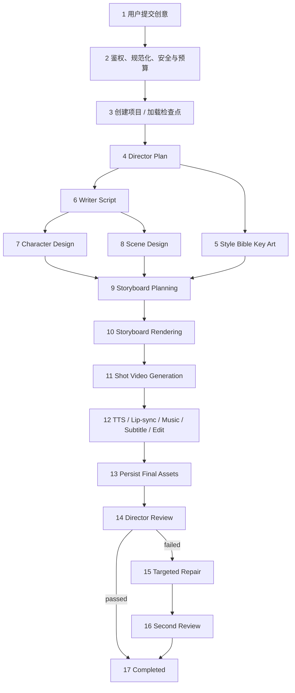
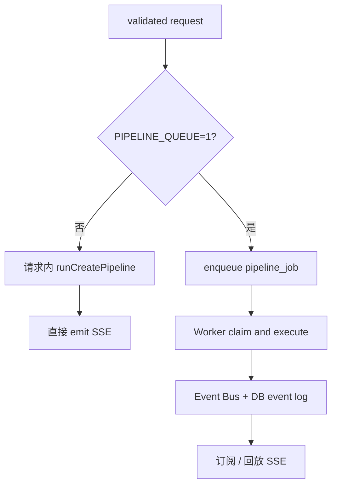
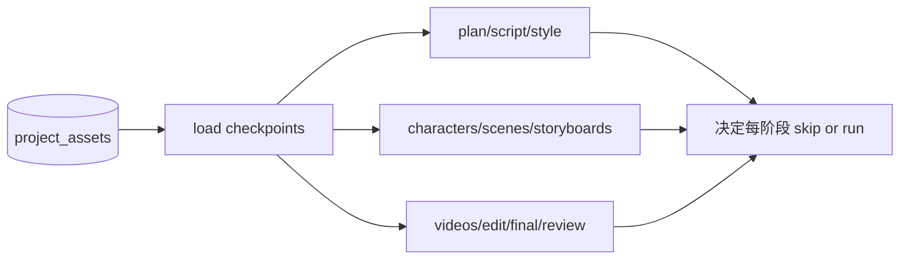
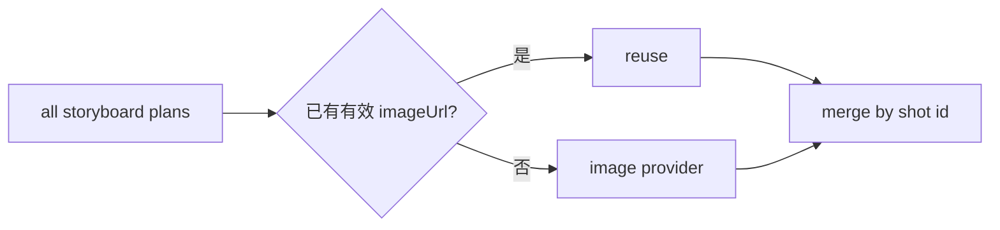
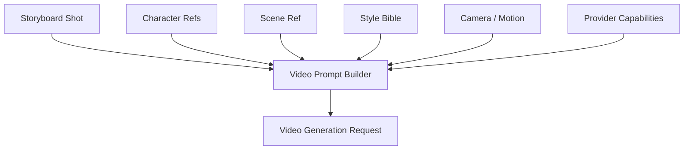
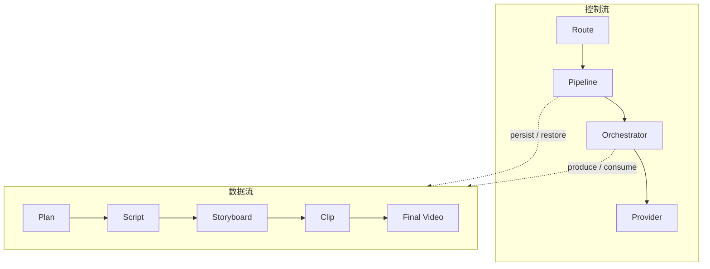

# Wind Comic“一句话到成片”完整调用链

## 1. 主入口定位

从用户点击“开始创作”到最终收到 `complete` 事件，最重要的三层入口是：

```text
POST app/api/create-stream/route.ts
  └─ lib/create-pipeline.ts::runCreatePipeline
       └─ services/hybrid-orchestrator.ts::runXxx
```

理解这个项目时，应沿这条链读代码，而不是从页面组件或单个 Provider 开始。

## 2. 全链路总图



## 3. 阶段 0：请求进入

客户端提交的内容不仅有 `idea`，还可能包括：

- 视频 Provider。
- 风格和画幅。
- 是否启用人工关卡。
- 模板 ID。
- 主角参考图、锁定角色。
- 镜头默认值、预览 Seed 图。
- 参考资产、复刻剧本、剪辑风格和语言。

后端先完成：

1. `requireUser` 恢复登录用户。
2. `normalizeIdea` 整理用户创意，必要时可用 LLM 辅助。
3. 拦截过短、无实际内容的输入。
4. `checkAndSanitize` 检测注入、越界、有害内容并脱敏 PII。
5. 合并创作模板与安全前缀。
6. `estimatePipelineCostCny` 预估费用。
7. `assertBudget` 检查用户月度 / 硬预算。

任何一步失败都应在调用昂贵模型前返回。

## 4. 阶段 1：选择执行模式



无论哪种模式，真正的业务流程都进入 `runCreatePipeline`，所以两者应产生相同阶段资产；差别在任务生命周期和事件传输。

## 5. 阶段 2：项目上下文与恢复

`runCreatePipeline` 创建 `HybridOrchestrator`，注入项目、用户、画幅、风格、语言、参考图和关卡设置。若要求 resume，则从资产表重建检查点。

恢复算法可概括为：



重要原则：检查点是“已经成功的业务产物”，不是单纯的阶段布尔值。只有资产内容可用才应该跳过阶段。

## 6. 阶段 3：Director Plan

调用：

```typescript
plan = await orchestrator.runDirector(idea);
```

输出 `DirectorPlan`，并保存为 `plan` 资产。它是后续所有岗位的语义起点，至少决定故事方向、风格、角色、场景和结构。

失败策略：

- 尝试 LLM 路由与回退。
- 对输出做 JSON 提取。
- 必要时使用 `fallbackDirectorPlan`，并应在质量报告中标记降级。

## 7. 阶段 4：Style Bible

调用：

```typescript
const bibleUrl = await orchestrator.runStyleBibleArtist(plan);
```

输出一张或一组风格锚点。后续角色、场景和分镜应尽可能复用这份视觉基准。若用户提供预览 Seed、绑定 style reference 或系列锚点，orchestrator 会把它们合并到生产上下文。

## 8. 阶段 5：Writer Script

调用：

```typescript
script = await orchestrator.runWriter(plan);
```

保存 `script` 资产。启用“剧本后关卡”时，此处可以暂停，让用户先确认文本再进入视觉生成。

这是最值得设置人工关卡的位置之一，因为修改文字的成本远低于重做图片和视频。

## 9. 阶段 6：角色与场景

```typescript
const [chars, scns] = await Promise.all([
  runCharacterStep(),
  runSceneStep(),
]);
```

在无人工 gate 的自动模式下，角色与场景并行；启用逐项确认时则按关卡安排执行。

### Character 输出

- 角色视觉描述。
- 可供图片模型使用的 Prompt。
- 参考图 URL。
- 身份与连续性锚点。

### Scene 输出

- 地点和空间结构。
- 光照、时间、气氛和色彩。
- 场景参考图和视觉 Prompt。

两类结果分别保存为项目资产。

## 10. 阶段 7：分镜规划

调用：

```typescript
storyboardPlans = await orchestrator.runStoryboardArtist(
  script,
  characters,
  scenes,
);
```

这里先生成文本级镜头计划，而不是立即调用图片模型。镜头计划通常描述：

- 哪些角色出现、做什么。
- 场景与时间。
- 景别、机位、镜头运动。
- 画面 Prompt。
- 对白、旁白和目标时长。

## 11. 阶段 8：分镜渲染

恢复时会先计算 `pendingPlans`，只渲染尚无有效图片的分镜：

```typescript
const rendered = await orchestrator.runStoryboardRenderer(
  pendingPlans,
  script,
  characters,
  scenes,
);
```



这是资产级幂等的典型实现。

## 12. 阶段 9：视频生成

同样先筛选未完成镜头，再执行：

```typescript
const made = await orchestrator.runVideoProducer(
  pendingBoards,
  activeProvider,
  characters,
  scenes,
  script,
);
```

视频服务经常采用异步 submit + poll。为避免浏览器或代理误判连接无响应，流水线期间会发送心跳事件。生成后每个 clip 单独持久化，便于部分成功。

### 单镜头上下文



## 13. 阶段 10：Editor 成片

调用：

```typescript
editResult = await orchestrator.runEditor(videos, script);
```

Editor 的内部任务比其他 Agent 更偏媒体工程：

1. 按角色对白生成 TTS。
2. 对需要说话的镜头尝试 Lip-sync。
3. 生成或选择背景音乐 / 音效。
4. 构建字幕与剪辑时间线。
5. 检查视频素材时长、编码和可读性。
6. 使用 FFmpeg 转码、拼接、转场、混音和导出。
7. 返回 `EditResult` 与最终视频 URL。

主链随后保存 timeline、final_video、music 和 quality_report；最终视频质量评分可异步执行，避免阻塞完成事件。

## 14. 阶段 11：系列连续性锚点

如果项目属于系列内容，系统会尽力保存本集的连续性信息，例如末尾画面或角色 / 场景锚点，供下一集使用。该步骤采用 best-effort：失败不应抹掉已经生成的本集成片。

这是主事务与辅助索引应分离的例子：成片是主结果，系列锚点是可补偿的派生数据。

## 15. 阶段 12：导演审核与返工

```typescript
review = await orchestrator.runDirectorReview(
  script,
  videos,
  editResult,
);
```

如果已有 review 检查点则直接复用；否则生成并发送 `review` 事件。

审核不通过时：

```typescript
const improved = await orchestrator.executeReviewFeedback(
  review,
  script,
  storyboards,
  videos,
);
const review2 = await orchestrator.runDirectorReview(...);
```

返工目标是最小化重算范围，而不是从 Director 重新开始。

## 16. 阶段 13：完成

最后更新项目：

- `status = completed`。
- 写入最终封面、剧本、视频和导演备注等字段。
- 发 `stageTiming`。
- 发 `complete`，携带项目 ID 和主要阶段结果。

若队列执行失败并耗尽重试，Worker 会把任务和对应项目标为 failed，避免 UI 永远显示 active。

## 17. SSE 事件模型

事件名称以代码为准，主要语义包括：

| 事件 | 用途 |
|---|---|
| `status` | 用户可读阶段说明 |
| `progress` / Agent 状态 | 工作进度与岗位状态 |
| `step` | 任务表可记录的阶段边界 |
| `asset` 类事件 | 新中间产物可展示 |
| `review` | 导演审核结果 |
| `heartbeat` | 长阶段保活 |
| `stageTiming` | 各阶段耗时 |
| `complete` | 流程完成 |
| `error` | 失败和是否重试 |

前端应以 `complete` / 项目状态确认终态，并在断线重连后查询任务或项目，不应仅靠页面内累计百分比推断完成。

## 18. 断线、重启与重试场景

### 浏览器断线

- 请求内模式下可能影响连接，但已经落盘的阶段资产仍在。
- 队列模式下 Worker 继续执行，重连可回放事件。

### Node 进程重启

- instrumentation 启动 Worker。
- 心跳过期的 running job 会重新入队。
- 新 orchestrator 从资产检查点恢复。

### 单个 Provider 超时

- Provider / LLM 层尝试重试或回退。
- 阶段抛错后，队列任务最多尝试若干次。
- 已成功资产应复用，防止重复计费。

### 某个镜头质量不合格

- 审核反馈定位镜头。
- `regenerateShot` 只重做目标镜头。
- 合并旧 clip 与新 clip，再重新剪辑或复审。

## 19. 数据流与控制流的区别



控制流可以因重启而重新创建；数据流必须持久化。这是理解断点续跑的关键。

## 20. 最容易发生重复计费的点

- 视频 submit 成功，但客户端在收到 task ID 前超时。
- Provider 已生成结果，但下载 / 持久化失败。
- Worker 心跳过期被重新认领，原任务其实仍在远端运行。
- 资产已经生成，但写库失败，恢复时被视为缺失。

改进建议：为每次外部调用保存 `provider_request_id`、幂等键、Prompt 哈希和状态；恢复时优先查询远端任务，而不是立即重新 submit。

## 21. 调试路径

当“创作卡住”时按以下顺序排查：

1. 看项目 `status` 和 pipeline job `state`。
2. 看最新 `step` 和事件日志，而不是只看浏览器动画。
3. 查对应阶段资产是否已经写入。
4. 查 Provider 请求 / 轮询错误和健康冷却。
5. 查 Worker heartbeat 是否更新。
6. 查 FFmpeg / ffprobe 输出和本地文件是否存在。
7. 确认容器网络中的 Provider 地址是否正确。

## 22. 面试表达

> 一句话到成片的主链先做鉴权、安全和预算，然后由 `runCreatePipeline` 创建有状态的 `HybridOrchestrator`。导演、编剧、风格、角色场景、分镜、视频、剪辑和审核逐阶段执行，每一步都把结构化结果或媒体 URL 保存为项目资产。视频按镜头生成，恢复时只补缺失镜头；最终由 FFmpeg 做确定性合成，导演审核失败后只对指定镜头返工。实时体验走 SSE，可靠状态走数据库任务和资产检查点，所以连接断开或进程重启不需要全量重做。

## 23. 源码索引

- [`app/api/create-stream/route.ts`](../app/api/create-stream/route.ts)
- [`lib/create-pipeline.ts`](../lib/create-pipeline.ts)
- [`lib/pipeline-checkpoints.ts`](../lib/pipeline-checkpoints.ts)
- [`lib/pipeline-worker.ts`](../lib/pipeline-worker.ts)
- [`services/hybrid-orchestrator.ts`](../services/hybrid-orchestrator.ts)
- [`services/agents/editor-agent.ts`](../services/agents/editor-agent.ts)
- [`services/video-composer.ts`](../services/video-composer.ts)
