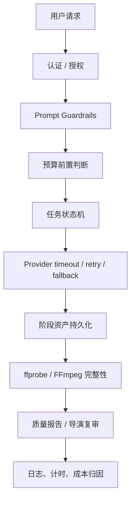
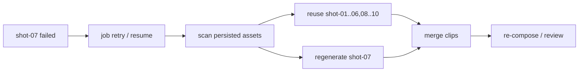
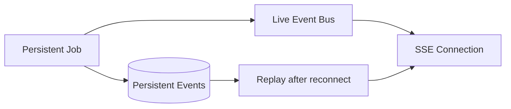
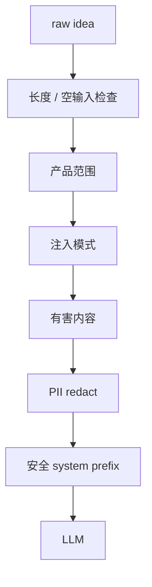
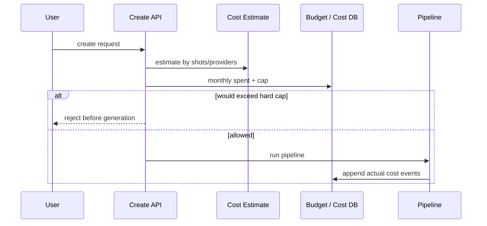
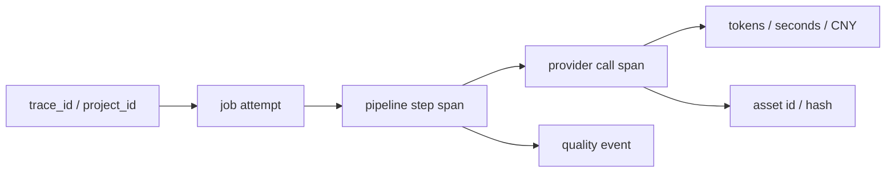
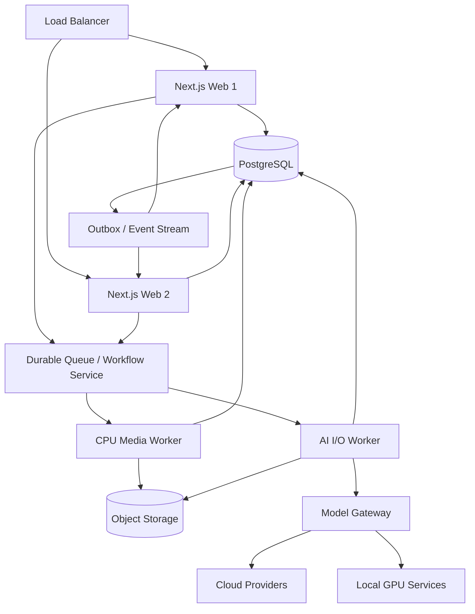

# Wind Comic 可靠性、安全、成本与生产化边界

## 1. 为什么这类系统比普通 Web 后端更难

AI 漫剧生产同时具备四个特征：

- 长耗时：一次视频生成可能持续数分钟。
- 高成本：图片、视频、TTS 都可能按次计费。
- 概率性：同一 Prompt 也可能出现质量差异。
- 部分成功：十个镜头中可能九个成功、一个失败。

因此可靠性目标不是“请求要么成功要么回滚”，而是：**保住已经付费得到的有效资产，识别最小失败范围，并安全、可追踪地继续。**

## 2. 可靠性防线总览

## 3. 任务级可靠性

### 3.1 状态机

数据库任务使用 `queued -> running -> done / failed`，失败未耗尽次数时回到 queued。这个状态机提供：

- 请求与任务生命周期解耦。
- 重启后恢复。
- 死信识别和人工重投。
- 前端查询明确终态。

### 3.2 原子认领

Worker 先找最老 queued 任务，再用 `WHERE state='queued'` 条件更新。只有更新成功的 Worker 获得任务，避免多实例同时拿到同一行。

需要注意：数据库原子认领只能防止“同一任务行被双 claim”，不能防止远端 Provider 因网络超时被重复 submit。外部调用仍需幂等策略。

### 3.3 心跳与孤儿恢复

- Worker 每约 15 秒更新心跳。
- 超过约 90 秒未更新的 running 任务重新进入 queued。
- 超过 24 小时的 queued / running 任务终止为 failed。
- 创建任务终态失败时同步更新项目，避免项目永久卡 active。

### 3.4 重试边界

任务最多尝试 3 次。重试次数必须有限，否则高成本 Provider 的持续故障会形成费用和队列风暴。

## 4. 资产级可靠性

任务重试并不等于整条流水线重跑。`pipeline-checkpoints.ts` 从已持久化资产重建上下文，只执行缺失部分。

### 幂等层次

| 层次 | 当前手段 | 进一步改进 |
|---|---|---|
| 项目阶段 | 按资产类型恢复 | 阶段输入哈希、版本快照 |
| 镜头 | 只补缺失图 / 视频 | shot revision 与 idempotency key |
| DB 任务 | 条件 claim | 租约 token、attempt 表 |
| Provider | 有请求 / 任务 ID 的实现可轮询 | 统一持久化外部 request ID |
| 文件 | 检查存在和媒体完整性 | 内容哈希、对象存储原子发布 |

## 5. Provider 级可靠性

### 5.1 超时

不同模态需要不同超时：LLM 通常秒到分钟，图片更长，视频 submit + polling 可达数分钟。单一全局超时不合理。

### 5.2 重试与降级

- 429 / 5xx / 网络错误：有限重试、退避、切 Provider。
- 认证、欠费、模型不存在：快速失败并进入健康冷却。
- 输出格式错误：JSON 修复 / 提取或岗位 fallback。
- 视频失败：保留其他镜头，只处理目标镜头。

### 5.3 防止重试放大

假设存在三层重试：HTTP client 3 次、Provider Registry 3 次、Job 3 次，最坏可能产生 27 次调用。系统应规定唯一重试责任：

- Client 层只处理连接级瞬时问题。
- Provider 层处理同一请求的有限重试 / 路由。
- Job 层只重新执行可恢复阶段，并复用已有 request ID / 资产。

## 6. SSE 与连接可靠性

SSE 适合服务器持续推送状态，但不是队列本身。

推荐语义：

- Event Bus 提供低延迟。
- 数据库事件提供重放和审计。
- 项目 / Job 状态提供最终事实。
- 心跳只证明连接或 Worker 仍活跃，不证明业务一定前进。

## 7. 媒体完整性

仅有一个 URL 不代表视频可用。媒体链需要验证：

- 文件是否存在且非零字节。
- ffprobe 是否能解析容器、编码和时长。
- 音视频轨是否符合预期。
- 分辨率、画幅和帧率是否可合并。
- 最终成片能否完整解码。

`video-composer.ts` 使用 FFmpeg / ffprobe 做拼接、转码、静态图转视频、响度标准化和完整性探测，并设置降级路径。质量报告会记录某些 fallback 和异常事件。

## 8. Prompt 安全

`prompt-guardrails.ts` 处理四类问题：

1. Prompt Injection：如要求忽略系统规则、泄露 Prompt。
2. Out-of-scope：明显与影视创作无关的请求。
3. Harmful：命中有害内容规则的请求。
4. PII：API Key、卡号、证件等敏感信息脱敏。

### 边界

规则和正则只能做第一道防线：

- 容易误报或漏报。
- 多语言、隐喻和图片内容不能只靠文本正则。
- Provider 自带审核规则可能与产品策略不同。
- 最终图片、视频、音频也需要输出审核。

生产环境应加入内容分类模型、媒体审核、申诉与审计流程。

## 9. 身份、授权与多租户

### 已有机制

- JWT + HttpOnly Cookie / Bearer。
- 生产强 Secret 要求。
- 项目、工作流等数据路径包含 owner 校验。
- 注册、邀请、管理员等相关模型。

### 必须持续审计的点

- 每个 `projectId` 路由是否先校验 owner / collaborator。
- 媒体静态 URL 是否绕过项目权限。
- SSE 订阅频道是否验证当前用户。
- 工作流执行绑定的项目是否属于用户。
- 管理员接口是否只判断登录而未判断角色。
- Body 返回 Token 是否可能被浏览器日志或第三方脚本读取。

不能因为大多数接口有鉴权就宣称“全系统已完成租户隔离”；这需要逐路由安全测试。

## 10. Secret 与网络安全

生产部署建议：

- API Key 使用容器 Secret / 云 Secret Manager，不写入镜像和仓库。
- 日志对 Authorization、Cookie、Prompt 中的 Key 做脱敏。
- Provider base URL 若可由用户配置，需要防 SSRF。
- 下载远端媒体时限制协议、域名、大小、超时和重定向。
- 上传文件校验 MIME、扩展名、魔数、尺寸和解码安全。
- 最终媒体用对象存储签名 URL，而非永久公开本地路径。

## 11. 预算与成本治理

### 11.1 前置预算

`budget-estimate.ts` 根据镜头等输入粗估 LLM、图片、视频、TTS / BGM 成本；`budget-enforce.ts` 读取用户预算上限和当月 `cost_log`，在执行前裁决。

### 11.2 事后真实归因

`cost-attribution.ts` 将 `cost_log.engine` 归类为：

- LLM
- Image
- Video
- TTS
- Lip-sync
- Other

并计算总成本、占比、最贵类目和节省建议。

### 11.3 估算与记账的区别

- 估算用于在调用前阻止明显超支。
- 真实记账用于账单、报表和预算余量。
- 两者不能互相替代。
- Provider 超时后是否已计费，需要结合外部请求 ID 对账。

## 12. 质量治理

质量不是一个 `passed` 布尔值，应覆盖：

| 维度 | 可检查项 |
|---|---|
| 文本 | 剧情完整、对白自然、结构可拍 |
| 视觉 | 角色一致、场景一致、无明显畸变 |
| 镜头 | 构图、运动、节奏、连续性 |
| 音频 | 音色一致、对白可懂、响度平衡 |
| 媒体 | 文件可解码、时长、音视频轨、分辨率 |
| 业务 | 成本、耗时、fallback 次数、用户修改率 |

项目已有质量事件、health score、导演复审和最终视频探测等基础。更完整的生产方案应把自动指标与人工抽检结合。

## 13. 可观测性

当前可利用的信号包括：

- SSE / pipeline 事件。
- 阶段计时 `stageTiming`。
- Provider 错误与健康缓存。
- 任务 attempts、heartbeat、last_error。
- cost_log 和质量报告。
- 可选 Sentry 初始化。

建议统一为一条 Trace：

每个外部调用至少记录：Provider、模型、耗时、重试次数、状态码、远端 request ID、输入摘要哈希、输出资产 ID 和费用；敏感 Prompt 内容应按策略脱敏。

## 14. 单机与多实例边界

| 组件 | 单机 | 多实例风险 / 要求 |
|---|---|---|
| SQLite | 合适 | 不适合多副本共享写 |
| PostgreSQL | 可用 | 推荐共享状态 |
| EventEmitter | 正常 | 无法跨进程传播 |
| Redis Bridge | 可选 | 用于跨实例实时事件 |
| 进程内 Worker | 简单 | 资源隔离和滚动发布复杂 |
| 本地文件 | 简单 | 多实例不可共享、URL 漂移 |
| 对象存储 | 可选演进 | 多实例推荐 |

## 15. 生产化目标架构

不是说项目必须立即重构成上图，而是当并发、团队和 SLA 上升时，各风险有清晰演进方向。

## 16. 建议优先级

### P0：上线前

- 全路由对象级授权审计。
- Secret 管理、生产 JWT Secret、日志脱敏。
- 对象存储或可靠持久卷。
- Provider 出站超时、大小限制与 SSRF 防护。
- 备份与恢复演练。

### P1：规模增长

- Web / Worker 分离。
- PostgreSQL 完整集成与并发压测。
- 外部请求 ID、幂等键和对账。
- 跨实例事件与断线回放。
- 统一 Model Gateway 和 Trace。

### P2：质量与效率

- 自动媒体审核和人工抽检。
- Provider 质量 / 成本动态路由。
- Prompt、模型、资产版本可复现。
- 基于历史成功率的镜头策略选择。

## 17. 故障演练清单

建议定期验证：

1. 生成第 7 个镜头时杀死 Node 进程，能否只补第 7 个。
2. Provider 返回 429，是否退避且不会形成 27 倍重试。
3. submit 成功但响应丢失，能否按 request ID 恢复。
4. 浏览器断开后，队列任务是否继续，重连是否回放。
5. FFmpeg 输入一个损坏 clip，是否报告明确阶段错误。
6. 硬预算不足时，是否在任何付费调用前拒绝。
7. 两个用户猜测对方 projectId，是否全部被拒绝。
8. 多实例同时 claim，同一任务是否只执行一次。
9. Redis / Event Bus 暂时不可用，项目最终状态是否仍正确。
10. 数据库恢复后，本地 / 对象存储资产是否能对应上。

## 18. 面试表达

> 这类 AI 视频系统最大的可靠性问题是长耗时、真实计费和部分成功，所以我们不追求一个大事务回滚，而是使用任务状态机、心跳、有限重试和阶段资产检查点。Provider 层负责超时、健康和降级，镜头级资产让重试只补失败部分；SSE 只做实时体验，数据库状态才是事实来源。请求前还有 Prompt 安全与预算硬拦截，完成后有 ffprobe、质量报告和导演复审。生产扩容时优先拆 Web 与 Worker、迁 PostgreSQL 和对象存储，再引入统一模型网关和分布式 Trace。

## 19. 源码索引

- [`lib/pipeline-worker.ts`](../lib/pipeline-worker.ts)
- [`lib/repos/pipeline-job-repo.ts`](../lib/repos/pipeline-job-repo.ts)
- [`lib/pipeline-checkpoints.ts`](../lib/pipeline-checkpoints.ts)
- [`lib/prompt-guardrails.ts`](../lib/prompt-guardrails.ts)
- [`lib/budget-estimate.ts`](../lib/budget-estimate.ts)
- [`lib/budget-enforce.ts`](../lib/budget-enforce.ts)
- [`lib/cost-attribution.ts`](../lib/cost-attribution.ts)
- [`lib/quality-report.ts`](../lib/quality-report.ts)
- [`lib/film-health.ts`](../lib/film-health.ts)
- [`services/video-composer.ts`](../services/video-composer.ts)
- [`instrumentation.ts`](../instrumentation.ts)
