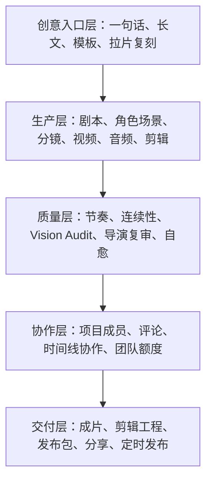
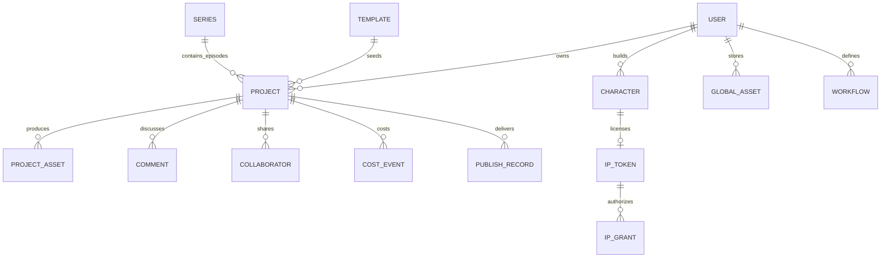
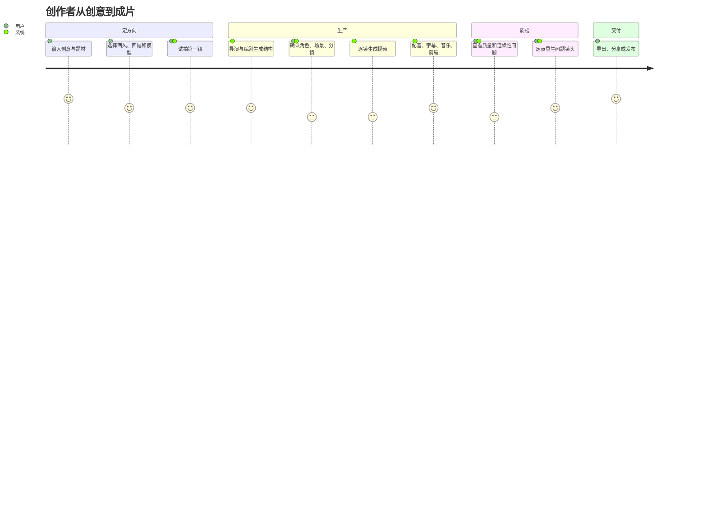
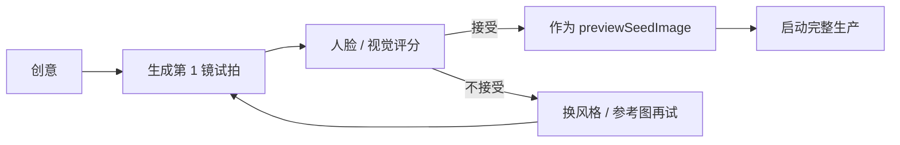
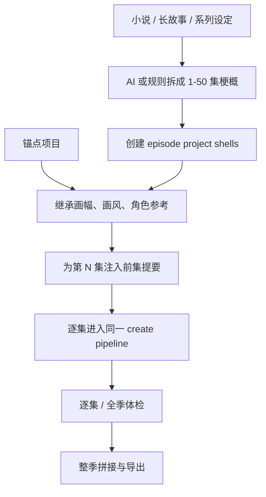
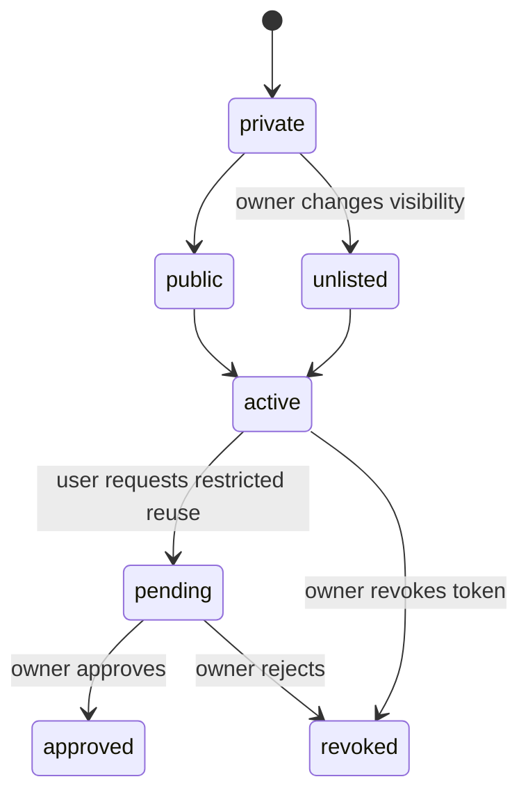
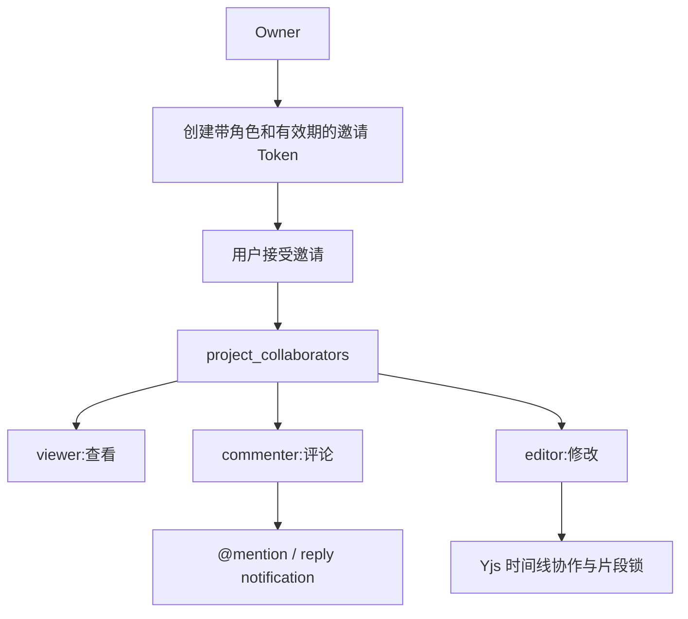
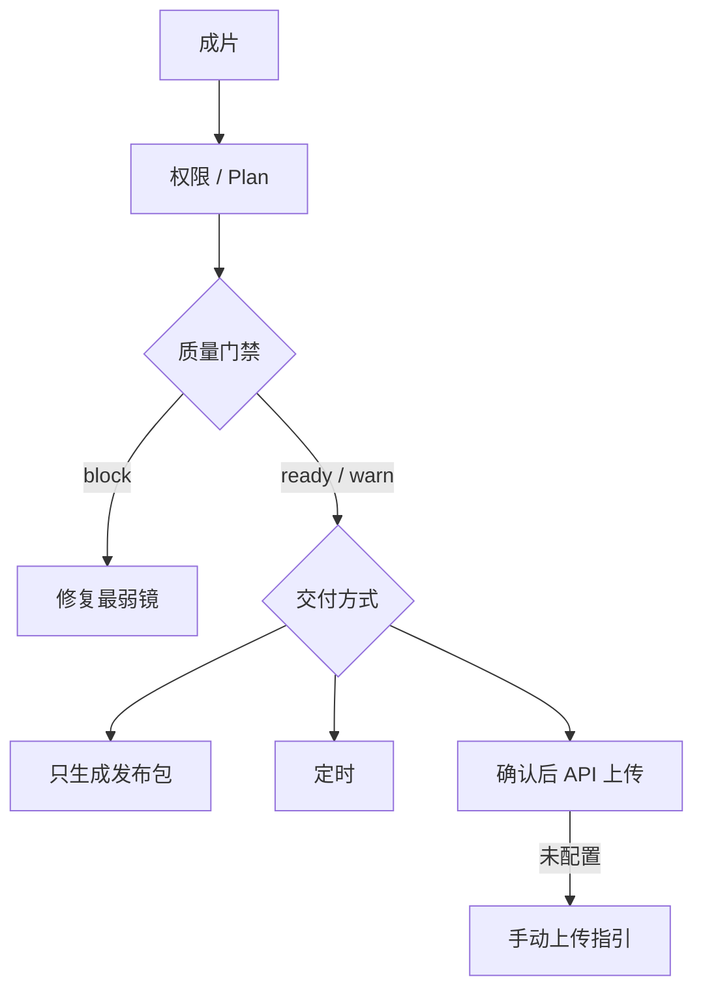
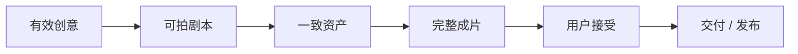

# Wind Comic 业务域、产品流程与商业逻辑深度解析

> 本篇回答三个问题：平台为谁解决什么问题、业务对象如何流转、技术能力如何转化为可交付价值。市场规模等外部数据不在本文结论范围内。

## 1. 产品不是单一“AI 视频生成器”

从页面、API 和数据表看，Wind Comic 已形成五层产品能力：

因此它的业务价值不应只表述为“用 AI 降低生成成本”，而应表述为：

**把离散的模型能力组织成有中间资产、有人工控制、有质量门槛、能继续进入专业剪辑和发布环节的制作工作台。**

## 2. 目标用户与核心任务

| 用户 | 核心任务 | 最关心的结果 |
|---|---|---|
| 短剧 / 漫剧创作者 | 从创意快速形成可发布内容 | 钩子、反转、竖屏、成片速度 |
| 漫画改编团队 | 把文本 / 漫画结构变成分镜与视频 | 角色一致性、镜头可编辑 |
| 品牌内容团队 | 快速生成广告或内容营销视频 | 品牌安全、画面统一、交付格式 |
| 独立影视创作者 | 将 AI 素材接入人工制作流程 | 时间线、字幕、EDL / AAF 等导出 |
| 内容代工团队 | 并行管理多个客户 / 项目 | 成本、权限、自托管、可追踪 |
| 开发者 | 替换模型并扩展工作流 | Provider 插件、DAG、可测试性 |

## 3. 业务角色与权限角色不要混淆

### 3.1 影视岗位角色

Director、Writer、Character Designer、Scene Designer、Storyboard、Video Producer、Editor、Producer 是 AI 生产岗位。

### 3.2 项目协作角色

| 角色 | 权限语义 |
|---|---|
| viewer | 查看项目 |
| commenter | 查看并评论 |
| editor | 修改资产、时间线和相关项目内容 |
| owner | 项目所有者；代码中按 editor 能力处理，并拥有删除 / 分享管理等权限 |

### 3.3 团队角色

团队工作区另有 owner、admin、member，用于额度分配和成员管理。项目角色与团队角色是两套权限维度，不能用团队 admin 自动推导所有项目 editor，除非业务代码明确映射。

## 4. 核心业务对象

### 4.1 Project

项目是一部单集作品，也是所有阶段资产、成本、评论和发布记录的聚合根。主要状态包括 draft、active、completed、failed、archived 等，但仓库中并没有一个集中、严格的状态枚举约束所有写入点，属于后续应收口的领域规则。

### 4.2 Project Asset

项目资产是制作过程的核心事实：计划、剧本、角色、场景、分镜、视频、音频、时间线和成片都落在这里。它同时承担：

- 用户可查看 / 修改的制作资产；
- 流水线检查点；
- 单镜重生的目标；
- 导出和复审的输入；
- 版本、确认和 stale 传播。

### 4.3 Global Asset

全局资产用于跨项目复用角色、场景、风格、道具和模板。它与 Project Asset 的区别是生命周期不绑定单个项目，并可通过标签、视觉锚点或 embedding 做相似检索。

### 4.4 Character Library 与 Cameo IP

角色库保存角色外观、多视图、DNA、音色等信息。Cameo IP 在其上增加 Token、可见性、授权类型、建议版税和 Grant 审批，使“角色复用”从技术功能变成业务授权流程。

### 4.5 Series

系列并没有独立的主表；当前以 `projects.series_id + episode_number` 组织各集，并使用 `series_anchors` 保存跨集角色、风格和上一集尾帧等锚点。

## 5. 业务主流程一：一句话创作

### 业务规则

1. 创意过短或缺少题材信号会被拒绝，避免付费生成占位内容。
2. 在任何 LLM 之前检查登录和预算。
3. Style Bible、锁脸角色和参考元素可以约束全片。
4. 开启 gate 后可在高成本阶段前人工确认。
5. 视频按镜头生成，失败不应抹掉其他成功镜头。
6. 审核不通过时做有限轮定点返工。

## 6. 业务主流程二：试拍再开机

试拍不是单纯预览，它是降低错误方向成本的业务漏斗：

接受的试拍图可直接复用为第一镜分镜并充当风格锚，既省一次图片调用，也减少“用户预期与整片画风不同”的风险。

## 7. 业务主流程三：长文拆集与系列生产

### 关键业务细节

- 集数限制为 1–50，输入设定会截断以控制 LLM 成本和垃圾数据。
- 已有项目可成为第一集锚点；后续集号取现有最大值加一。
- 第 N 集会注入前几集梗概，避免每集成为互不相关的独立故事。
- 默认整季并发为 1，因为多集并行会同时冲击视频 Provider、预算和跨集尾帧连续性。
- 队列关闭时使用进程内后台任务，进程重启可能丢失在途执行，这是明确技术边界。

## 8. 业务主流程四：项目后期工作台

项目完成后仍可进行大量非线性操作：

| 业务动作 | 对应能力 |
|---|---|
| 改某镜画面 | regenerate-storyboard / regenerate-shot |
| 改某段动作 | segment-retake |
| 只重做语音 | voice-retake / shot-audio |
| 调整字幕和口型 | lipsync-align / lipsync render |
| 调整剪辑 | timeline / recompose / edit intent |
| 改画幅 | reframe / export-platform |
| 补坏镜头 | heal-shots / render-loop |
| 质量检查 | vision-audit / health / drift-check |
| 生成封面 | covers / anytext-cover |
| 导出专业工程 | EDL、AAF、剪映等 |

这说明项目不是“黑盒整片生成”：资产级可编辑和定点返工才是主要制作价值。

## 9. 业务主流程五：拉片与复刻

逐镜视觉识别失败时会降级为结构骨架，因此“复刻”应理解为复用镜头结构、时长和参数，不是逐像素复制原片。

## 10. 业务主流程六：模板市场与资产复用

### 模板生命周期

1. 从高质量项目沉淀模板。
2. 保存风格、题材、节奏、元素和起片 payload。
3. 设为 public 或 private。
4. 用户收藏、评分、使用或通过 Token 分享。
5. 使用次数和评分聚合用于排序。

### 业务风险

- 模板 payload 可能引用已失效的本地 URL。
- 源项目删除后，模板的来源与授权信息需要保留快照。
- 公共模板应做内容审核和版权声明。
- 评分应防刷，当前联合主键只解决“一人一评分”，不解决批量假账号。

## 11. 业务主流程七：角色 IP 授权

Token 包含 view / remix / commercial 授权语义和建议 royalty。代码具备授权记录，但真正的财务结算、合同、税务和争议处理不在当前系统内，因此它更接近“IP 授权规则与使用记录地基”，不是完整版权交易平台。

## 12. 业务主流程八：协作

评论目标可定位 project、shot、scene、character、storyboard。Yjs 用于实时文档和 presence，数据库评论用于可审计沟通，两者职责不同。

## 13. 业务主流程九：发布与交付

发布不是简单上传按钮，当前顺序为：

1. 登录。
2. 项目 owner / editor 权限。
3. 订阅计划门槛。
4. 质量门禁；block 返回 422。
5. 组装平台发布包。
6. 立即打包、定时发布或显式确认后真实上传。
7. 无凭据 / 无公开 API 时诚实返回 manual，不伪造 published。
8. 落 `publish_records` 或 `scheduled_publishes`。

## 14. 收费与成本业务

代码中同时存在 Subscription、Plan Gate、Usage Tracking、Cost Log、Team Allocation 和 Stripe。它们对应不同问题：

| 机制 | 解决的问题 |
|---|---|
| Subscription | 用户属于哪个套餐 |
| Plan Gate | 某功能是否允许使用 |
| Usage Quota | 本周期还能使用多少 |
| Budget Guard | 本次调用会不会超过金额上限 |
| Cost Log | 实际模型成本如何归因 |
| Team Allocation | 主账号如何给成员分额度 |
| Stripe | 结账、客户和订阅状态同步 |

业务上必须避免“套餐允许”被误解为“无限调用”。代码注释已经指出重度 4K 用户成本可能超过订阅价，因此功能权限、用量和金额预算要三层同时治理。

## 15. 价值链与关键指标

每层应有指标：

| 环节 | 建议指标 |
|---|---|
| 创意 | 薄创意拒绝率、模板使用率、试拍接受率 |
| 剧本 | gate 修改率、结构校验通过率、单次通过率 |
| 视觉 | 角色 / 风格审计分、重生率、人工复核率 |
| 视频 | Provider 成功率、镜头降级率、单镜成本和 P95 |
| 编辑 | 音轨完整率、实际 / 设计时长偏差、FFmpeg fallback 率 |
| 质量 | 首次审核通过率、返工镜头数、最终健康分 |
| 交付 | 导出率、发布门禁阻塞率、手动 / API 发布比例 |
| 留存 | 资产复用率、系列续集率、模板复用率 |

## 16. 当前业务问题

### P0：业务事实可能不一致

- Project 状态值由多个模块直接写字符串，缺少统一状态机。
- SQLite / PostgreSQL 混读可能导致“有权限却查不到”或读到另一库状态。
- 项目资产既存最新产物又存追加历史，查询者若用 `LIMIT 1` 可能拿错版本。

### P1：产品面过宽

182 个 API 路由覆盖创作、协作、IP、发布、系列、MV、漫画、短视频等多个方向。若没有主航道指标，研发资源容易被功能数量稀释。

### P1：降级的用户感知

系统大量采用 best-effort 和 fallback。业务上必须明确展示：

- 当前成片是否用了 Ken Burns / B-roll 等降级镜头；
- 是否真正完成 Lip-sync；
- 是否真实发布还是只生成手动包；
- 是否使用 fallbackScript / fallbackReview；
- 哪些模型未配置。

否则“流程成功”可能掩盖“产品结果不合格”。

### P1：授权与交易边界

Cameo IP 有授权记录和建议版税，但没有真实结算闭环。UI 文案和面试表述应避免将其描述成完整商业授权市场。

### P2：系列一致性仍是弱约束

前集 recap、角色锚和尾帧能提升连续性，但它不是完整剧情知识图谱；角色关系、未解决冲突、道具状态和时间线仍可能漂移。

## 17. 推荐的业务优先级

1. 以“一句话 / 长文 → 可编辑成片 → 专业交付”为主航道。
2. 用首次成片成功率、降级镜率、单片成本和导出率作为北极星链路。
3. 优先修复会导致错账、越权、重复计费和资产错版本的问题。
4. 将质量降级完全透明化，允许用户按镜头决定是否接受。
5. 模板、角色 IP、发布等生态功能围绕主航道复用，不独立扩张成多个半成品平台。

## 18. 面试追问

### 为什么制作平台不应只优化“更便宜”？

因为生成便宜但废片率高，用户仍无法交付。真正影响价值的是可用成片率、局部返工成本、人工接管能力和发布成功率。Wind Comic 的差异点更接近资产化生产和质量闭环，而不是某个模型最低价。

### 为什么项目资产是业务核心，不是模型调用记录？

用户购买的不是一次 API 调用，而是可修改、可复用、可交付的角色、分镜、视频和时间线。模型调用只是生产动作，资产才是可持续累积的产品价值。

### 业务上为什么限制自动审核轮数？

因为每轮返工都可能触发真实图片 / 视频费用，而且自动评分并不保证审美提升。有限轮自动修复加人工确认能给成本设置上界。

## 19. 源码索引

- [`app/create/page.tsx`](../app/create/page.tsx)
- [`app/projects/[id]/page.tsx`](../app/projects/[id]/page.tsx)
- [`lib/series.ts`](../lib/series.ts)
- [`lib/repos/series-repo.ts`](../lib/repos/series-repo.ts)
- [`lib/project-share.ts`](../lib/project-share.ts)
- [`lib/cameo-ip.ts`](../lib/cameo-ip.ts)
- [`lib/team-credits.ts`](../lib/team-credits.ts)
- [`lib/publish-dispatch.ts`](../lib/publish-dispatch.ts)
- [`app/api/projects/[id]/publish/route.ts`](../app/api/projects/[id]/publish/route.ts)
