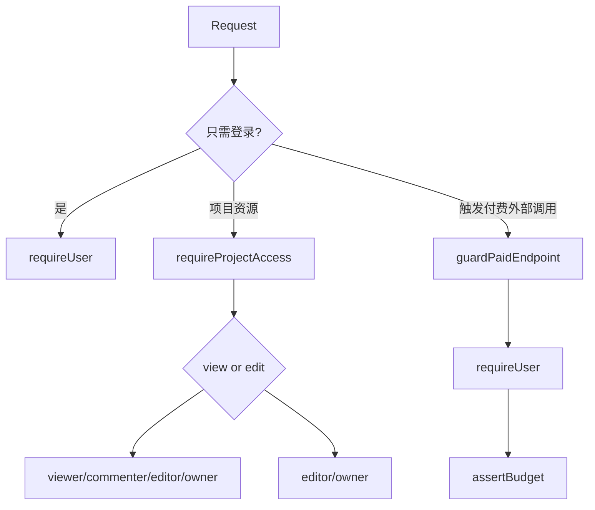

# Wind Comic API、认证权限与 SSE 协议详细参考

> 当前源码快照包含 182 个 `route.ts`，其中约 75 个位于 `/api/projects/[id]` 子域。本篇按业务域整理，不把所有路由误当成同等成熟的公共 API。

## 1. API 运行模型

- Next.js Route Handlers，Node runtime 为主。
- JSON API 使用 `NextResponse.json` 或 `Response`。
- 长任务使用 `text/event-stream`。
- 媒体服务需要本地文件、FFmpeg 和动态 Provider，因此不能统一切 Edge runtime。
- `/api/v1/projects` 只是有限的版本化入口，大部分接口仍为内部产品 API，不具备稳定公共版本承诺。

## 2. 路由域清单

| 业务域 | 当前路由文件数 | 代表能力 |
|---|---:|---|
| projects | 75 | 资产、时间线、重生、复审、导出、发布、协作 |
| series / season | 10 | 建系列、拆集、批量生成、体检、合集导出 |
| templates | 8 | 模板市场、收藏、评分、分享、克隆 |
| auth | 4 | 登录、注册、当前用户、退出 |
| workflows | 4 | DAG CRUD、普通执行、流式执行 |
| global-assets | 4 | 全局资产 CRUD、使用、相似检索 |
| team | 4 | 团队邀请、额度分配与消耗 |
| characters | 4 | 角色库和 Character Studio |
| tools | 4 | 去背景、URL 转 brief、视频锚点与对比 |
| cameo-ip | 3 | IP Token、授权申请与审批 |
| comic / MV / U2V | 多个 | 专门媒体生成入口 |
| usage / stripe | 多个 | 用量、预算、结账、Webhook |
| health / admin / metrics | 多个 | Provider 健康、用量、遥测 |

## 3. 认证令牌

### 3.1 登录态来源

`getUserFromRequest` 支持：

1. `Authorization: Bearer <jwt>`；
2. `qfmj-session` HttpOnly Cookie。

Bearer 优先于 Cookie。JWT payload 的 `sub` 是用户 ID。生产环境弱 `JWT_SECRET` 会触发 fail-fast；未配置时的开发行为不能当成生产安全方案。

### 3.2 Cookie 语义

- HttpOnly：浏览器 JavaScript 无法直接读取。
- SameSite=Lax：降低部分跨站请求风险。
- 仍需关注 HTTPS 下的 Secure、反向代理协议识别和 CSRF 语义。
- 若同一 API 支持 Cookie 写操作，SameSite 不是对象级授权的替代品。

## 4. 三类后端守卫



### 4.1 `requireUser`

用于用量、账户、角色库等非项目作用域接口，失败返回 401。

### 4.2 `requireProjectAccess`

- `view`：owner 或 viewer / commenter / editor。
- `edit`：owner 或 editor。
- 未登录返回 401；已登录但无权限返回 403。

### 4.3 `guardPaidEndpoint`

一次完成登录与预算检查。用于图生视频、TTS、人脸 Vision 等会直接烧平台额度的侧门接口；预算不足返回 402，并携带 `code=budget_exceeded`。

## 5. 权限矩阵

| 操作 | viewer | commenter | editor | owner |
|---|---:|---:|---:|---:|
| 查看项目 / 资产 | ✓ | ✓ | ✓ | ✓ |
| 评论 | 取决于评论路由角色检查 | ✓ | ✓ | ✓ |
| 修改分镜 / 时间线 | ✗ | ✗ | ✓ | ✓ |
| 触发镜头重生 | ✗ | ✗ | ✓ | ✓ |
| 删除项目 | ✗ | ✗ | 通常 ✗ | ✓ |
| 创建 / 撤销邀请 | ✗ | ✗ | 依路由规则 | ✓ |
| 发布 | ✗ | ✗ | ✓ | ✓ |

注意：这是目标语义。仓库经历过多轮鉴权补漏，实际安全性必须逐路由核对，不能只看 `auth-guard.ts`。

## 6. 核心创建接口

### `POST /api/create-stream`

#### 输入摘要

```typescript
{
  idea: string;
  projectId?: string;
  videoProvider?: string;
  style?: string;
  aspect?: string;
  enableGates?: boolean;
  templateId?: string;
  primaryCharacterRef?: string;
  lockedCharacters?: LockedCharacter[];
  cameraDefault?: string;
  previewSeedImage?: string;
  references?: ReferenceElement[];
  editStyle?: string;
  language?: string;
  sketchLock?: boolean;
}
```

`duration` 和 `isPreset` 会从 Body 读取，但当前主 input 组装未继续使用，属于接口历史残留或待核实字段。

#### 前置校验顺序

1. `idea` 非空。
2. 必须登录。
3. 预估完整流水线费用并检查预算。
4. 规则 / 可选 LLM 规范化创意。
5. 少于 10 字硬拒绝；10–30 字且无题材信号软拒绝。
6. 注入、有害、越界和 PII 安全处理。
7. Prompt 模板增强。
8. 进入队列或请求内流水线。

#### 常见响应

| HTTP | 语义 |
|---:|---|
| 400 | 空创意、薄创意、安全拒绝或参数错误 |
| 401 | 未登录 |
| 402 | 预算不足 |
| 200 + SSE | 已进入生产流程 |

## 7. SSE 数据帧

当前服务没有使用浏览器原生 `event:` 字段区分事件，而是统一发送：

```text
data: {"type":"status","data":{"message":"导演正在规划"}}

```

因此客户端要先解析 JSON，再按 `type` 分发。

### 主要事件

| type | data 典型内容 | 客户端动作 |
|---|---|---|
| `jobQueued` | jobId、projectId | 记录可查询任务 ID |
| `step` | step | 切换当前阶段、写时间线 |
| `status` | message | 展示用户可读状态 |
| `agentUpdate` 等 | role、progress、status | 更新 Agent 卡片 |
| `storyboardSketch` | shotNumber、sketchUrl | 展示草图锁中间产物 |
| `characterDna` | perCharacter | 展示 / 保存角色 DNA |
| `review` | DirectorReview | 展示质量与返工项 |
| `stageTiming` | 阶段耗时摘要 | 性能分析 |
| `complete` | 项目与主要产物 | 进入项目详情 |
| `error` | message、retrying | 提示失败或等待重试 |

### 协议问题

- 未定义正式版本和 JSON Schema，前后端可能随代码同步演化。
- 队列事件回放与 live 订阅可能重复，客户端必须幂等更新。
- 默认请求内路径没有显式 catch 包装 `runCreatePipeline`；错误事件主要由内部流程发出，边界异常需要确认流是否正常关闭。
- 进度百分比是体验信号，不应替代项目终态。

## 8. 队列 API

| 路由 | 用途 | 核心约束 |
|---|---|---|
| `GET /api/pipeline-jobs` | 查询本人任务 | 必须按 user 过滤 |
| `POST /api/pipeline-jobs/[id]/retry` | 重投 failed 任务 | 仅 failed，可验证归属 |

创建接口入队时必须写 `user_id`。代码注释记录过一次安全收口后忘记补写 owner，导致任务列表对创建者不可见；这是“读侧加守卫时必须同步检查写侧归属”的典型教训。

## 9. 项目基础 API

### `GET /api/projects`

列出当前用户项目。应关注状态过滤、归档项目、封面子查询和资产聚合性能。

### `POST /api/projects`

创建基础项目壳；与 `/create-stream` 创建生产项目不是完全相同的用例。

### `GET /api/projects/[id]`

- 要求 view 权限。
- 读取项目与全部资产。
- 对 cover、script、director notes 使用或应使用安全 JSON 解析。
- 当前项目行仍直接从 SQLite `db.prepare` 读取，而资产通过 DbDriver，PostgreSQL 模式存在混读风险。

### `PATCH /api/projects/[id]`

有两个语义：

- `status=archived|active`：owner 归档 / 恢复。
- `assetId + data`：editor 修改资产。

把多个命令放在同一个 PATCH 中会增加校验分支，长期可拆成更明确的命令端点。

### `DELETE /api/projects/[id]`

owner 删除并级联清理子表。媒体对象和远端资产是否同时删除，需要结合 storage / cleanup 策略，数据库级联不等于文件已清理。

## 10. 项目制作 API 分类

### 10.1 资产和镜头

- `/assets`、`/asset-ledger`
- `/regenerate-asset-image`
- `/regenerate-storyboard`
- `/regenerate-shot`、`/regenerate-shot-4k`
- `/segment-retake`
- `/shot-sketch`、`/shot-spec`
- `/candidates`、`/candidates/pick`

### 10.2 一致性与质量

- `/consistency`、`/continuity`
- `/drift-check`
- `/vision-audit`、`/vision-audit/run`
- `/director-review`
- `/health`、`/heal-shots`
- `/review-status`

### 10.3 音频和剪辑

- `/timeline`
- `/music`、`/narration`
- `/shot-audio`、`/voice-retake`、`/voice-overrides`
- `/lipsync`、`/lipsync/render`、`/lipsync-align`
- `/recompose`、`/render-loop`

### 10.4 导出和发布

- `/export`、`/export-edl`、`/export-aaf`、`/export-jianying`
- `/export-platform`、`/format`、`/reframe`
- `/publish-preflight`、`/publish-readiness`
- `/publish-package`、`/publish`、`/distribution`

## 11. 单镜重生 SSE

单镜重生类接口通常：

1. 要求 edit 权限。
2. 读取项目画风、角色参考、Style Bible 和目标镜头。
3. 合并用户 customPrompt。
4. 调图片或视频 Provider。
5. 更新 / 新增目标 shot 资产。
6. 发 status、complete 或 error。

风险点：旧文件头可能仍写着 “demo-friendly 不强制鉴权”，而实现后来已加 `requireProjectAccess`。文档和注释不一致会误导维护者，应以实际调用为准并清理过期注释。

## 12. 系列 API

| 路由 | 作用 |
|---|---|
| `GET /api/series` | 列本人系列 |
| `POST /api/series` | 创建系列、可自动拆集 |
| `POST /api/series/split` | 单独调用 AI 拆集 |
| `GET /api/series/[id]` | 获取各集与进度 |
| `POST /api/series/[id]/generate` | 批量生成待生产集 |
| `POST /api/series/[id]/resume` | 恢复系列任务 |
| `GET /api/series/[id]/health` | 全季质量体检 |
| `POST /api/series/[id]/export` | 拼接整季 |
| `POST /api/series/[id]/cover` | 生成季封面 |
| `GET /api/series/[id]/drama-package` | 组装系列交付包 |

批量生成前按 `targets.length × 单集估算` 做预算判断；若队列关闭，则使用 fire-and-forget，进程重启会丢失在途任务。

## 13. 工作流 API

| 路由 | 方法 | 说明 |
|---|---|---|
| `/api/workflows` | GET / POST | 列表与保存 |
| `/api/workflows/[id]` | GET / DELETE | 读取和删除 owner 工作流 |
| `/execute` | POST | 返回完整执行结果 |
| `/execute/stream` | POST | 推送节点生命周期 |

Real-run 应检查工作流 owner、绑定项目访问权和实际 Provider 能力；仅检查某一个 OpenAI Key 会错误拒绝本地 XVERSE 或错误放行不完整媒体能力。

## 14. 发布 API 的错误语义

`POST /api/projects/[id]/publish` 的门禁：

| HTTP | 含义 |
|---:|---|
| 401 | 未登录 |
| 403 | 非 owner / editor |
| 402 | 套餐不满足 |
| 422 | 质量门禁 block |
| 400 | platform 或 scheduledAt 非法 |
| 200 packaged | 只完成发布包 |
| 200 published | 真实上传成功 |
| 200 packaged + upload.manual | 无凭据 / 无 API，需人工上传 |

`manual` 不是失败，也不是 published，前端必须明确展示三态。

## 15. Cron 与 Webhook

- Stripe Webhook 必须验证签名，不能使用普通登录鉴权。
- 定时发布 Cron 应使用专用 Secret 或内部网络限制。
- 清理媒体 Cron 必须限制删除范围和保留仍被资产引用的文件。
- GET 触发有副作用的 Cron 会增加误触风险，生产建议只允许受保护 POST。

## 16. 文件服务

`/api/serve-file` 用于向浏览器交付本地成片。历史上“任意登录用户传 path”会形成任意文件读取风险，当前通过服务端签名能力 URL 收口。

安全规则应包括：

- 只接受服务端签发的 path + 签名 + 过期时间。
- `Resolve-Path` 后验证仍位于允许的媒体目录。
- 不相信 URL 前缀本身。
- 设置正确 MIME、Content-Disposition 和 Range。
- 多实例时迁移对象存储，避免签名 URL 命中没有文件的实例。

## 17. API 设计问题清单

### P0：SQLite / PostgreSQL 混读

多个 Route 在完成 `requireProjectAccess` 后仍直接 `db.prepare`，而 Repository 走配置驱动。PG 部署时权限判断、项目行和资产可能来自不同数据库。

### P0：内部无 owner 方法被路由误用的风险

`updateProjectById` 等方法为了流水线按 ID 更新，不带 owner 条件。它们必须只在已完成上层授权或可信内部流程中使用，命名应明确为 `updateProjectInternal` 并限制导出面。

### P1：路由数量和鉴权漂移

大量项目侧门曾出现 GET 有守卫、POST 无守卫或付费调用无预算。已补修不代表以后不会复发，应使用静态 Gate 扫描：

- 所有动态 `[id]` 项目路由必须出现项目守卫；
- 所有调用付费 Provider 的路由必须出现 paid / budget guard；
- 所有出站 URL 必须通过 SSRF 安全封装。

### P1：缺少统一错误模型

当前错误字段混用 `error`、`message`、`code`，SSE 又使用 `{type:'error', data}`。建议统一：

```typescript
interface ApiError {
  code: string;
  message: string;
  retryable: boolean;
  traceId?: string;
  details?: Record<string, unknown>;
}
```

### P1：缺少契约版本

为创建 SSE、工作流 SSE 和公开导出接口建立 Zod / JSON Schema，并给事件加 `schemaVersion` 和单调 `eventId`。

### P2：一个 Route 承担多命令

例如项目 PATCH 同时处理归档和资产编辑。拆成命令路由能减少分支鉴权和 Body 歧义。

## 18. 推荐的 API 测试矩阵

每个项目路由至少验证：

1. 无 Token → 401。
2. 其他用户 → 403 / 404。
3. viewer 对写操作 → 403。
4. commenter 对评论成功、编辑失败。
5. editor 对编辑成功。
6. owner 删除成功。
7. 不存在 ID → 404。
8. 非法 JSON / 字段 → 400。
9. 预算不足的付费操作 → 402 且 Provider 未被调用。
10. 重试请求不重复生成已存在资产。

## 19. 源码索引

- [`app/api/auth/lib.ts`](../app/api/auth/lib.ts)
- [`lib/auth-guard.ts`](../lib/auth-guard.ts)
- [`lib/paid-endpoint-guard.ts`](../lib/paid-endpoint-guard.ts)
- [`app/api/create-stream/route.ts`](../app/api/create-stream/route.ts)
- [`app/api/projects/[id]/route.ts`](../app/api/projects/[id]/route.ts)
- [`app/api/series/[id]/generate/route.ts`](../app/api/series/[id]/generate/route.ts)
- [`app/api/projects/[id]/publish/route.ts`](../app/api/projects/[id]/publish/route.ts)
- [`app/api/serve-file/route.ts`](../app/api/serve-file/route.ts)
