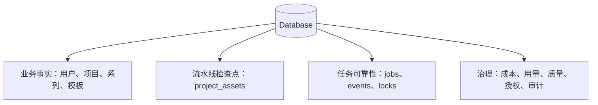
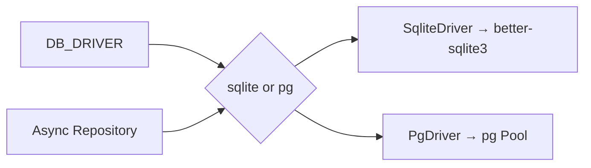
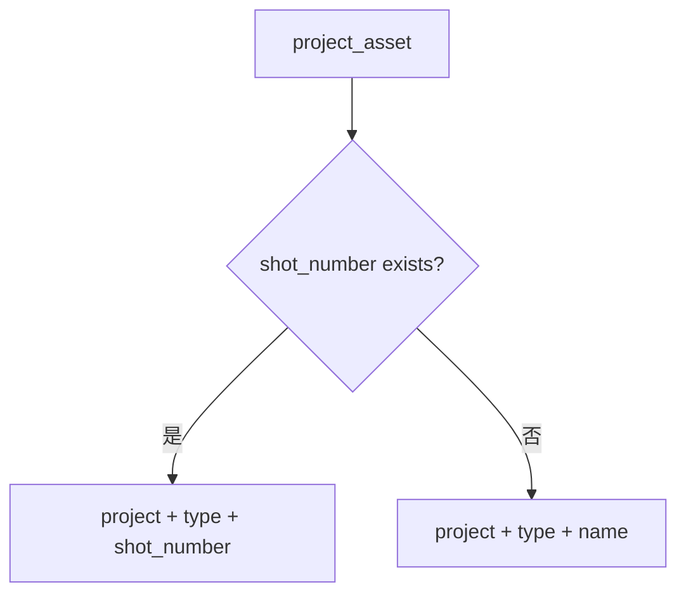
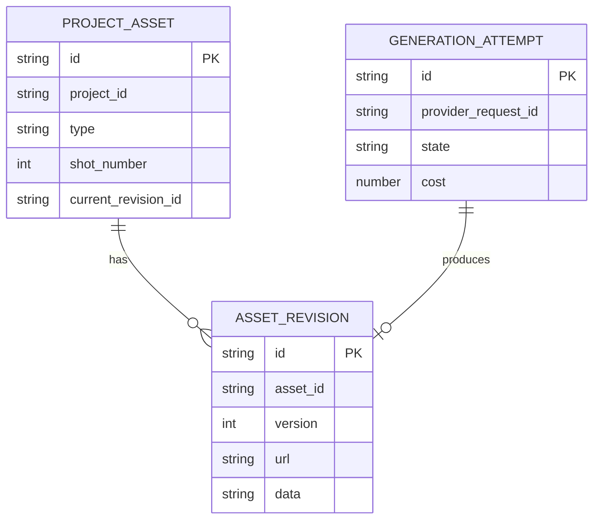
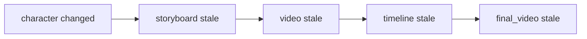

# Wind Comic 数据库、资产版本与状态机源码级解析

## 1. 数据库在系统中的四个角色

它不是简单 CRUD 库。尤其 `project_assets` 和 `pipeline_jobs`，直接决定 AI 长任务能否恢复和是否重复计费。

## 2. SQLite 初始化

默认 `lib/db.ts` 使用 better-sqlite3：

- 数据文件位于 `data/qfmj.db`。
- 启用 foreign keys。
- 使用 WAL / 相关 pragma（具体以代码为准）。
- `busy_timeout=5000`，多 Worker 同时写时最多等待 5 秒，减少瞬时 `database is locked`。
- 启动时执行 `CREATE TABLE IF NOT EXISTS` 和 `addColumnIfMissing`。

这种“运行时迁移”方便单机升级，但不如正式 migration 具备版本、回滚和失败审计。

## 3. PostgreSQL 切换

`DbDriver` 统一 `get/query/run/transaction`。SQLite 同步操作包装为 Promise；PostgreSQL 需要 `DATABASE_URL` 并转换参数占位符。

`scripts/pg-migrate.ts` 并非直接信任仓库中现成的 `db/schema.pg.sql`：它先从当前活 SQLite 的 `sqlite_master` 导出并翻译最新 DDL，覆盖生成 `db/schema.pg.sql`，再逐条应用到 PostgreSQL。仓库中的静态 Schema 快照可能落后于 `lib/db.ts` 后续新增的 job、event、lock 等表，因此部署时应运行迁移脚本并核对导出结果，而不是只手工导入旧快照。

### 关键现实

仓库中仍有大量直接 `lib/db` 引用。静态扫描当前 `app/lib/services` 得到 131 个候选文件，其中有些仅用于 SQLite 初始化或兼容，但也有真实业务路径直接 `db.prepare`。因此 `DB_DRIVER=pg` 不能只看驱动存在，要做完整接口集成测试。

## 4. 表目录

### 4.1 账号、套餐和团队

| 表 | 作用 |
|---|---|
| `users` | 账号、角色、语言、预算、Stripe 字段 |
| `subscriptions` | 套餐、状态、开始和到期时间 |
| `usage_tracking` | Credits 使用动作 |
| `team_allocations` | 团队总额度和成员分配 JSON |
| `team_invites` | 团队邀请 Token 与角色 |
| `invite_codes` | 注册邀请码 |
| `waitlist` | 候补 / 审批 |

### 4.2 内容项目

| 表 | 作用 |
|---|---|
| `projects` | 单部作品 / 单集聚合根 |
| `project_assets` | 全阶段资产、检查点、版本和 URL |
| `generations` | 生成请求历史 |
| `chat_messages` | 项目 Agent 对话与动作消息 |
| `series_anchors` | 跨集角色 / 风格 / 尾帧锚点 |
| `project_locked_characters` | 锁脸 JSON 的归一索引镜像 |
| `preview_history` | 试拍历史和频率依据 |
| `cases` | 公开案例 |

### 4.3 资产与生态

| 表 | 作用 |
|---|---|
| `character_library` | 用户角色库 |
| `global_assets` | 跨项目角色 / 场景 / 风格 / 道具 / 模板 |
| `film_templates` | 项目模板市场 |
| `template_ratings` | 一人一模板一评分 |
| `template_favorites` | 收藏关系 |
| `template_share_tokens` | 模板外链分享 |
| `character_ip_tokens` | 角色 IP 可见性、许可与建议版税 |
| `character_ip_grants` | IP 复用申请和审批 |

### 4.4 任务与并发

| 表 | 作用 |
|---|---|
| `pipeline_jobs` | queued/running/done/failed 任务 |
| `pipeline_job_events` | append-only SSE 进度事件 |
| `pipeline_reruns` | 重跑记录 |
| `resource_locks` | 跨实例 TTL 互斥锁 |
| `model_overrides` | 模型雷达选择的 env 覆盖 |

### 4.5 质量、成本和遥测

| 表 | 作用 |
|---|---|
| `cost_log` | 每次引擎成本 |
| `api_usage_events` | Provider 成功 / 失败、耗时和错误码 |
| `api_quota_alerts` | 欠费、限流、饱和告警 |
| `project_quality_scores` | 连贯、光影、脸相似等历史评分 |
| `shot_vision_audits` | 每镜剧本符合度和问题 |
| `plugin_chain_events` | Provider 插件链主用 / 影子结果 |
| `ui_events` | 轻量产品埋点 |
| `consent_log` | 声音克隆等授权同意日志 |

### 4.6 协作和发布

| 表 | 作用 |
|---|---|
| `comments` | 项目 / 镜头 / 场景等评论 |
| `notifications` | mention、reply、invite 通知 |
| `project_share_tokens` | 带角色和有效期的邀请链接 |
| `project_collaborators` | 用户与项目角色 |
| `project_track_edits` | 时间线编辑记录 |
| `yjs_docs` | Y.Doc 二进制快照 |
| `publish_records` | packaged/published/scheduled/failed |
| `scheduled_publishes` | 定时发布任务 |

## 5. `projects`：聚合根

初始列只有用户、标题、描述、封面、状态和时间，后续通过 `addColumnIfMissing` 增加：

- `script_data`、`director_notes`、`pipeline_state`；
- `mode`、`execution_mode`、`style_id`、`aspect`；
- `global_asset_ids`、`output_config`；
- `series_id`、`episode_number`；
- `primary_character_ref`、`locked_characters`；
- `share_token`、`share_created_at`。

### 设计问题

1. 项目表逐版本横向膨胀，多个 JSON 列缺少 Schema。
2. 状态字符串未由数据库约束。
3. `script_data` 与 `project_assets(type=script)` 可能形成双事实源。
4. `director_notes` 与 review 资产 / review_status 可能形成双事实源。
5. `locked_characters` JSON 又同步到归一表，存在双写一致性。

## 6. `project_assets`：核心资产表

关键列：

| 列 | 语义 |
|---|---|
| `project_id` | 资产归属项目 |
| `type` | plan、script、character、storyboard、video 等 |
| `name` | 非镜头资产身份或展示名 |
| `data` | JSON 结构化元数据 |
| `media_urls` | JSON URL 数组 |
| `persistent_url` | 优先使用的稳定 URL |
| `shot_number` | 镜头资产的业务键 |
| `version` | 重生成版本 / 尝试参考 |
| `confirmed` | 人工确认 |
| `stale` | 上游变化后需重算 |

### 6.1 两类业务键

### 6.2 Upsert 实现

`upsertAsset` 在同一事务内先 UPDATE，未命中再 INSERT。这个修复针对两个 Worker 同时恢复任务时产生重复镜头资产的竞态。

### 6.3 为什么没有直接加唯一索引

同一表还保存 voice-retake 等追加式历史：同项目、同类型、同镜头可能故意存在多条。给整个表加 `(project,type,shot)` 唯一约束会破坏历史记录。

这暴露了一个建模问题：

- “当前资产”需要唯一 upsert；
- “生成 / 重录尝试”需要 append-only。

推荐拆为：

## 7. Checkpoint 重建

`loadCheckpoints` 并行查询：plan、script、styleBible、character、scene、storyboard、video、final_video 和 timeline。

### 有效性条件

- Script 必须有非空 shots 才可续跑。
- URL 优先 `persistent_url`，否则取 `media_urls` 第一个 HTTP(S)。
- 角色 / 场景按 name 取最新。
- 分镜 / 视频按 shot_number 取最新并排序。
- 分镜有 imageUrl 才算已经渲染。
- final_video 至少一个有效 URL 才算完成。

### 问题

`pipeline-checkpoints.ts` 读取 review 时直接使用 SQLite `db.prepare`，PG 模式下可能拿不到真实 `director_notes`。这会导致已经审核的项目再次调用 LLM 审核或状态不一致。

## 8. Stale 传播

上游资产变化后，下游产物不应继续被视为有效。例如角色外观变化可能使相关分镜、视频和最终成片失效。

当前通过 `stale` 标记和 rerun 逻辑处理部分依赖，但没有一份统一、可查询的资产依赖图。建议把资产 lineage 显式化，避免每个路由手写失效范围。

## 9. `pipeline_jobs` 与事件

### Job 核心列

- `type`、`project_id`、`user_id`；
- `state`、`step`、`payload`；
- `attempts`、`last_error`、`heartbeat_at`；
- `created_at`、`updated_at`。

旧的 `progress_log` JSON 保留兼容，新事件写入 `pipeline_job_events`。

### 为什么改为 append-only

旧做法是 SELECT JSON → parse → push → UPDATE：

- 多实例会 lost update；
- JSON 越大写放大越严重；
- 并发顺序难保证。

新表每个事件 INSERT 一行，用 `at + ord` 排序，并限制回放条数。

## 10. Resource Lock

`resource_locks` 用 `key` 主键、owner 和 expires_at 实现跨实例锁：

1. 尝试更新已过期锁。
2. 不存在则 `INSERT OR IGNORE` / `ON CONFLICT DO NOTHING`。
3. 只有 owner 能释放。
4. 进程崩溃后由 TTL 兜底。

适合整季导出等低频长任务，但需要评估操作是否可能超过 TTL；若会，需要续租，而不是让另一个 Worker 在旧任务仍运行时抢锁。

## 11. 成本数据

`cost_log` 保存 engine、resolution、duration 和 CNY；`api_usage_events` 保存更细的调用成功、错误码、耗时和估算费用。

两个表的差异：

- cost_log 面向账务归因；
- api_usage_events 面向 Provider 运维。

它们都缺少统一的 generation attempt / remote request ID 外键，因此远端账单、重试和资产之间的精确对账仍有限。

## 12. 协作数据

### Comments

评论冗余保存 `project_id`，并使用 `target_type + target_id` 定位镜头或资产；author_name 使用快照，避免用户改名影响历史展示；parent_id 只支持简单回复层级。

### Yjs

`yjs_docs` 保存 BLOB 全量快照和 update_count。它适合实时编辑状态，不替代业务资产的版本与权限审计。

### Project collaborators

`UNIQUE(project_id,user_id)` 防止重复成员。邀请 Token 和正式协作者分表，使链接可撤销、成员关系可长期保留。

## 13. JSON-in-TEXT 的收益与代价

### 收益

- 迭代快、SQLite 友好。
- AI 输出结构变化时不需频繁改列。
- 保存完整阶段上下文方便调试。

### 代价

- TypeScript 类型不等于历史行一定合法。
- 查询 JSON 子字段困难，索引能力有限。
- SQLite / PostgreSQL JSON 语法不同。
- `JSON.parse` 失败可能让整个列表 500。
- 多个模块对同一 JSON 形状理解不一致。

项目已引入 `safeJsonParse`，但仍存在裸 parse。建议：入口 Schema 校验、写入规范化、读取安全降级、重要查询字段归一化。

## 14. 双数据库的具体问题

### 问题 A：项目与资产来自不同库

`GET /api/projects/[id]` 使用 SQLite 查项目，再用 DbDriver 查资产。PG 模式可能出现项目 404 或把 SQLite 项目与 PG 资产拼在一起。

### 问题 B：创建流程兜底读 SQLite

读取 `primary_character_ref` 的某些兜底路径仍直接 `db.prepare`，PG 项目可能丢失锁脸参考。

### 问题 C：发布和质量路径

部分 publish、quality、workflow 模块直接读 SQLite。若写路径已迁 PG，功能会出现数据不一致而非明确报错，最难排查。

### 修复策略

1. 禁止业务代码 import 裸 `db`，仅 `db.ts` / SqliteDriver 可用。
2. 所有查询迁 Repository / DbDriver。
3. 加 ESLint / consumer gate 规则。
4. 用空 SQLite + 有数据 PostgreSQL 跑全 API 集成测试，最容易抓混读。
5. CI 比较当前 SQLite 导出结果与提交的 `db/schema.pg.sql`，防止 Schema 快照漂移。

## 15. 删除与生命周期

`deleteProjectCascade` 手动删除多个项目子表，再删项目。风险包括：

- 新增子表后忘记加入清单。
- 本地 / S3 媒体未同步删除。
- 分享 Token、通知或审计记录是否应保留需要业务政策。
- Worker 正在生成时删除项目，可能在删除后又写回资产。

建议先将项目标记 `deleting`，取消 / 隔离任务，删除对象存储，最后清 DB，并保留审计 Tombstone。

## 16. 索引与性能

源码注释记录过 `project_assets` 无核心索引导致全表扫描，后来补上 project / type 等索引并显著改善。

重点索引模式：

- `projects(user_id,status,updated_at)`；
- `project_assets(project_id,type,shot_number)`；
- `pipeline_jobs(state,created_at)`；
- `pipeline_job_events(job_id,at,ord)`；
- `cost_log(user_id,created_at)`；
- `comments(project_id,created_at)`；
- `notifications(recipient_user_id,read_at,created_at)`。

实际索引必须以 EXPLAIN 和真实数据量验证，不能只凭列名堆索引。

## 17. 建议的数据一致性测试

1. 同一镜头两个 Worker 同时 upsert，只产生一个当前资产。
2. Voice retake 同镜多次追加，历史不丢。
3. 修改角色后，相关镜头 stale，其他镜头不受影响。
4. PG 模式下 SQLite 保持空库，所有核心页面仍正常。
5. 删除项目时所有业务子表清理符合政策。
6. Job 事件并发写入无丢失，回放顺序稳定。
7. 锁超时后可重拿，但旧 owner 不能释放新 owner 的锁。
8. JSON 脏行不会让整个项目列表或详情 500。

## 18. 源码索引

- [`lib/db.ts`](../lib/db.ts)
- [`lib/db-driver.ts`](../lib/db-driver.ts)
- [`lib/db-dialect.ts`](../lib/db-dialect.ts)
- [`db/schema.pg.sql`](../db/schema.pg.sql)
- [`lib/repos/asset-repo.ts`](../lib/repos/asset-repo.ts)
- [`lib/repos/project-repo.ts`](../lib/repos/project-repo.ts)
- [`lib/repos/pipeline-job-repo.ts`](../lib/repos/pipeline-job-repo.ts)
- [`lib/pipeline-checkpoints.ts`](../lib/pipeline-checkpoints.ts)
- [`lib/repos/resource-lock-repo.ts`](../lib/repos/resource-lock-repo.ts)
