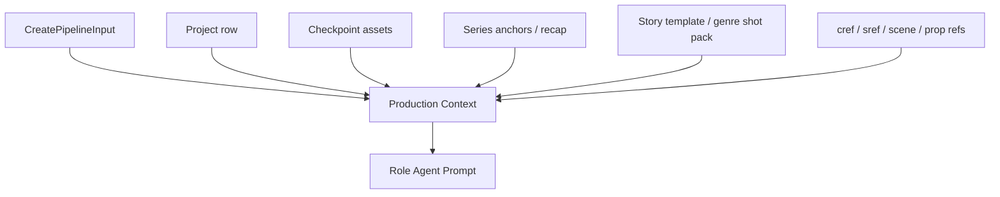
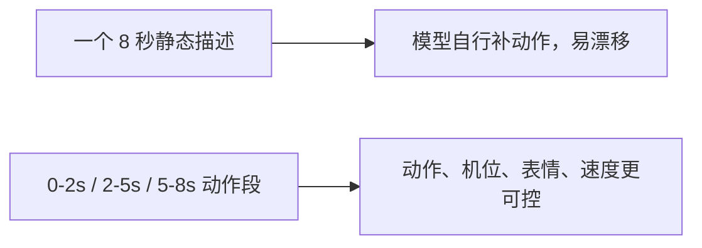
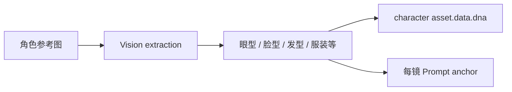
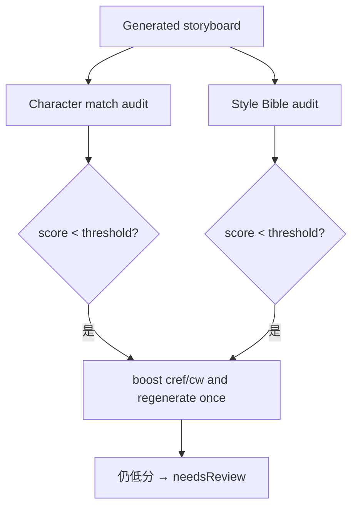
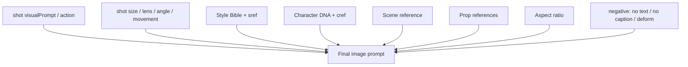
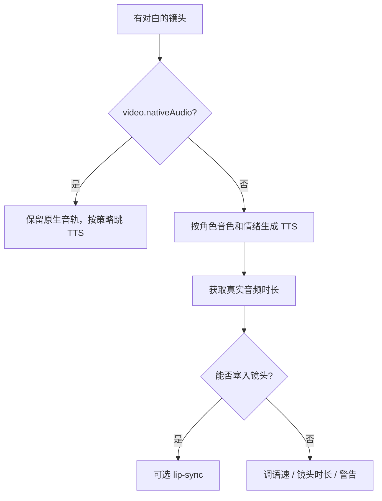
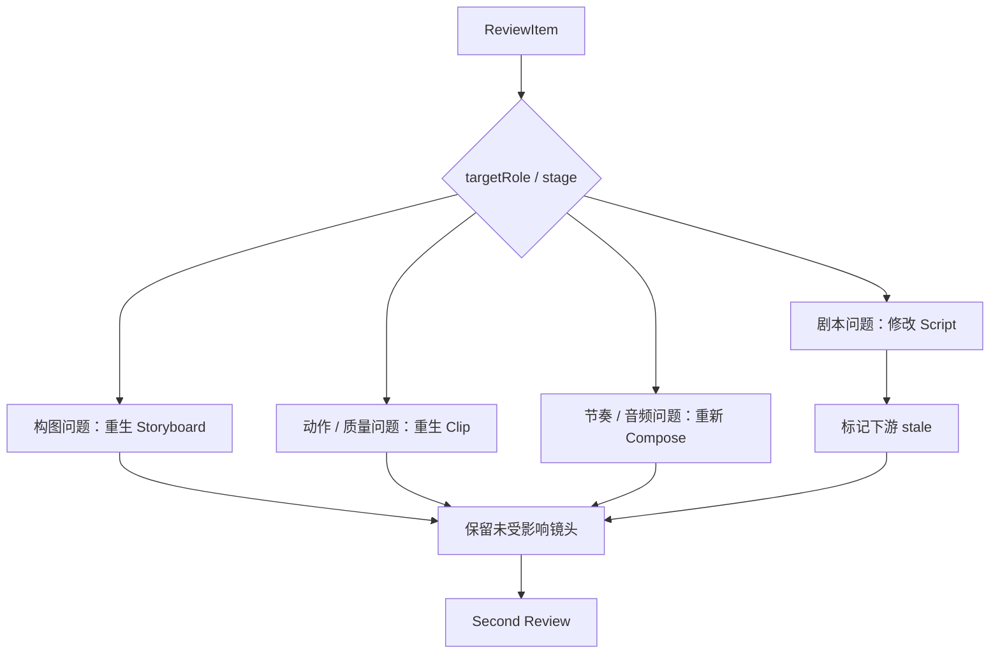

# Wind Comic Agent 数据契约、Prompt 上下文与返工机制源码级解析

## 1. Agent 的工程边界

在 Wind Comic 中，一个岗位 Agent 可以抽象为：

```typescript
type RoleAgent<I, O> = {
  buildPrompt(input: I, context: ProductionContext): Prompt;
  invoke(prompt: Prompt): Promise<RawOutput>;
  parse(raw: RawOutput): O;
  validate(output: O): ValidationResult;
  fallback(error: unknown): O;
};
```

实际代码未全部统一成这个接口，但它能准确解释岗位方法的职责。Agent 不负责 HTTP、数据库任务认领和 SSE 连接；这些属于应用层。

## 2. Agent 状态模型

```typescript
type AgentStatus = 'idle' | 'thinking' | 'working' | 'completed' | 'error';
```

`Agent` 还包含 progress、currentTask、output 和 error。状态主要服务 UI，不是可靠任务状态：浏览器看到 completed 不代表资产一定已提交；可靠完成以资产和项目 / Job 状态为准。

## 3. 上下文来源



上下文包括：

- 项目、用户、画幅、语言、风格；
- 剪辑风格、默认摄影语言、草图锁；
- 主角参考和 1–3 个锁脸角色；
- Style Bible、场景 / 道具参考；
- 系列前情提要、前集尾帧和跨集锚点；
- Provider 能力和当前健康状态；
- 历史质量分和审核反馈。

## 4. Director 契约

### 输入

- 安全清洗、规范化和模板增强后的 idea。
- 用户风格、画幅、语言和题材上下文。

### 输出 `DirectorPlan`

```typescript
interface DirectorPlan {
  genre: string;
  style: string;
  characters: Character[];
  scenes: Scene[];
  storyStructure: {
    acts: number;
    totalShots: number;
  };
}
```

### Character 细节

角色不仅有 name / description / appearance，还支持：

- 11 维视觉结构：年龄、头型、体型、肤色、脸、发型、服装、道具、肢体语言、配色、轮廓；
- 内在悖论 paradox；
- speechStyle；
- role。

这些字段的目标是把“一个漂亮女人”变成可跨镜重复注入的特征集合。

### Scene 细节

场景 visual 可包含 lighting、atmosphere、architecture、weather、timeOfDay、soundscape、smell、colorPalette。气味不能直接生成画面，但可帮助 LLM转译成材质、空气感和表演氛围。

### Fallback

LLM 失败时 `fallbackDirectorPlan` 保证最小结构可执行。业务上应标记该结果是降级计划，而不是与正常导演输出等价。

## 5. Writer 契约

### 输入

- DirectorPlan；
- 可选前集 recap 和承接纪律；
- 题材模板、节奏要求、目标语言；
- 可能的历史质量建议。

### 输出 `Script`

```typescript
interface Script {
  title: string;
  synopsis: string;
  shots: ScriptShot[];
  scenes?: Array<{ sceneId: string; dialogue: string; action: string }>;
}
```

### `ScriptShot` 的业务分层

#### 基础叙事

- shotNumber、sceneDescription、action、emotion；
- characters、dialogue；
- act、storyBeat、subtext、beatFunction。

#### 摄影语言

- shotSize、lens、cameraAngle、cameraMovement；
- lightingIntent、composition；
- editPattern、whyThisChoice；
- diegeticSound、scoreMood、rhythmicSync。

#### 视频执行

- duration、visualPrompt、negativePrompt；
- targetEngine；
- mustShow；
- transition=`cut|continuous`。

#### 逐秒 Micro-beat

```typescript
interface MicroBeat {
  ts: string;
  startSec: number;
  endSec: number;
  action: string;
  camera: string;
  dialogue?: string;
  audio?: string;
  characters?: string[];
  scene?: string;
  mood?: string;
  microExpression?: string;
  speedRamp?: string;
}
```

### Micro-beat 为什么重要



它把镜头拆成 2–4 个可执行动词链，并要求起止秒与 duration 对齐。对视频模型而言，“人物紧张”弱于“0–2 秒握紧手机，2–5 秒抬眼，5–8 秒后退半步”。

### `transition` 的连续性语义

- `cut`：换场或硬切，不应无条件拿上一镜末帧做 I2V。
- `continuous`：同场景连续动作，可用上一镜真实末帧作为下一镜起点。

如果不区分，跨场景也强行串末帧，会把上一场景人物和背景污染到新镜头。

## 6. Writer 输出治理

Writer 输出需要经历：

1. 去除模型思考标签。
2. 从 Markdown 或杂文本提取 JSON。
3. 结构解析。
4. McKee / 字段丰富度校验。
5. 摄影字段软校验。
6. 必要时要求模型返回修正后的完整 JSON。
7. 最终 fallbackScript。

部分校验是 soft warning，以保证总能产出；这提高可用性，但可能把字段缺失推给下游。质量报告应区分“合法”和“高质量”。

## 7. Style Bible 契约

Style Bible 的输出在主链中主要是 URL，而不是强类型对象。其 Prompt 来源于 Director 风格、题材、画幅和可选用户参考。

问题：仅保存 URL 难以记录生成它的模型、Seed、Prompt、色板和版本。更稳的类型应是：

```typescript
interface StyleBible {
  imageUrl: string;
  prompt: string;
  palette: string[];
  lighting: string;
  texture: string;
  characterProportion: string;
  provider: string;
  model: string;
  inputHash: string;
}
```

## 8. Character Designer 契约

```typescript
interface CharacterDesignerResult {
  character: string;
  prompt: string;
  imageUrl: string;
  name?: string;
  description?: string;
  appearance?: string;
}
```

源码注释指出生产方只稳定产 `character/prompt/imageUrl`，但消费方仍访问 name / description / appearance，因此这些字段被标可选以通过类型检查。这是契约漂移的直接证据。

### Character DNA

角色图生成后，可通过 Vision 提取结构化 DNA，并通过 progress 回调 best-effort 合并到 character asset：



当前 DNA 落库使用 fire-and-forget；主流程可能先完成，而 DNA 写入稍后失败。它是增强信息，不应作为不落盘就无法继续的强依赖。

## 9. Scene Designer 契约

```typescript
interface SceneDesignerResult {
  sceneId: string;
  name: string;
  description: string;
  imageUrl: string;
}
```

其中 name 实际等于输入 location，并被下游用于匹配。若 Writer、Director 和 Scene Designer 对场景名的规范化不同，会出现“已生成场景但镜头找不到参考图”。应使用稳定 sceneId 做关联，name 仅展示。

## 10. Storyboard 契约

### 基础字段

- shotNumber、imageUrl、prompt；
- planData.cameraAngle / composition / lighting / colorTone；
- characterAction、transitionNote。

### Cameo 一致性字段

- cameoScore；
- cameoRetried / attempts / finalCw；
- cameoReason、needsReview；
- cameoPerCharacterScores。

### Style Audit 字段

- styleAuditScore；
- palette、lighting、colorTemperature、texture 四维；
- styleAuditRetried、styleAuditReason。



自动重生次数受限，避免 Vision 误判导致无限图片费用。

## 11. Storyboard Prompt 组装

一个镜头 Prompt 不是单一 Writer 字段，而是多个约束的合成：



对话文字通常不交给图片 / 视频模型绘制，而是在后期烧字幕，避免生成乱码。

## 12. Video Producer 契约

```typescript
interface VideoClip {
  id?: string;
  shotId?: string;
  shotNumber?: number;
  videoUrl: string;
  coverImageUrl?: string;
  duration?: number;
  status?: 'pending'|'generating'|'completed'|'error';
  nativeAudio?: boolean;
}
```

### 输入适配

- 文生 / 图生；
- 首帧 / 首尾帧；
- 参考主体；
- duration、ratio、resolution；
- target engine 的 micro-beat 合成格式；
- 是否需要原生音频。

### `nativeAudio`

如果视频引擎已经生成可用原生对白 / 音效，Editor 应跳过重复 TTS 或避免覆盖真音轨。这个字段是视频与编辑之间的重要契约，默认 false / 缺失时必须保守处理。

## 13. Editor 契约

`EditResult` 是最复杂、最接近交付的输出。

### Timeline item

- shotNumber、videoUrl；
- duration：合成后的真实终值；
- baseDuration：原始设计值；
- transition：实际转场；
- transitionDurationS；
- emotion、act、dialogue、speaker；
- emotionTemperature、tensionLevel。

### 顶层输出

- totalDuration 与 designedTotalDuration；
- finalVideoUrl、musicUrl；
- voiceoverClips；
- highlightAnalysis；
- audioWarnings；
- hasBgm / hasVoiceover；
- qualityReport。

### 为什么要区分设计值和成片真值

转场会重叠两个镜头，真实总时长不是简单 duration 求和。FFmpeg 合成后必须把实际时长和转场回写，否则 EDL / AAF、字幕、配音和 UI 时间线会漂移。

## 14. 音频决策



源码中已有针对“只按情绪猜音色”“不看镜头时长导致台词被切”的问题修正与注释，说明音色身份、韵律情绪和时间适配应是三个独立维度。

## 15. DirectorReview 契约

### 基础字段

- overallScore、summary、items；
- status、passed；
- dimensions；
- producerReports。

### ReviewItem

- shotNumber；
- targetRole；
- issue、suggestion、severity；
- stage、dimension。

`targetRole` 已放宽为 `AgentRole|string`，因为 LLM 和 fallback 会返回裸字符串。这保证运行，但削弱类型安全；更好的做法是在解析边界规范化为受控枚举并保存 unknown 原值供审计。

### Producer 四类报告

1. continuityFlags：道具、服装、视线、轴线、时间、天气。
2. assetLedger：每镜角色 / 场景 / 分镜 / 视频 / 对白 / 音乐状态。
3. rhythmReport：平均镜长、方差、类型基准和节奏判定。
4. runtimeReport：目标 / 实际时长、超时和三幕占比。

## 16. 反馈到返工的路由



当前 `executeReviewFeedback` 更偏镜头级返工。若 Writer 级结构变化，应显式计算完整下游失效范围，否则旧分镜可能与新剧本不一致。

## 17. 人工 Gate 契约

```typescript
interface GateResult {
  action: string;
  editedData?: any;
}
```

`editedData` 仍为 any，因为调用方直接赋给 any[]。Gate 允许 continue 或 edit，但类型未严格限定。这是后续最适合引入判别联合的位置：

```typescript
type GateResult<T> =
  | { action: 'continue' }
  | { action: 'edit'; editedData: T }
  | { action: 'cancel'; reason?: string };
```

## 18. 契约问题清单

### P0：公开方法仍有 any

静态扫描当前 `HybridOrchestrator` 仍约有 94 处 `any`，`create-pipeline` 约 65 处。数量会随版本变化，但说明类型边界仍不稳定。

### P1：生产方和消费方字段漂移

CharacterDesigner 生产 `character`，消费方却兜底访问 name。长远应统一 DTO，不依靠可选字段掩盖不一致。

### P1：资产类型联合不完整

`AssetType` 联合列出常见资产，但代码还使用 plan、styleBible、quality_report 等扩展字符串。类型与运行时值需要统一，否则 Repository 失去约束作用。

### P1：Fallback 缺少统一标志

不同岗位 fallback 后可能继续完成项目。应给每个输出附：

```typescript
meta: {
  generatedBy: 'model' | 'rule-fallback' | 'mock';
  provider?: string;
  model?: string;
  warnings: string[];
}
```

### P2：Prompt 不可复现

只保存产物 URL 不足以重现。需要保存 Prompt version、完整输入哈希、Provider、model、Seed、参考资产版本和解析器版本。

## 19. 契约测试建议

1. 每个 Agent 的真实、fallback、Mock 三条路径都通过同一 Schema。
2. Writer beats 时间连续、无重叠、总时长匹配。
3. transition=cut 不使用上一镜尾帧；continuous 才允许。
4. Character / Scene 使用稳定 ID 关联。
5. 低 Cameo / Style 分只自动重生有限次数。
6. nativeAudio clip 不重复 TTS。
7. Editor 合成后实际时长回写并与 ffprobe 一致。
8. ReviewItem 非法 role 在解析边界被规范化。
9. Gate edit 数据按阶段 Schema 校验。
10. 任一 fallback 在质量报告中可见。

## 20. 源码索引

- [`types/agents.ts`](../types/agents.ts)
- [`services/hybrid-orchestrator.ts`](../services/hybrid-orchestrator.ts)
- [`services/agents/writer-agent.ts`](../services/agents/writer-agent.ts)
- [`services/agents/editor-agent.ts`](../services/agents/editor-agent.ts)
- [`lib/mckee-skill.ts`](../lib/mckee-skill.ts)
- [`lib/writer-enhance.ts`](../lib/writer-enhance.ts)
- [`lib/character-dna.ts`](../lib/character-dna.ts)
- [`lib/style-audit.ts`](../lib/style-audit.ts)
- [`services/cameo-retry.ts`](../services/cameo-retry.ts)
