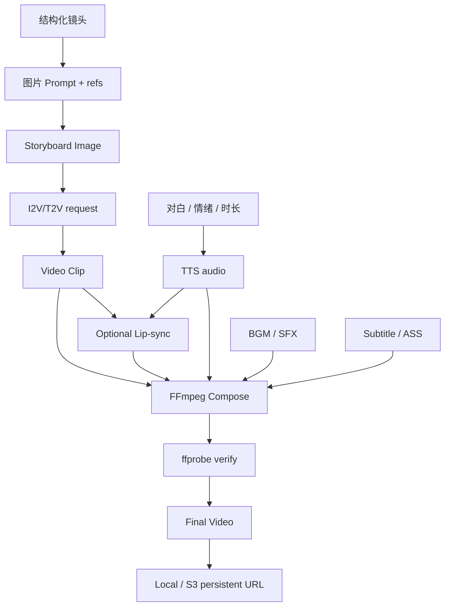
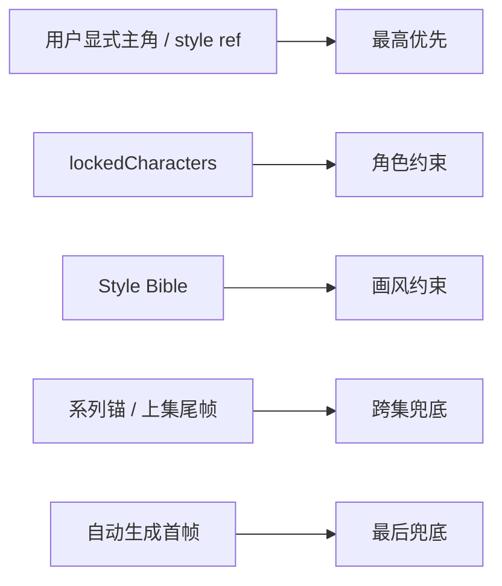
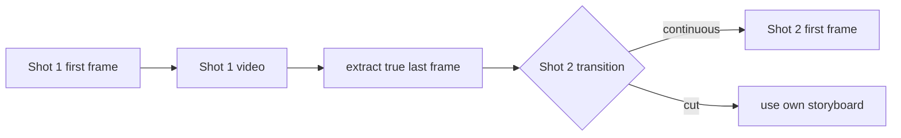
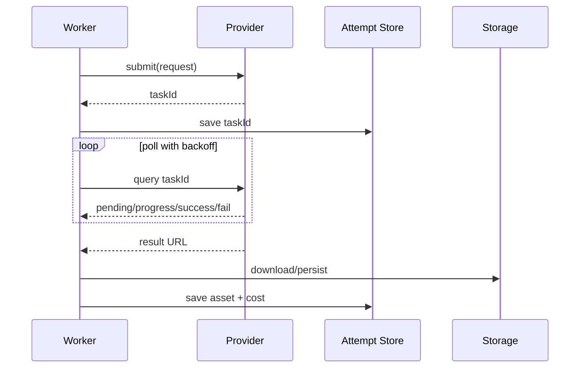
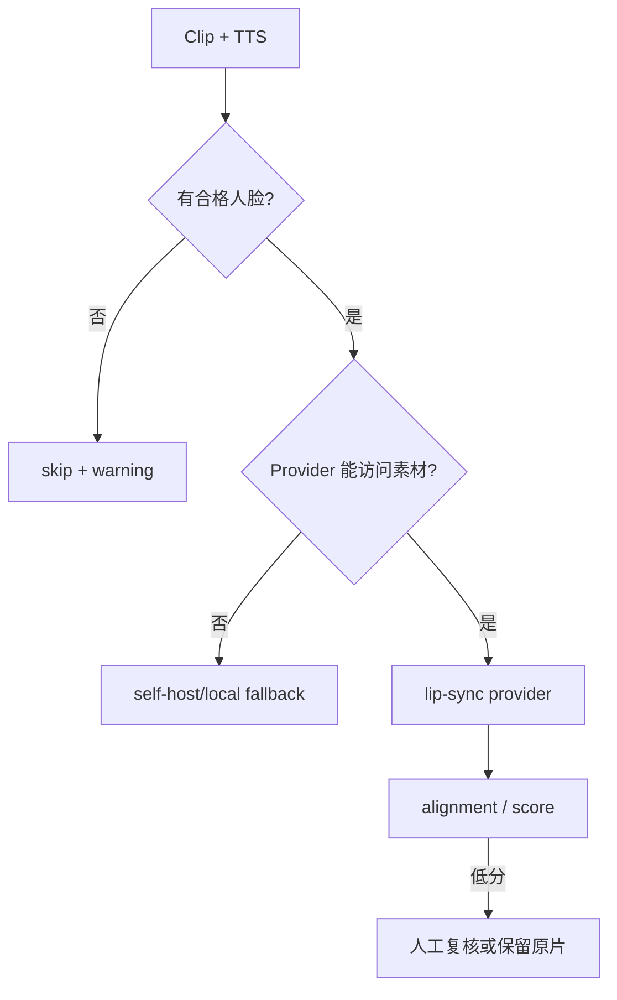
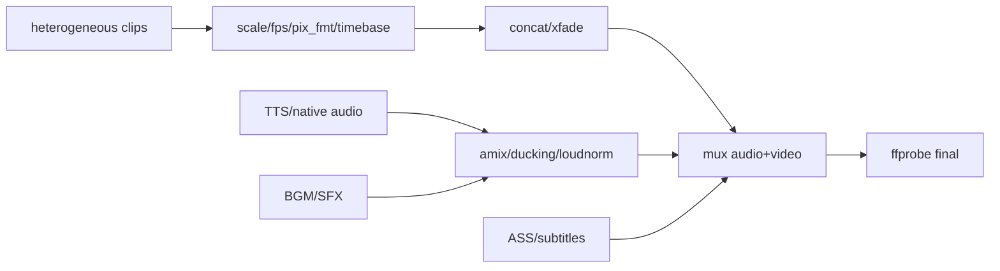

# Wind Comic 图片、视频、音频、FFmpeg 与存储链路深度解析

## 1. 媒体链路总图



## 2. 图片生成请求

图片层主要用于 Style Bible、角色、场景、分镜和封面。一个完整请求通常包含：

- 正向 Prompt；
- negative prompt；
- 画幅；
- Style reference（sref）；
- Character reference（cref）；
- 场景 / 道具参考；
- Provider 特定模型和参数；
- 项目 / 镜头上下文，用于日志和成本。

### 参考图优先级



显式用户选择应始终覆盖自动推断，否则系统可能“智能地”改掉用户已经确认的角色或画风。

## 3. 图片 Provider 能力差异

| 能力 | 影响 |
|---|---|
| 纯文生图 | 无法直接使用角色参考 |
| Image-to-image | 可维持布局或外观 |
| 多参考图 | 可同时传角色、风格和场景 |
| 原生 Mask / Edit | 适合局部改图 |
| Seed | 提高可复现性，但跨模型不可等价 |
| 画幅参数 | 有的用 aspect，有的用 width/height |
| 异步任务 | 需要 submit、poll、超时和持久 request ID |

统一 Provider Registry 不能掩盖能力差异；请求适配器应在调用前明确说明哪些约束会丢失。

## 4. Storyboard 质量门

分镜图生成后可能经过：

1. Style Bible 四维审计。
2. 主角 / 多角色 Cameo 相似度。
3. 文字烤入、3D 塑料感等镜头质量检查。
4. 低于阈值时有限重生。
5. 仍不合格则 needsReview。

Vision 服务不可用时部分规则会诚实放行或降级，避免整条流程阻塞。这意味着 `pass` 需要区分“评估通过”和“未评估但放行”。

## 5. 视频引擎请求模型

```typescript
type VideoRequest = {
  prompt: string;
  imageUrl?: string;
  lastFrameUrl?: string;
  subjectReferences?: string[];
  duration: number;
  aspectRatio: string;
  resolution?: string;
  nativeAudio?: boolean;
  projectId?: string;
  shotNumber?: number;
};
```

实际 Provider 字段各异，以上是概念模型。

## 6. 首尾帧与连续性

### 首帧

分镜图作为 image-to-video 首帧，锁定构图、角色和风格。正因为后面视频吃的是这张图，分镜阶段才会有「草图锁」：默认把草图当软参考；配置 ComfyUI ControlNet（Canny）后可按线稿硬锁构图、机位和主体位置。概念见 [00 总览 2.1](./00_WindComic项目解析总览.md) 与 [02 ControlNet](./02_AI服务与Provider路由机制.md)。

### 尾帧

部分引擎支持 first-last-frame。上一镜尾帧还可作为下一镜首帧，但仅应在 `transition=continuous` 时使用。



视频并发越高，越难等待前一镜尾帧，因此生成速度和链式连续性存在直接冲突。

## 7. 视频异步任务

多数云视频 Provider 是：



当前不同实现对 request ID 持久化程度不完全统一，这是超时后重复计费的关键风险。

## 8. 视频引擎链与降级

`video-engine-chain.ts` 会按配置顺序尝试引擎，成功则返回；全部失败时返回空 URL，由上层决定 Ken Burns、B-roll 或错误。

### 降级层次

| 层 | 结果 | 用户感知 |
|---|---|---|
| 首选视频引擎 | 真实生成视频 | 正常 |
| 备用视频引擎 | 真实视频但能力可能不同 | 应标注 Provider 切换 |
| 重试当前镜头 | 同引擎再次生成 | 增加成本 |
| Ken Burns | 静态图平移缩放成视频 | 明显降级 |
| B-roll / 占位 | 替代素材 | 内容可能不匹配 |
| 空结果 | 阶段失败 | 不应伪装成完成 |

QualityReport 的 degradedShots 应把真实视频与静态降级明确区分。

## 9. 比例问题

项目可能设 9:16，但 Provider 参数错误或被静默忽略后返回 16:9。源码已有针对这类问题的注释和修复。

防线应包括：

1. 使用 Provider 官方真实字段映射。
2. 提交响应若返回 usage.ratio，立即交叉检查。
3. 下载后 ffprobe 验证宽高。
4. 同一运行发现 Provider 某比例失配后，停止继续烧后续镜头。
5. 最终合成前统一 reframe / pad / crop 策略。

## 10. TTS 链路

TTS（Text-To-Speech，文本转语音）把剧本对白合成音频。它发生在 Editor 阶段，上游是角色与对白契约，下游是字幕、对口型和 FFmpeg 混音。默认 Provider 为 MiniMax / VectorEngine 等外部服务；`MOCK_ENGINES=1` 只产出测试占位音。镜头若声明 native audio，不应再生成一遍 TTS。术语与路由口径见 [00 总览 2.1](./00_WindComic项目解析总览.md) 和 [02 §8](./02_AI服务与Provider路由机制.md)。

### 输入

- speaker / character；
- dialogue；
- language；
- emotion / prosody；
- 目标镜头时长；
- 角色 voice override 或自动音色。

### 输出

- 音频 URL / 本地文件；
- 实际时长；
- Provider 和模型；
- warning / fallback。

### 音色与情绪不能混为一谈

- 音色描述“谁在说”：性别、年龄、音质、角色身份。
- 情绪描述“怎么说”：愤怒、悲伤、快速、停顿。
- 时间适配描述“多长说完”。

源码注释指出历史实现曾用台词情绪猜性别，并忽略镜头时长。这类错误会造成角色声音漂移或后半句被下一镜切掉。

## 11. 对口型

### Provider 选择

- 云端 Kling / Sync.so / Hailuo 等；
- 自托管 Wav2Lip HTTP；
- local-2d 静态脸降级。

### 前置条件

- 有可识别正脸；
- 有对白音频；
- 某些服务要求音频至少约 2 秒；
- 云服务常要求视频 URL 公网可访问；
- 语言和输入类型在 Provider 支持范围内。



Lip-sync 失败不必让整片失败，但必须在 UI 和质量报告中可见。

## 12. 字幕链路

### 为什么后期烧字幕

图片 / 视频模型生成中文文字容易乱码，因此 Prompt 会加 `no text/no captions`，再用真实字体和 FFmpeg/libass 烧入字幕。

### 字幕数据

- 文本来源于 Script dialogue / narration；
- 时间来源于真实 TTS 与剪辑时间线；
- CJK 字体按系统和开源字体发现；
- 可扩展 ASS 样式、卡拉 OK、位置和安全区。

### 风险

- Docker 只有 DejaVu 时 CJK 字形可能不完整；需要提供明确可商用 CJK 字体。
- 路径和字体名在 Windows、Alpine、macOS 不同。
- 字幕起止必须考虑 xfade 重叠，而不是简单累加镜长。

## 13. BGM、音效与 Ducking

Editor 可使用生成或项目选择的 BGM。混音需要：

- 对白出现时压低 BGM（ducking）；
- 防止削波；
- 统一采样率和声道；
- 处理无音轨素材；
- 末尾淡出；
- 最终 loudnorm。

如果视频带 native audio，需要决定保留环境声、替换对白或与 TTS 混合，不能一律静音原轨。

## 14. 时间线和转场

### 设计时间线

Writer / Editor 根据镜头时长、情绪和节奏生成 baseDuration 与 transition 设计。

### 渲染时间线

FFmpeg 实际转场可能降级或改变时长。渲染后应回写：

- duration；
- transition；
- transitionDurationS；
- totalDuration。

### Xfade 计算

两个镜头 5 秒和 5 秒，转场重叠 0.5 秒，合成总时长约 9.5 秒，不是 10 秒。多个转场时偏差累积，会影响字幕、配音、音乐卡点和 EDL。

## 15. FFmpeg 合成层

典型处理：

1. 下载或定位每个 clip。
2. ffprobe 检查。
3. 统一分辨率、像素格式、帧率、编码和 timebase。
4. 缺视频时将分镜图转 Ken Burns 视频。
5. 拼接或 xfade。
6. 混合 native audio、TTS、BGM 和 SFX。
7. 烧字幕 / 水印。
8. 导出 MP4。
9. 再 ffprobe 验证最终时长和轨道。



## 16. 多级合成降级

复杂 xfade / 滤镜失败时，Editor 可能退到更简单拼接，再退到首个有效视频。这个策略保证流程能出结果，但 `finalVideoUrl` 非空不代表完整成片：

- videoCount 是否等于预期；
- totalDuration 是否接近设计；
- hasVoiceover / hasBgm；
- qualityReport.degradedShots；
- audioWarnings；

这些字段必须共同判断交付质量。

## 17. Storage

项目支持本地存储和可选 S3。写入策略大致是：

- 优先上传持久存储；
- 失败时保留 local-only URL；
- 某些本地媒体算法仍要求本地文件；
- `persistent_url` 优先于可能过期的外部 URL。

### 本地 URL

通常通过签名 `/api/serve-file` 暴露。容器重建、换实例或未挂卷会失效。

### S3 问题

仅把最终文件上传 S3 不够。需要统一：

- 中间资产是否持久化；
- 下载到临时目录的生命周期；
- S3 上传成功、DB 写入失败的孤儿对象清理；
- 对象 Key 命名和用户隔离；
- 签名 URL 到期后是否保存稳定 object key。

## 18. 媒体安全

- 远端 URL 下载防 SSRF，并逐跳验证重定向。
- 限制 Content-Length 和实际下载大小。
- 只允许 HTTP(S)，阻止 file/gopher 等协议。
- 对上传检查 MIME、魔数和解码结果。
- FFmpeg 使用参数数组，避免用户文本进入 shell。
- 临时文件名随机化，目录限制在专用 temp。
- serve-file 使用服务端签名与允许目录检查。

## 19. 高频问题定位

### 成片是黑屏

检查 clip 可解码性、pix_fmt、滤镜报错、最终文件大小和 ffprobe duration。

### 成片无声音

检查原 clip 是否有 audio stream、TTS 是否成功、amix 输入索引、AAC 编码器和最终 ffprobe streams。

### 字幕乱码

检查 CJK 字体是否存在、libass 是否可用、字体名转义和容器内路径。

### 9:16 变 16:9

检查 Provider 实际参数名、返回 usage ratio、分镜尺寸、ffprobe 宽高和 composer scale/crop。

### 某镜重复或顺序错

检查 shot_number、资产去重规则、timeline 排序和旧重复资产。

### 对白被截断

对比 TTS 真实时长、镜头渲染时长、转场重叠与字幕区间。

## 20. 源码索引

- [`lib/image-providers`](../lib/image-providers)
- [`lib/video-providers`](../lib/video-providers)
- [`lib/video-engine-chain.ts`](../lib/video-engine-chain.ts)
- [`lib/tts-providers`](../lib/tts-providers)
- [`lib/lipsync-providers`](../lib/lipsync-providers)
- [`services/lipsync.service.ts`](../services/lipsync.service.ts)
- [`services/video-composer.ts`](../services/video-composer.ts)
- [`lib/text-control.ts`](../lib/text-control.ts)
- [`lib/storage.ts`](../lib/storage.ts)
- [`lib/film-health.ts`](../lib/film-health.ts)
