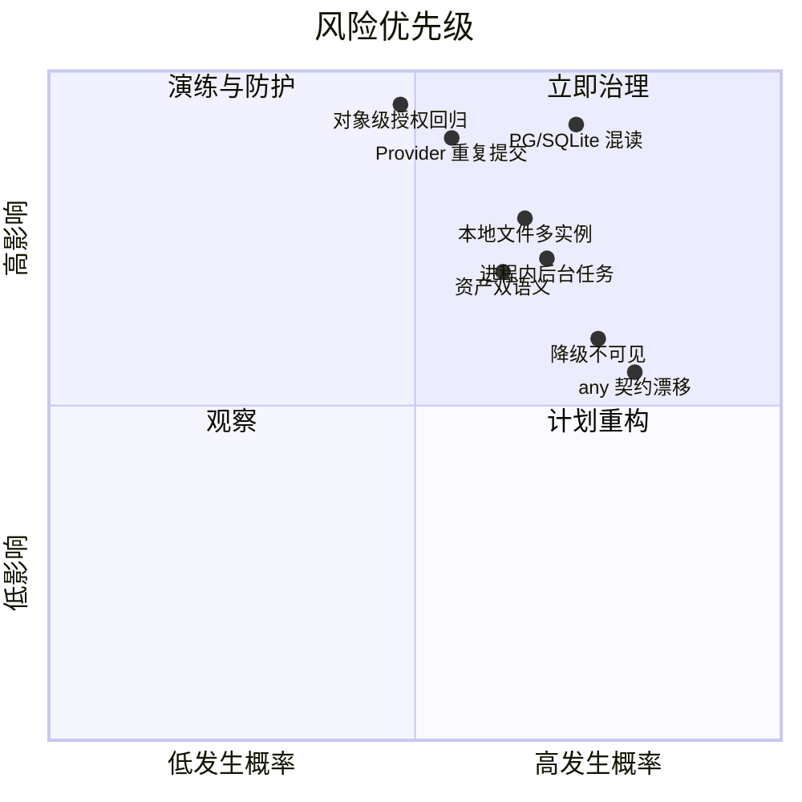
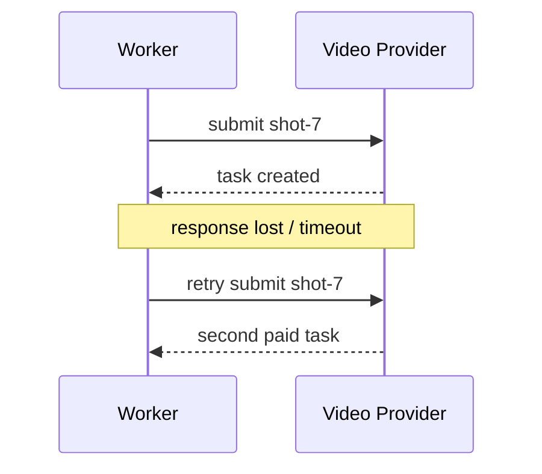

# Wind Comic 已知问题、技术债、风险清单与改进方案

> 口径：分为“当前结构性问题”“需要专项验证”“源码注释记录的历史已修问题”。历史问题不等于当前仍可利用，但能揭示最容易回归的区域。

## 1. 风险评分

| 等级 | 定义 |
|---|---|
| P0 | 可能导致越权、错账、重复高额计费、数据错库或核心任务不可恢复 |
| P1 | 明显影响质量、稳定性、扩容或维护效率 |
| P2 | 中期架构债、体验问题或可观测性不足 |
| P3 | 文档、命名、部署体积等低紧急度问题 |

## 2. 总览



## 3. P0-1：SQLite / PostgreSQL 混读

### 证据

- `GET /api/projects/[id]` 用 `db.prepare` 读取项目，用 `asset-repo` 读取资产。
- `pipeline-checkpoints.ts` 用 DbDriver 读资产，用裸 SQLite 读 director_notes。
- `create-pipeline.ts` 的主角参考兜底仍直接查 `db`。
- publish、quality 等部分路径也直接引用 `lib/db`。

### 触发条件

设置 `DB_DRIVER=pg`，PostgreSQL 有真实业务数据，而本地 SQLite 为空、旧数据或 demo 数据。

### 后果

- 明明存在的项目返回 404。
- 权限判断和项目内容来自不同数据源。
- 已审核任务被重复审核。
- 锁脸 / 风格参考丢失。
- 写入 PG、读取 SQLite，功能表现为静默不生效。

### 修复

1. 业务模块禁止 import 裸 `db`。
2. 所有项目 / 资产 / 质量查询进入 Repository。
3. 添加静态检查白名单，只允许 `db.ts` 和 SqliteDriver 使用 better-sqlite3。
4. CI 启动“空 SQLite + 有数据 PG”运行接口集成测试。

## 4. P0-2：外部 Provider 提交缺少统一幂等账本

### 触发场景



### 当前缓解

- 阶段 / 镜头资产检查点避免已落盘结果重做。
- 某些 Provider 返回 task ID 并轮询。
- Job 重试次数有限。

### 缺口

在“远端已受理、task ID 未落库”窗口，资产检查点无能为力。

### 修复

建立 `generation_attempts`，调用前保存 idempotency key 和 input hash；submit 后立即保存 remote_request_id；恢复时先 query，不直接再次 submit；成本记录引用 attempt。

## 5. P0-3：对象级授权容易在侧门回归

### 历史证据

源码注释记录过：

- 项目 IDOR；
- GET 有守卫而 POST 无守卫；
- TTS、图生视频、Vision 侧门零鉴权零预算；
- serve-file 任意路径风险；
- 安全收口后忘记在入队写入 user_id，产生功能回归。

多数已在 v12.218–v12.234 附近补修，但 182 个路由使人工复核容易漏。

### 修复

- 动态项目路由必须调用 `requireProjectAccess`，CI 零容忍。
- 付费 Provider 路由必须调用 `guardPaidEndpoint` 或等效预算守卫。
- 内部 `updateProjectById` 改名并限制只能由已授权调用点使用。
- 为 viewer/commenter/editor/owner 生成参数化权限测试。

## 6. P0-4：内部无 owner 更新方法的误用风险

`updateProjectById(id, patch)` 为流水线内部更新设计，只限制列白名单，不限制 user_id。若某个外部 Route 未先做项目守卫，知道 ID 即可写项目。

### 建议

- `updateOwnedProject(id,userId,patch)` 作为默认公开 API。
- `updateProjectInternal` 放到明确的 internal 模块。
- Route 层禁止直接 import internal Repository 方法。
- 通过调用图 / lint rule 阻止误用。

## 7. P0-5：项目状态和资产存在多事实源

### 例子

- Script 同时存在 `projects.script_data` 与 script asset。
- Review 同时存在 `director_notes`、review status 和可能的资产。
- Locked characters 同时存在 JSON 和归一表。
- Final video 同时存在 project 字段 / final_video asset / timeline result。

### 后果

不同 API 读取不同来源，出现 UI 和流水线判断不一致。

### 建议

定义单一事实源与派生缓存：

| 领域 | 主事实 | 派生 / 快照 |
|---|---|---|
| 剧本 | versioned script asset | projects.script_data 只作当前快照 |
| 审核 | review entity / asset | director_notes 作摘要 |
| 锁脸角色 | 归一表 | JSON 作 API 快照或淘汰 |
| 成片 | final asset revision | project final URL 作快速索引 |

## 8. P1-1：队列 Worker 仍在 Web 进程

### 后果

- 滚动发布会中断媒体任务。
- Web 与 FFmpeg / 下载 / JSON 解析争 CPU 和内存。
- 同一实例故障同时影响请求和任务。
- 扩 Web 副本会同时增加 Worker 数，难以独立控制容量。

### 建议

保留同一代码库，拆两个启动命令：Web 只处理 API，Worker 只 claim job。部署层分别配置副本、CPU、内存和优雅停机。

## 9. P1-2：队列关闭时整季任务 fire-and-forget

`POST /api/series/[id]/generate` 在 `PIPELINE_QUEUE!=1` 时立即返回，再在进程内 `void async` 执行。进程重启会丢在途任务，前端只能看到 active / draft 状态变化。

### 建议

生产强制 `PIPELINE_QUEUE=1`；若关闭，则接口不提供“后台批量生成”，改成明确同步或返回配置错误。

## 10. P1-3：本地文件与多实例不兼容

### 触发

实例 A 生成 `/app/data/x.mp4`，数据库保存 `/api/serve-file?...`，下一次请求被负载均衡到实例 B。

### 后果

B 没有文件；签名正确也返回 404。

### 建议

- 生产媒体全部进入对象存储。
- DB 保存 object key 和稳定 URL，不保存实例本地绝对路径。
- 本地降级只允许单机模式；多实例时 S3 失败应让步骤失败或进入可恢复队列，而不是静默 local-only。

## 11. P1-4：资产表同时承担当前值和追加历史

upsert 镜头资产要求业务唯一，voice-retake 又要求同镜多条历史。没有唯一约束时并发可能重复；加统一唯一约束又会破坏历史。

### 建议

拆 `assets` 与 `asset_revisions/generation_attempts`，当前表只指向 active revision。

## 12. P1-5：Agent 类型契约仍有大量 `any`

静态扫描当前版本：

- `hybrid-orchestrator.ts` 约 94 次 `any`；
- `create-pipeline.ts` 约 65 次；
- `types/agents.ts` 仍保留兼容性 any。

### 后果

- 字段重命名无法由 TypeScript 发现。
- fallback 和真实路径形状不同。
- gate editedData 可把非法结构直接放入下游。

### 建议

以阶段边界做 Zod / JSON Schema 运行时校验，优先治理公开方法与数据库序列化边界，不追求一次消灭所有内部 any。

## 13. P1-6：超大 Orchestrator

`hybrid-orchestrator.ts` 仍有四千余行，聚合：

- Agent 状态；
- LLM 调用；
- Prompt；
- Provider；
- 连续性；
- 视频生成；
- 复审返工。

Writer 和 Editor 已拆出，但 Facade 仍过重。建议拆 Model Gateway、Continuity、Storyboard、Video Production 和 Repair Planner。

## 14. P1-7：LLM 调用策略重复

`lib/llm-client.ts` 与 `HybridOrchestrator.callLLM` 各自管理候选、超时和解析。长期会导致：

- 某条路径有健康冷却，另一条没有；
- 成本和调用日志不一致；
- 新 Provider 只接入一半；
- 测试无法覆盖统一行为。

建议由唯一 Model Gateway 执行，Agent 只传模型意图（creative/general/vision）和结构 Schema。

## 15. P1-8：重试可能乘法放大

如果 HTTP、Provider Registry、视频轮询、Pipeline Job 都独立重试，理论调用次数会相乘。需要为每类错误规定唯一责任层，并把 attempt 数传到质量与成本日志。

## 16. P1-9：降级成功与业务成功混淆

### 例子

- fallbackScript 仍可进入后续生成。
- 视频全失败后可能用 Ken Burns。
- Lip-sync 失败时保留原片。
- 发布无凭据时返回 manual packaged。
- Editor 复杂合成失败可退到简单拼接甚至首片。

这些设计本身合理，但最终 `completed` 不能被理解为“质量完整”。

### 建议

项目增加 delivery grade：

```text
complete
├─ grade A: 全部真实能力成功
├─ grade B: 轻微 fallback，可发布
├─ grade C: 有降级镜，需人工确认
└─ grade D: 仅流程占位，不可发布
```

## 17. P1-10：预算估算与真实成本可能脱节

预算使用镜头数和模型单价估算；真实情况受重试、时长、分辨率、Provider 切换和审核返工影响。

### 建议

- 任务开始预留预算 reservation；
- 每个 attempt 实时扣减 / 释放；
- 达到任务预算时停止新增镜头并保留已生成资产；
- Provider 账单异步对账；
- 用户看到“估算、已用、可能追加”三类金额。

## 18. P1-11：同步 SQLite 会阻塞 Node 事件循环

SqliteDriver 把同步 better-sqlite3 包装成 Promise，但不会使操作真正异步。大查询、JSON 解析和迁移仍占用 Web 事件循环。

单机小规模可接受；高并发应使用 PostgreSQL 或把重型 DB / 媒体工作放 Worker。

## 19. P1-12：缺少统一限流

预算守卫限制金额，不限制瞬时请求速率。攻击者或误操作可能在预算范围内瞬间创建大量任务，压垮 Provider 或 Worker。

需要：

- 用户级 requests/min；
- 项目级互斥；
- Provider 并发；
- IP / 账号异常速率；
- 队列长度和等待时间门槛。

## 20. P1-13：工作流 Real-run 能力判断过窄

Real-run 主要检查 OpenAI 配置，可能忽略仅启用 XVERSE 的场景，也不能证明图片 / 视频 / TTS 能力齐全。应由每个节点声明 capability，运行前生成能力缺口报告。

## 21. P2-1：Fire-and-forget 派生数据可能丢失

DNA、embedding、遥测、UI event 等使用 best-effort fire-and-forget。对于增强数据这是合理的，但需要：

- 明确不是主事务；
- 可重建；
- 有失败计数；
- 不能被主流程错误地当成已完成。

## 22. P2-2：SSE 没有正式事件 Schema

回放与 live 事件可能重复，事件结构靠前后端约定。建议增加 eventId、schemaVersion、jobAttempt、stageAttempt，并对 complete / error 做判别联合。

## 23. P2-3：JSON-in-TEXT 脏数据

已有 `safeJsonParse` 但仍有裸 `JSON.parse`。一个损坏字段可能让整个详情或列表失败。应在写入时 Schema 校验，在读取时有上下文日志，并提供数据修复脚本。

## 24. P2-4：状态字符串未集中

Project、Job、Publish、Review 各自有状态，但 Project 状态被多个模块直接写。建议建立状态转移函数，拒绝 completed → active 等非法跳转，并记录 actor / reason。

## 25. P2-5：系列“记忆”仍是文本提要

前情 recap、角色锚和尾帧能改善跨集一致性，但未结构化追踪：

- 角色关系和立场；
- 未解决悬念；
- 道具归属 / 损坏状态；
- 时间地点；
- 角色服装版本。

建议引入 `SeriesState`，由每集完成后提取事实，Writer 下一集消费事实而不是仅消费摘要。

## 26. P2-6：质量模型不可用时“放行”语义

Vision 挂掉时部分质量 Gate 不阻塞，这是可用性取舍。但发布门禁应知道“未检查”和“检查通过”的差别，尤其是品牌和合规项目。

## 27. P2-7：生产镜像包含 devDependencies

Docker deps 阶段执行完整 `npm ci`，runner 又复制整个 node_modules，包括 Vitest、Playwright 等开发依赖。这使镜像更大、漏洞面更广。

建议 Next standalone 输出或 production prune；测试放 CI builder，不进入 runner。

## 28. P3-1：过期注释与实现不一致

例如 `regenerate-storyboard` 文件头仍写“demo-friendly 不强制 ACL”，实现已加入项目守卫。过期注释可能让维护者错误移除安全代码或误判风险。

建议将安全修复原因保留在 ADR / 测试名中，文件头描述当前行为。

## 29. 历史已修问题与应保留的回归测试

| 历史问题 | 当前防线 | 必须保留的测试 |
|---|---|---|
| 匿名完整创作烧额度 | 登录 + 预算 | Provider 未被调用 |
| 项目 IDOR | requireProjectAccess | 他人 ID 403 |
| 付费侧门无守卫 | guardPaidEndpoint | 401 / 402 |
| serve-file 任意路径 | 签名能力 URL | 篡改 path / sig 失败 |
| Pipeline event JSON lost update | append-only event table | 并发不丢事件 |
| Worker tick 并发超过 MAX_ACTIVE | tick 互斥 | PG 慢 claim 下仍 ≤2 |
| 孤儿任务盲重置导致双跑 | heartbeat stale 判断 | 活跃心跳不被 requeue |
| Asset check-then-insert 竞态 | 同事务 update/insert | 并发只一个当前资产 |
| 发布伪成功 | manual / published 分离 | 无凭据不出现 published |

## 30. 建议修复路线

### 第一阶段：数据和安全

1. 消除核心路径裸 SQLite。
2. 建立 generation attempt 幂等账本。
3. 自动化项目权限 / paid endpoint 静态门禁。
4. 收口内部无 owner Repository。

### 第二阶段：任务和存储

1. Web / Worker 分离。
2. 强制生产队列。
3. 对象存储作为多实例唯一媒体事实。
4. 资产 current / revision 分表。

### 第三阶段：契约和质量

1. Agent 边界运行时 Schema。
2. 统一 Model Gateway。
3. Delivery grade 与降级透明。
4. 系列结构化状态。

## 31. 源码索引

- [`lib/auth-guard.ts`](../lib/auth-guard.ts)
- [`lib/paid-endpoint-guard.ts`](../lib/paid-endpoint-guard.ts)
- [`lib/db-driver.ts`](../lib/db-driver.ts)
- [`lib/repos/project-repo.ts`](../lib/repos/project-repo.ts)
- [`lib/repos/asset-repo.ts`](../lib/repos/asset-repo.ts)
- [`lib/pipeline-worker.ts`](../lib/pipeline-worker.ts)
- [`lib/pipeline-checkpoints.ts`](../lib/pipeline-checkpoints.ts)
- [`lib/workflow-real-runner.ts`](../lib/workflow-real-runner.ts)
- [`Dockerfile`](../Dockerfile)
