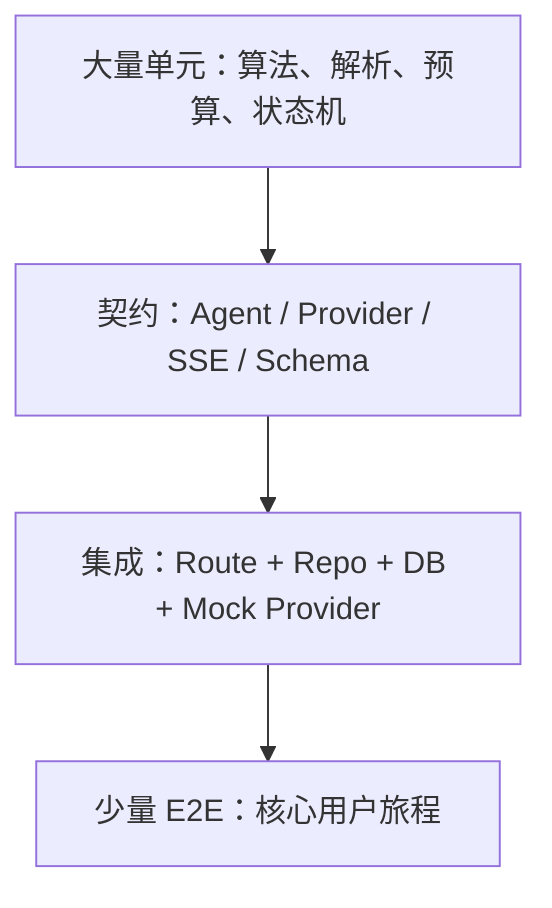
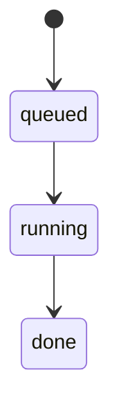
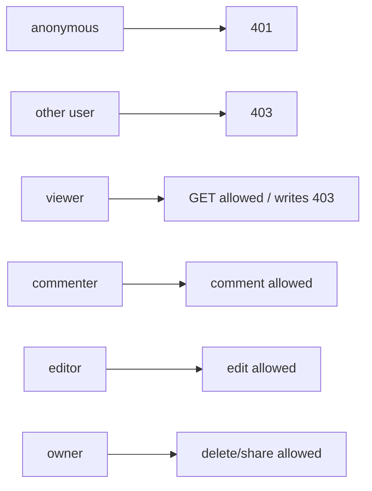
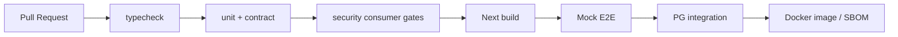

# Wind Comic 测试体系、质量门禁与验收用例详细解析

## 1. 当前测试资产

静态扫描当前仓库得到约 488 个 `*.test.* / *.spec.*` 文件，使用：

- Vitest：单元与集成测试；
- Testing Library / jsdom：组件行为；
- Playwright：浏览器 E2E 和 a11y；
- Mock Providers：封闭 AI 依赖；
- PostgreSQL / S3 smoke scripts；
- Consumer Gate、API health audit、文档 / 版本哈希检查。

测试文件数不等于测试用例数，也不等于全部通过。项目文档中的动态数字需要实际 CI 输出验证。

## 2. 测试金字塔



AI 项目还需要金字塔外的“真实小额评测”，用于验证模型质量和 Provider 兼容，但不能每次 CI 都运行。

## 3. 为什么需要 Mock Engine

真实模型测试存在：

- 费用；
- 时延；
- 限流和欠费；
- 非确定输出；
- 内容审核变化；
- 外部服务故障。

`MOCK_ENGINES=1` 应保证测试可重复，并覆盖完整编排。Mock 测试能证明控制流、持久化和 UI，不证明真实审美质量。

## 4. 单元测试重点

### 4.1 纯算法

- 节奏 / 冲突曲线；
- Micro-beat 校验；
- 剧本题材和语言检测；
- 镜头枚举规范化；
- 预算估算与成本归类；
- Timeline / xfade 时长；
- Provider 错误分类；
- JSON 安全解析；
- 质量 Gate；
- Series recap 和集号分配。

### 4.2 状态机

- Job 状态转移；
- Publish 状态；
- Review 状态；
- 资源锁获取 / 释放 / 过期；
- 工作流节点 success / failed / skipped。

纯函数测试应是最快、最稳定的一层。

## 5. Agent 契约测试

每个 Agent 至少准备三组 Fixture：

1. 正常模型 JSON。
2. Markdown 包裹、think 标签或轻微损坏 JSON。
3. 完全失败触发 fallback。

### Writer 断言

- title / synopsis / shots 存在。
- shotNumber 唯一且有序。
- 每镜 characters、action 和 duration 合法。
- beats 起点为 0、连续、无重叠、终点匹配 duration。
- dialogue 长度和目标语言符合约束。
- transition 只为 cut / continuous。

### Storyboard 断言

- shotNumber 对应 Script。
- style / cameo 审计字段范围 0–100。
- 低分只重生允许次数。
- needsReview 在重生后仍低分时设置。

### Editor 断言

- 实际 duration 与 ffprobe 一致。
- nativeAudio 镜头不会重复生成 TTS。
- finalVideoUrl 非空时验证 videoCount 和 health，不只验证字符串。
- audioWarnings 和 degradedShots 可追踪。

## 6. Provider 契约测试

所有 Provider 应通过统一测试套件：

```typescript
describeProviderContract(factory, {
  rejectsWhenUnconfigured: true,
  normalizesSuccess: true,
  classifiesAuthAsFatal: true,
  retries429: true,
  doesNotRetryInvalidInput: true,
  recordsProviderId: true,
});
```

### 视频 Provider 额外断言

- ratio 映射正确；
- duration / resolution 在能力范围；
- task ID 解析；
- polling 超时；
- result URL 空值处理；
- nativeAudio 标志；
- Provider 返回成功但 ratio 不符时中止同类后续请求。

## 7. Repository 双驱动测试

同一 Repository 合约必须分别在 SQLite 和 PostgreSQL 运行：

| 合约 | SQLite | PostgreSQL |
|---|---:|---:|
| CRUD | ✓ | ✓ |
| Transaction commit | ✓ | ✓ |
| Transaction rollback | ✓ | ✓ |
| Unique violation 分类 | ✓ | ✓ |
| 并发 claim | ✓ | ✓ |
| Asset upsert race | ✓ | ✓ |
| JSON / BLOB | ✓ | ✓ |
| 时间排序 | ✓ | ✓ |

### 抓混读的关键方法

测试 PG 时让 SQLite 保持空库或放入故意不同的数据。如果两个库内容完全相同，直接读错 SQLite 也可能“测试通过”。

## 8. 任务队列测试

### 正常流程



断言：attempts+1、step 更新、事件写入、项目完成。

### 重试

- 第一次失败 → queued。
- 第三次失败 → failed。
- failed 项目同步标 failed。
- 手动 retry 仅接受 failed。

### 孤儿恢复

- 新鲜 heartbeat 不重排。
- 超过阈值 running → queued。
- 超过 24h → failed。
- 多 Worker 同时扫描不双跑。

### 并发上限

使用故意延迟的 PostgreSQL claim，验证 tick 重入时 active 永远不超过 2。

## 9. Checkpoint 测试矩阵

| 已有资产 | 期望执行 |
|---|---|
| 无 | 全流程 |
| plan | 跳 Director |
| plan + script | 从视觉阶段开始 |
| 10 个分镜计划、6 个有图 | 只渲染 4 个 |
| 10 个分镜、9 个视频 | 只生成 1 个视频 |
| timeline + final | 不重复合成 |
| review | 不重复 LLM 复审 |
| Script 资产但 shots=[] | 视为无效，重新生成 |

还要验证重复历史资产按 updated_at 取最新。

## 10. API 权限测试

为每个项目 Route 参数化执行：



### 付费端点

- 匿名 401。
- 超预算 402。
- Provider mock 断言调用次数为 0。
- 合法用户只调用一次。

### 文件服务

- 无签名、过期签名、篡改 path、目录穿越、编码穿越、符号链接逃逸都失败。
- 合法 Range 请求可播放。

## 11. SSE 测试

### 协议断言

- Content-Type 是 text/event-stream。
- 每帧以 `data: JSON\n\n` 结束。
- JSON 包含 type。
- complete 后关闭。
- error 路径不会永远挂起。

### 断线与回放

1. 创建 Job。
2. 收到一部分事件后断线。
3. Worker 继续完成。
4. 重连读取 event log。
5. live 与 replay 重复不导致 UI 资产重复。

## 12. DAG 测试

- 重复节点 ID。
- 缺失依赖。
- 自依赖。
- 多节点环。
- 多个入口。
- 同层并发。
- dependency failed → skipped。
- abort / continue。
- 单次 Runner 覆盖不污染并发请求。
- 两个相同 kind 节点的数据绑定行为。

## 13. 媒体测试

### Fixture 设计

准备极小媒体：

- 1 秒 H.264 无声视频；
- 1 秒含 AAC 视频；
- 竖屏 / 横屏；
- 不同帧率；
- 损坏 MP4；
- 静态图；
- 0.5 秒与 3 秒音频；
- CJK 字幕。

### 断言

- ffprobe 能解析最终文件。
- 最终画幅正确。
- 音轨存在。
- 转场总时长符合公式。
- 字幕画面非空且字体不报错。
- 损坏 clip 触发明确降级 / 错误。
- 临时文件清理。

## 14. 业务验收用例

### 用例 A：单集正常生产

给 50 字完整创意，选择 9:16、Mock、无 Gate。应创建项目，生成完整阶段资产，Job done，项目 completed，成片可访问。

### 用例 B：预算不足

用户当月花费接近硬上限，提交创建。应 402，projects / jobs / Provider 调用都不新增。

### 用例 C：剧本 Gate 编辑

启用 Gate，Writer 完成后暂停；用户修改 shots 并继续；下游消费编辑后版本，原版本保留审计或版本信息。

### 用例 D：单镜失败恢复

让第 4 镜视频第一次失败，任务重试后只再次调用第 4 镜，前 3 镜不重复计费。

### 用例 E：跨集一致性

第一集完成后创建第二集，检查锁脸、Style Bible、尾帧和 recap 被注入；第二集角色名、外观和未解决情节承接。

### 用例 F：协作者权限

viewer 查看但不能改；commenter 能评论；editor 能改时间线；非 owner 不能删除项目。

### 用例 G：发布质量门禁

存在 fail Vision Audit 时发布返回 422；修复后 package 成功；无 Token 的平台返回 manual 而非 published。

## 15. 安全测试

### 输入

- Prompt Injection 多语言变体。
- 超长文本。
- Key、卡号、证件 PII 脱敏。
- 恶意 JSON 和原型污染字段。

### 出站

- 127.0.0.1、169.254.169.254、IPv6、DNS rebinding。
- 重定向从公网跳内网。
- 超大文件和慢速响应。

### 文件

- `../`、双编码、Windows 盘符、UNC、symlink。
- 上传伪造 MIME。

### 权限

- 猜测项目 / 角色 / Workflow / Job / Share Token。
- Token 过期、撤销和角色降级。

## 16. 性能测试

### API

- 项目列表 300 项目 × 40 资产。
- 项目详情 100+ 资产。
- 评论和通知分页。
- Job event 回放上限。

### Worker

- 两个长视频任务 + 同时 Web 请求。
- 50 集 Series 排队。
- Provider 429 时队列增长。
- FFmpeg 并发内存和 CPU。

### 数据库

- SQLite 写锁等待。
- PG 连接池耗尽。
- Claim contention。
- Asset upsert race。

## 17. 质量评测

真实模型不适合断言像素相同，应使用固定评测集：

| 维度 | 指标 |
|---|---|
| 剧本 | JSON 合法率、结构完整、钩子 / 反转 |
| 角色 | 跨镜相似度、人工身份保持率 |
| 风格 | palette / lighting / texture 分 |
| 视频 | 可解码率、动作符合度、比例 |
| 音频 | 音色一致、台词完整、对齐偏差 |
| 成片 | 首次审核通过率、降级镜率、用户接受率 |

模型升级必须比较质量、成本和延迟，不能只看成功率。

## 18. CI 门禁建议



### 必须阻止合并

- 类型错误。
- 项目路由无授权守卫。
- 付费路由无预算守卫。
- 双驱动契约失败。
- Mock 一句话成片失败。
- Docker build 失败。

### 可定时执行

- 小额真实 Provider smoke。
- 全量 Playwright。
- 性能基准。
- S3 / 发布适配器测试。

## 19. 本次环境中的测试状态

### 已完成的静态检查

- 约 488 个测试 / spec 文件存在。
- package scripts 包含 test、test:e2e、typecheck、PG/S3 smoke 和 consumer gate。
- 当前 Docker 容器健康并能提供 Web 服务。

### 未能完成的执行

- 宿主机没有安装 node_modules，`npm test` 报找不到 Vitest。
- 运行容器包含 Vitest，但生产镜像未复制 tests，因此提示 No test files found。

所以本文不能宣称当前 4,000+ 用例已在本机全部通过。正确验证方式是在 CI / builder 或安装依赖的工作区执行，而不是在最小运行镜像内测试。

## 20. 推荐本地验证顺序

在允许安装依赖的开发环境中：

```powershell
npm ci
npm run typecheck
npm test
npm run build
npm run gate:consumer
npm run test:e2e
```

PG / S3 只在准备好隔离测试资源后执行对应 smoke，避免误写生产资源。

## 21. 源码索引

- [`package.json`](../package.json)
- [`tests`](../tests)
- [`e2e`](../e2e)
- [`lib/mock-providers.ts`](../lib/mock-providers.ts)
- [`scripts/consumer-gate.mjs`](../scripts/consumer-gate.mjs)
- [`scripts/pg-smoke.mjs`](../scripts/pg-smoke.mjs)
- [`scripts/pg-verify.ts`](../scripts/pg-verify.ts)
- [`playwright.config.ts`](../playwright.config.ts)
- [`vitest.config.ts`](../vitest.config.ts)
